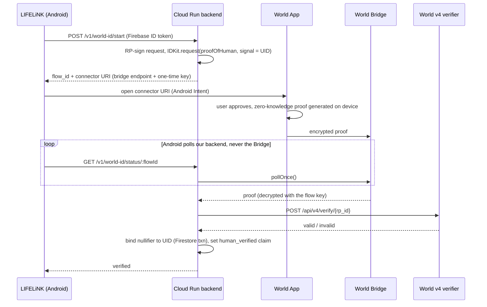
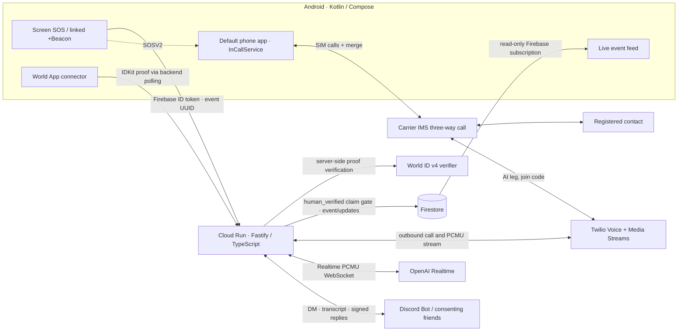

# LIFELiNK — A Human-Verified Lifeline

> **You are never alone.**
>
> Press SOS. A trusted person gets a real phone call—even when you cannot speak.

**ETHGlobal Tokyo 2026 · World / Best Use of IDKit**

LIFELiNK is an Android emergency-contact app. Set up a phone contact in advance, verify that you are a unique human with World ID, and arm a screen button or link a BLE button. When you trigger an SOS, LIFELiNK calls your contact via Twilio; an OpenAI Realtime voice assistant explains the available context, listens, and passes along new information. Consenting friends receive a Discord DM, the live call transcript, and an opportunity to reply. Their replies can reach the person on the call through the assistant. The app shows the same event as a live conversation.

In the default **SOSV2-ambientMode**, the phone itself also joins: with LIFELiNK set as the phone app, a button press—even on a locked phone—quietly calls the AI and your contact from your own SIM and merges them into one carrier three-way call, so the AI and your contact can hear what is happening around you while your phone stays silent and dark.

**日本語で:** 事前登録した連絡先へ、声が出せない場面でもボタン操作から電話で知らせるアプリです。World ID の Proof of Human を通話起動の条件とし、本人の氏名や身分証をアプリ側で収集せずに「一人の人間か」という信頼を得ます。電話・AI・同意済みの友人を同じ緊急イベントに接続します。

> **Scope, not a safety guarantee:** This is a hackathon prototype for contacting *people you have registered*, not an emergency-services/119/110 dispatch system. It cannot guarantee BLE reception, a successful call, an accurate location, or a timely response. Do not rely on it as your sole way to get help.

## One-liner

**World ID makes a costly real-world action—placing an automated emergency call—available to a verified human without making the app collect their legal identity.**

## Idea — crypto utility outside the trading screen

Crypto's next everyday use case does not have to be an agentic wallet, a stablecoin payment, speculation, or another asset dashboard. It can be the invisible trust layer behind a useful action in someone's daily life. LIFELiNK takes a cryptographic proof from World ID and turns it into permission to make a *real phone call* to someone who cares about you.

The trust moment is concrete: **before our backend spends money to initiate a phone call and sends sensitive context to other people, should this account be allowed to activate SOS?** A Google account alone does not establish that accounts belong to distinct humans. Letting unlimited newly created accounts consume telephony and AI resources, or bother recipients with automated calls, is a poor starting point for this product. Requiring us to collect passports, names, or government IDs ourselves would create a different, heavy privacy and operational burden. World ID offers a more proportionate alternative for this particular gate.

There are many situations in which a person can press a button but cannot comfortably explain what happened. A contact may not have our app installed or be watching a dashboard. A regular telephone call reaches them where they already are; AI can speak the known facts, keep listening, and incorporate updates from the person and their consenting friends. This is **not** a claim that Web2 developers cannot build emergency apps; it is a demonstration that privacy-preserving human verification lowers one barrier to building them without running a document-collection pipeline.

### What “KYC without personal information” means here—and what it does not

The useful property is **human uniqueness**, not a legal identity check. The MVP uses the World ID **Proof of Human** credential through IDKit 4. It does not request a passport, verify a legal name, or determine who owns a phone number. LIFELiNK does **not** perform regulated KYC/AML, and World ID alone is not a substitute for those requirements. It also does not prove that an SOS is genuine, that the phone's current holder is its owner, or that a recipient has consented just because the sender is verified. We handle recipient registration and Discord consent separately.

We do still hold **operational personal data**: a registered contact's phone number, the user's Google/Firebase account, participating Discord identities, event metadata, and call transcripts. “Privacy-preserving proof” does not mean “the entire app stores no personal data.” What World ID removes from *our* onboarding is the need to collect and store government ID or biometric identity data simply to establish a human-uniqueness gate.

## How it works

### 1. A real human unlocks the ability to place a call

The user signs in with Google via Firebase Authentication. This identifies an application account; it is **not** our Proof of Human. The Android app asks our backend to start a production IDKit 4 flow. The backend signs a relying-party request with a server-only key, requests `proofOfHuman` with the Firebase UID as signal, and returns a connector URI. The user completes the request in World App. The backend polls the result, forwards the unmodified IDKit result to World's v4 verifier, checks the expected environment and action, and atomically binds the returned nullifier to the UID in Firestore. Only after success does it set the Firebase custom claim `human_verified: true`.

**The enforced boundary:** `POST /v1/emergency-events` checks the verified Firebase ID token and that custom claim on the backend **before** creating an event or calling Twilio. A fabricated client-side “verified” badge is not authorization. An unverified account can configure the app but cannot place an SOS call through this endpoint. The action is `verify-emergency-caller` in **production**; existing app/RP/action are reused rather than recreated. The actual Android flow uses `@worldcoin/idkit-core` on the backend and a World App connector URI—not the React IDKit widget or an Android IDKit SDK embedded in the APK.

The stored action/nullifier association stops the same human proof from being bound to a *different* Firebase account; verification again on the same account is supported. This is **onboarding-time Sybil resistance**, not a per-call proof, rate limiter, or guarantee against every form of nuisance calling. The user's UID is the proof's signal, so this implementation deliberately binds verification to an app account without asking World ID for the user's name.

#### Where the proof goes: World App never hands it back to our APK

World App is a separate app, so there is no app-to-app return value. The proof travels through World's encrypted **Bridge** relay, and the only party that receives it is our backend:

**How a proof becomes "this Google account is human" without a wallet.** Three independent links tie the proof to one Firebase account: the UID is the proof's **signal**; the pending flow is stored server-side under the UID that started it, and `/status` refuses any other token; and the **nullifier**, which is the same for one human and one action, is stored in `world_id_nullifiers` against that UID, so a second account that presents the same human gets a 409. The result lives in a Firebase custom claim, not on a chain. The user never needs a wallet, gas, or a transaction. The only on-chain artifact is our RP registration, which the World Developer Portal manages for us.

**Why World's verification API instead of an on-chain verifier.** An on-chain verifier contract would check the same zero-knowledge proof against World's identity set, but the root of trust would not change: in either case we rely on World's credential issuance. For Proof of Human, that means World's Orb enrollment, which no contract can re-examine. Given that trust is already delegated to World, also trusting World's v4 verification API adds little risk. It also removes wallet management, gas, and chain latency from an emergency app whose users are not crypto users. What we *do* keep under our own control is everything app-specific: RP request signing with a server-only key (held in Secret Manager), environment and action checks, one-human-one-account binding via the nullifier, and a server-side claim check before any call is placed. If a public, independently auditable verification record ever becomes a requirement, only the verifier step needs to move on-chain.

### 2. A press becomes one emergency event

Users register a phone number in E.164 format and link a specific physical +Beacon on their own device. The on-screen SOS requires **three taps or a two-second hold** to reduce accidental activation; a linked BLE button uses a long-press advertisement. Short presses and idle advertisements must not trigger a call. Both paths feed the same Android Safety gate, which keeps a stable event UUID across retries. On the backend, a Firestore transaction checks the event ID and ownership: a retry returns the existing result instead of placing a second call.

The phone can capture location and context before and during a call. Android reverse-geocodes to **prefecture level**; the backend strips latitude, longitude, and street-level detail before persistence. It intentionally retains location accuracy, timestamp, battery level, and motion observations as context. Movement or shaking is **context**, not an automatic reason to call.

### 3. The contact gets a real call, not another push notification

The backend resolves the registered destination and starts a Twilio Programmable Voice call. Twilio Media Streams sends and receives **G.711 μ-law / 8 kHz mono** audio over a WebSocket to an OpenAI Realtime session. The AI introduces itself as LIFELiNK, says the coarse area and freshness of the location fix, relays a note if available, and can continue the conversation. In-call notes and location updates are added to the same event and, while the session is active, queued for the assistant to speak. The Android owner sees contact/AI transcripts in a Firestore-backed live feed.

### 4. Consenting friends contribute while the call is happening

The owner creates a one-use, expiring invitation. A friend follows the link, signs in with Discord OAuth, **explicitly agrees** to the emergency DM and coarse location sharing, and confirms they can receive a test DM. When an event starts, the backend attempts a Discord DM independently of the Twilio call. The DM includes a reply button. Signed Discord Interactions accept the friend's response; it is written to the same event and, when the call is live, passed to the AI as attributed third-party information. Finalized call utterances are also relayed to friends whose emergency DM succeeded. **The current invitation does not explicitly disclose this transcript relay**; correcting the consent flow is necessary before production. A failed DM is reported as failed; it does not cancel the phone call.

### 5. An alternative path must not make a call

If World App verification is unavailable, cancelled, expired, or rejected, the proof is **not** upgraded to `human_verified`; without that claim the backend rejects `POST /v1/emergency-events` with 403 **before** invoking Twilio. The Android UI surfaces failure/expiry and allows another attempt. If the account is already verified, a later connector failure does not revoke its earlier claim; revocation and reauthentication controls are future work. The tested real-device success path and the server-enforced unverified path should be distinguished from a claim that every phone/network failure has been exhaustively tested.

### 6. SOSV2-ambientMode — your own phone joins the call (default)

The original flow (**SOSV1**) never puts the person in danger on the line: the backend calls the contact and the AI speaks for them. That cannot convey what is happening around them. SOSV2 closes that gap without any special microphone privilege:

1. The user makes LIFELiNK the default phone app (`RoleManager.ROLE_DIALER`, a real dial pad and in-call UI through `InCallService`).
2. A button press creates the same World ID–gated event with `mode: carrier_conference`. The backend notifies Discord but **does not** dial out; it returns an AI number and a one-time 6-digit join code valid for 10 minutes.
3. The phone calls the AI number over its own SIM and sends the code as DTMF. Twilio's signed webhook matches the code hash to the pending event, binds that inbound CallSid once, and connects the same bidirectional Media Stream to OpenAI Realtime. A caller ID alone is never trusted.
4. The phone then calls the contact (the AI leg goes on hold; the call gives up after 60 seconds without an answer) and merges both calls with `Call.conference()`. The carrier's **IMS conference** mixes the audio—this is **not** a Twilio Conference; Twilio is just one participant.
5. On the caller's phone the microphone stays on, audio goes to the earpiece at minimum volume, and the in-call screen does not light up. The AI is told the call sequence, that speakers are mixed and must be guessed, to ignore hold announcements, to describe sounds only as possibilities, and that Discord friends read the live transcript. The AI leg leaves after 60 minutes; the carrier call between humans is never cut by the backend.

The user can switch the button between **SOSV1-nope** and **SOSV2-ambientMode** in Settings; if LIFELiNK is not the phone app, the button falls back to SOSV1 so an SOS is never silently dropped. Emergency numbers always use the system dialer.

## Architecture

**Authority boundaries:** Google/Firebase authenticates the account; World ID proves the selected human property; Cloud Run decides whether to spend resources and write data; Twilio carries the call; the LLM describes incoming context but is **not** the security gate. Secrets stay in GCP Secret Manager. Firestore client writes are denied; Android reads its event/feed directly under security rules, while all changes pass through backend authorization. Twilio callbacks and Discord interactions are signature checked.

| Stage | Implementation | Why it exists |
| --- | --- | --- |
| Native client | Kotlin, Jetpack Compose, Credential Manager, Firebase Auth + Firestore, Google location, Android BLE foreground monitoring | An SOS control and linked hardware button on the device, including a real-time event feed. |
| Human gate | World ID 4.0, `@worldcoin/idkit-core` 4.x, Proof of Human, RP-signed connector request, backend v4 verification | One human can bind the protected calling capability to an app account without submitting a name or document to us. |
| API and storage | Node.js 22, Fastify 5, TypeScript, Firebase Admin SDK, Firestore, Cloud Run (`asia-northeast1`) | Authenticated writes, nullifier binding, event idempotency, call state, consent, and ordered updates. |
| Phone + speech | Twilio Programmable Voice / Media Streams, OpenAI `gpt-realtime` + transcription | A real outbound telephone conversation, duplex audio, contextual speech, and transcript events. |
| Friends | Discord OAuth2, Bot DM, Ed25519-verified Interactions | Opt-in, app-install-free friend notification and contextual replies. |
| Key custody | GCP Secret Manager | RP signing, telephony, AI, and Discord credentials never ship in the Android app. |

**Why the backend currently runs at `maxScale=1`:** active Realtime sessions, pending speech updates, and Discord transcript queues are held in process memory. Scaling this service to multiple instances without replacing that state with a shared durable transport would break in-call updates. Firestore holds event history, not the live audio bridge.

### Follow the working code

- Android SOS, settings and World App handoff: [MainActivity](android/app/src/main/java/com/rtree/LIFELiNK/MainActivity.kt); BLE scan and gating: [BeaconTriggerManager](android/app/src/main/java/com/rtree/LIFELiNK/BeaconTriggerManager.kt), [EmergencySafetyGate](android/app/src/main/java/com/rtree/LIFELiNK/EmergencySafetyGate.kt).
- Server-side RP signing, IDKit request/polling, verification and nullifier binding: [World ID integration](backend/src/worldid.ts); claim gate: [authentication](backend/src/auth.ts).
- Emergency events, idempotent creation, location privacy and update ingestion: [backend API](backend/src/server.ts); phone audio: [Realtime bridge](backend/src/voice.ts); consent, DMs and replies: [Discord integration](backend/src/discord.ts).
- SOSV2: default phone app [InCallService](android/app/src/main/java/com/rtree/LIFELiNK/LifeLinkInCallService.kt), [in-call UI](android/app/src/main/java/com/rtree/LIFELiNK/InCallActivity.kt), [dial pad](android/app/src/main/java/com/rtree/LIFELiNK/DialerActivity.kt), [conference orchestration](android/app/src/main/java/com/rtree/LIFELiNK/ConferenceSosOrchestrator.kt); inbound AI webhook and join code: [backend API](backend/src/server.ts); evidence: [ambient verification](doc/ja-jp/ambient-verification.md).
- Actual Firebase authorization rules: [Firestore rules](firestore.rules); complete schemas and design decisions: [project plan](doc/ja-jp/plan.md); reproducible MVP evidence: [MVP 0.1 record](doc/ja-jp/mvp0.1.md).

## Key innovations — why these choices matter

1. **A credential at the moment of resource authorization, not an identity sticker.** The proof changes what the backend will actually do: without `human_verified`, it does not create the protected event or place the call. Proof of Human is the *minimum sufficient credential for the human-uniqueness question*; a passport would collect a different assurance we do not need for this MVP.
2. **A Web3 primitive with a Web2-sized outcome.** The user's experience is not “manage keys” or “move tokens.” It is “call someone I trust.” Cryptographic personhood supports a familiar, tangible service that could reach people who have never used a crypto wallet. There is no smart contract or token in the current app, and we do not claim otherwise.
3. **One incident, multiple witnesses.** The contact talks by phone, friends participate through Discord, and the owner sees an event timeline—all keyed to the same emergency event. The AI can incorporate fresh notes and attributed replies while a call is in progress; it is a messenger, not a judge of whether the alert is real.
4. **Failure isolation and privacy as architecture.** Twilio calling does not wait for a successful friend DM. Coarse location is chosen at capture/persistence, client writes are blocked, proofs are checked server-side, and the RP signing key is kept in Secret Manager and never shipped to the client. These controls reduce risk without pretending the prototype is production-hardened.

## World sponsor track — Best Use of IDKit

The [ETHGlobal Tokyo 2026 World prize](https://ethglobal.com/events/tokyo2026/prizes/world) asks for a working IDKit integration, a real **trust moment**, a **proportionate credential**, backend verification, and both a successful and an alternative path. Our answer:

| Question | LIFELiNK's answer |
| --- | --- |
| What is the trust moment? | The backend is about to initiate a paid automated call to a registered third party and notify consenting friends. |
| Why is a human credential necessary? | Google login can be multiplied cheaply; a uniqueness gate raises the barrier to farming costly phone/AI resources with many accounts. It does **not** by itself prevent every nuisance call. |
| Why Proof of Human rather than Passport/NFC or Selfie Check? | This gate needs to know **unique human**, not legal identity, nationality, age, or document ownership. Adding credentials simply for the sake of collecting them would be a worse product decision. |
| What is actually verified? | The backend signs the RP request, verifies the returned IDKit result with World's v4 verifier, binds the nullifier to one Firebase UID in a transaction, then sets `human_verified`. The emergency endpoint checks the claim server-side. |
| Why no smart contract or wallet? | An on-chain verifier would still trust World's Orb-backed issuance; the root of trust is the same. We therefore use World's v4 verifier and keep the app-specific controls (RP signing, action check, nullifier-to-UID binding, server-side claim gate) in our own backend. Users need no wallet or gas. |
| What if it fails? | No successful new proof means no new claim; unverified SOS requests return 403 before event creation or Twilio. The UI exposes expired and failed flow states. |
| What was tested? | A real Android device and World App completed Proof of Human in production; the app showed verified state and the human-gated telephone flow ran on a physical device. This is **not** a World ID for Agents integration, a passport proof, or a Mini App. |

### IDKit integration debrief (honest engineering feedback)

- **Time to first success:** Not instrumented as an elapsed duration; we will not invent one. The real-device production success and proof-to-Firebase claim transition are recorded in [task history](doc/ja-jp/tasks.md).
- **Friction we hit:** In Node, IDKit Core 4.3 resolves its packaged WASM via `file://`, which native `fetch` does not accept; the backend bridges that local WASM read. A transient DNS failure during result polling required retaining the flow ID and retrying rather than discarding an otherwise completable verification.
- **Missing capability / documentation we would value most:** A first-class, documented **native Android → World App connector → server-side polling** example, including process interruption, expiration, and resumable requests; React widget examples alone do not cover this path.
- **Highest-impact improvement:** An official mobile handoff and recovery recipe with a reference backend would shorten the route from an IDKit proof to a reliable real-device authorization gate.

## What we built and verified

This is **implemented**, not a clickable mock: a Samsung Android 16 phone completed Google login and a production World ID Proof of Human, then a linked +Beacon long press created one event and an actual Twilio call (a recorded 46-second completed call; press-to-ring approximately seven seconds in that run). Idle/short-press advertisements produced no call in the dry run. Separate longer real calls validated Twilio ↔ OpenAI audio, AI speech, in-call notes, and transcript capture. A consenting real Discord account received the alert and transcript, replied several times, and the AI passed those replies to the person on the call. Later real-device runs confirmed the Home/Members/Settings UI and the Firestore-backed live feed. **SOSV2 was also verified on the same Samsung phone (SoftBank SIM):** with the screen locked, a +Beacon press sent the Discord alert, the phone called the AI and the contact, and the carrier merged all three into one call; the AI followed the hold/speaker rules and the caller's phone was nearly inaudible. These are observations from the hackathon setup, **not** a latency or reliability guarantee; see [the reproducible MVP record](doc/ja-jp/mvp0.1.md) and [the evolving task/evidence log](doc/ja-jp/tasks.md).

### A demo a judge can follow

1. On the Android phone, show a Google-signed-in account **without** World ID verification. Configure a consenting test phone contact; an SOS request from this account is denied by the backend with `world_id_verification_required` (403), so no Twilio call is started. This denied route follows from the implementation; it is not presented as an independently documented real-device failure test.
2. Open the World ID verification control in Settings, approve Proof of Human in World App, and return to the app. The app refreshes its Firebase ID token and displays its verified state.
3. Show the previously linked +Beacon and active monitoring, then long-press the physical button—or use three screen taps / a two-second hold. A pre-consenting test contact's phone rings; the AI gives the available prefecture-level and timestamped context.
4. Open the Discord alert on a previously linked friend's account. Have the friend reply with a new fact; listen to the AI relay that attributed update during the call. Watch the owner-side live feed record the conversation. **Only use consenting demo recipients**, and explain the transcript-consent gap noted above.

To reproduce the environment rather than imitate the UI, start with [host and build setup](doc/ja-jp/host-setup.md), [MVP 0.1 environment/secret names and test checklist](doc/ja-jp/mvp0.1.md), and the [current handover and deployment constraints](doc/ja-jp/handover.md). These documents describe an existing configured GCP project, physical Android device, World ID production RP, and external Twilio/Discord accounts; the repository alone does not supply their credentials. Do **not** create a replacement World ID RP or commit secret values to get a demo running.

## Challenges, trade-offs, and next steps

| Challenge | What we did / what is still true |
| --- | --- |
| BLE while a phone is locked | A long-press +Beacon advertises for 60 seconds; Android background monitoring and a 75-second burst gap avoid treating delivery pauses as new presses. OS screen-off scan throttling still exists, and a quickly repeated press can be coalesced. The link is device-local, not synchronized across phones. GATT is not yet implemented. |
| Speaking during a live AI response | In-call updates queue while Realtime is generating speech and drain at `response.done`; sending a competing `response.create` caused real errors. |
| Discord DM permissions | OAuth consent alone is insufficient in the current demo; Bot and recipient must share a Discord server or Discord returns `50278`. A failed DM does not imply the call failed. |
| Data minimization vs. useful emergency context | We avoid persisting or speaking raw GPS coordinates and street addresses, but **do** store the registered phone number, coarse area, accuracy, battery/motion metadata, and transcripts. Call audio files are not stored. The current Discord invite mentions the alert, coarse location, note, and replies **but not transcript relay**; the demo also does **not** announce sharing to the person answering the call. Explicit informed consent and retention rules are required before production. |
| Carrier three-way calls (SOSV2) | Works on the tested Galaxy + SoftBank; other carriers/devices may not offer conferencing. IMS replaces both legs with a new conference call and offers the merge only moments after the answer, so the app retries each second. Voices are mixed on one Twilio track, so the AI can only guess who is speaking. Being the default phone app means LIFELiNK must also handle ordinary calls. |
| Operational readiness | Single-instance live-session state, network/BLE uncertainty, retention and consent policy, abuse/rate controls, and failure-mode coverage need further work. This is a prototype, not a certified safety system. |

Next: complete World ID revoke/reverification UX and consider additional credentials only for use cases that actually need them; make SOSV2 fall back to a direct contact call when the AI cannot join; tell the AI when the contact joins to improve speaker guesses; design a durable multi-instance Realtime update path and a production-grade consent, retention, and incident-response policy. Standalone on-device ambient recording/classification (as opposed to the SOSV2 phone call), app-to-app friends, GATT button transport, and the proposed richer `emergencySessions` store are **not** shipping features. Current priorities and deferred work are tracked in [tasks](doc/ja-jp/tasks.md).

## Q&A

**Why not just send a push notification?** The destination is an already-registered *phone number*, not a person who must install LIFELiNK or watch a dashboard. A human voice conversation can continue while the owner cannot speak.

**Does World ID say who placed the call?** No. Proof of Human answers a bounded personhood/uniqueness question. Firebase authenticates the app account; the proof is bound to its UID. Neither guarantees physical possession of the phone at press time.

**Is this KYC, an emergency service, or onchain?** No, no, and no. It is a privacy-preserving **KYC-adjacent trust check** for an everyday product, not legal identity verification, emergency dispatch, or a blockchain transaction. The differentiating crypto component is the verifiable human-uniqueness credential.

**What if World ID or Discord is down?** A not-yet-verified account cannot initiate a protected call; a Discord delivery failure does not prevent an authorized telephone call. An account with an existing `human_verified` claim is not forced to reverify on every call. Availability and revocation semantics need stronger treatment for production.

## Closing line

**World ID lets us ask the smallest necessary identity question—“is this a unique human?”—before a phone call that may matter more than any transaction.**