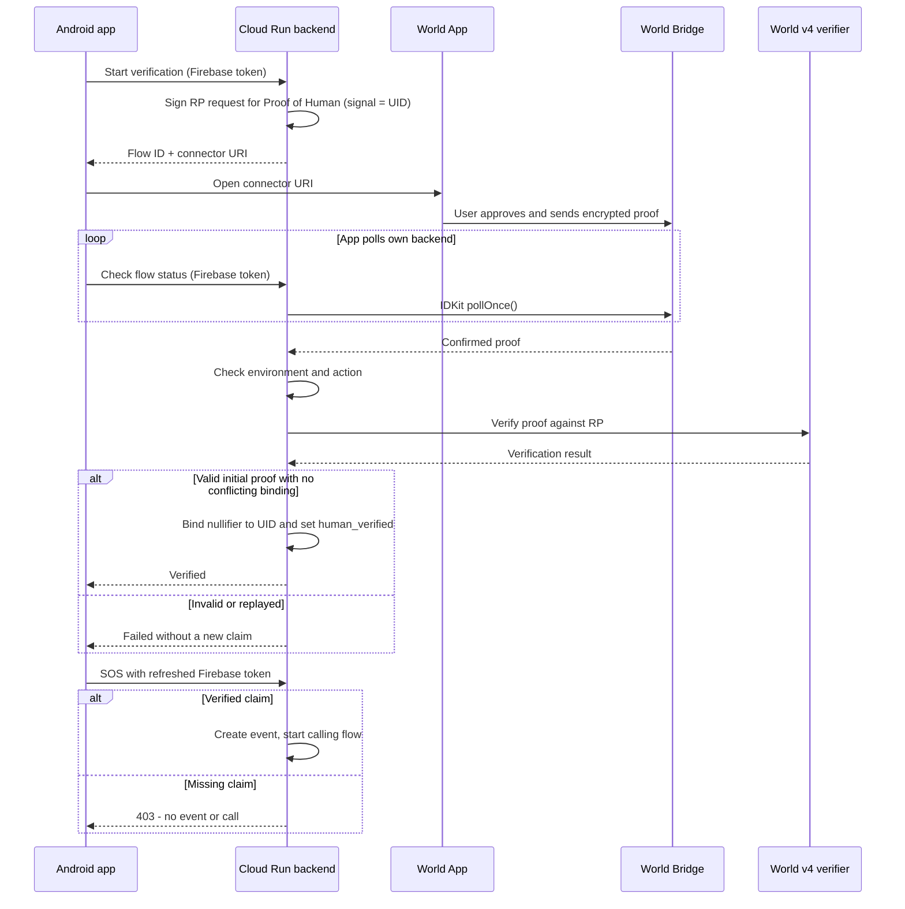

# LIFELiNK

> **You are never alone.** One button calls someone you trust—even when you cannot speak.

[Try the Android app / Download APK](https://lifelink-56179519-0e8c-4306-abad-ef9019fcec0e-4qp2xid4rq-an.a.run.app/) · ETHGlobal Tokyo 2026 · [World: Best Use of IDKit](https://ethglobal.com/events/tokyo2026/prizes/world)

## The idea

LIFELiNK calls a **pre-registered contact** when you press SOS on screen or long-press a linked BLE button. An AI explains what it knows; trusted friends get a Discord alert and can send updates into the call. The owner sees a live event feed.

What if crypto's next everyday use were not a wallet, stablecoin, or speculative asset, but the trust layer behind a call for help? In the future, an emergency contact might be a **police desk or a security company**. Such calls cannot be treated like unlimited anonymous notifications: if anyone could create endless caller identities and trigger automated alerts, the service would not be socially viable. **Human verification is a prerequisite for LIFELiNK to exist responsibly, not an optional login badge.** World ID lets us check human uniqueness without collecting legal IDs just to enable SOS; our current account-binding rules still need hardening before such institutional use.

**Today's demo calls only a pre-registered, consenting contact—not the police or a security company.** Proof of Human does not prove that an emergency is real or prevent every false alarm. Routing calls to public safety or professional responders would also require their agreement, stronger abuse controls, and operational/legal review. Proof of Human is **not legal KYC**; the app still handles necessary personal data such as phone numbers and call transcripts. Optional profile details are separate from World ID verification.

## How it works

1. **Verify before SOS.** Sign in with Google, then complete IDKit's **Proof of Human** request in World App. Our backend signs the request, verifies the result with World's v4 API, binds the **initial** proof's nullifier to the Firebase account, and grants `human_verified`. World ID is the human gate; Google is the app login.
2. **Press SOS.** Three screen taps, a two-second hold, or a linked +Beacon long press starts one idempotent emergency event. The backend checks `human_verified` **before** allowing an event or a call. An unverified user receives 403; no phone call is started.
3. **Talk through AI.** The default **SOSV2-ambientMode** calls the AI and the contact from the user's SIM, then merges them into a carrier three-way call. With LIFELiNK set as the default phone app, the AI can hear the phone's surroundings while the screen stays dark. The older **SOSV1** instead has Twilio call the contact directly; it is also used when LIFELiNK is not the default phone app. Both routes use Twilio Media Streams and OpenAI Realtime for the AI leg.
4. **Bring in trusted people.** Consenting Discord contacts receive an alert and call transcripts. Their replies can be relayed by the AI during the call; the owner sees updates in a Firestore-backed feed. Only prefecture-level location—not raw coordinates—is persisted or spoken.

World App delivers the proof to the backend through World's Bridge; the APK never receives the proof or the RP signing key:

```mermaid
sequenceDiagram
	participant A as Android app
	participant B as Cloud Run backend
	participant W as World App
	participant R as World Bridge
	participant V as World v4 verifier
	A->>B: Start verification (Firebase token)
	B->>B: Sign RP request for Proof of Human (signal = UID)
	B-->>A: Flow ID + connector URI
	A->>W: Open connector URI
	W->>R: User approves and sends encrypted proof
	loop App polls own backend
		A->>B: Check flow status (Firebase token)
		B->>R: IDKit pollOnce()
	end
	R-->>B: Confirmed proof
	B->>B: Check environment and action
	B->>V: Verify proof against RP
	V-->>B: Verification result
	alt Valid initial proof with no conflicting binding
		B->>B: Bind nullifier to UID and set human_verified
		B-->>A: Verified
	else Invalid or replayed
		B-->>A: Failed without a new claim
	end
	A->>B: SOS with refreshed Firebase token
	alt Verified claim
		B->>B: Create event, start calling flow
	else Missing claim
		B-->>A: 403 - no event or call
	end
```

| Component | Job |
| --- | --- |
| Android / Kotlin / Compose + BLE | SOS button, +Beacon monitoring, World App handoff, live feed, SOSV2 carrier conference |
| World ID 4 / IDKit Core + Firebase Auth | Proof of Human verified server-side; custom claim gates the emergency endpoint |
| Cloud Run / Fastify / Firestore | Authorization, consent, idempotent events, live updates; secrets in Secret Manager |
| Twilio + OpenAI Realtime | Phone and AI audio bridge (G.711 μ-law, 8 kHz) |
| Discord OAuth + Bot | Opt-in friend alerts, transcripts, signed replies |

The current backend keeps live AI sessions in memory, so its Cloud Run service is deliberately limited to **one instance**. This is a hackathon prototype, **not** a guaranteed emergency-services replacement; BLE reception, carrier conferencing, call delivery, and consent/retention still need production hardening. In particular, the current invite does not explicitly disclose transcript sharing, and the person answering the call is not told about it; both must be addressed before release.

## World — Best Use of IDKit

Our answers to the five [qualification requirements](https://ethglobal.com/events/tokyo2026/prizes/world):

| Requirement | LIFELiNK's answer |
| --- | --- |
| **1. Integrate IDKit in a functioning app** | An Android app uses a backend-generated IDKit Core request and opens World App. On a real phone, verification unlocked an actual emergency call; a locked-phone +Beacon also started a tested SOSV2 three-way call on Samsung/SoftBank. [Test record](doc/ja-jp/tasks.md). |
| **2. Use a supported credential; verify server-side** | **Proof of Human** in production. Cloud Run signs the RP request and checks the result with World's v4 verifier. For **initial verification** it binds the nullifier to the Firebase UID; re-verifications are recorded separately. Only after successful verification does it grant `human_verified`. The SOS endpoint checks that claim; the client cannot authorize itself. |
| **3. Identify the trust moment and minimum sufficient assurance** | **Before initiating a serious automated emergency call to another person.** Future recipients may include police or security companies, so letting one person create unlimited verified caller identities would undermine the product's legitimacy. Proof of Human offers app/action-scoped uniqueness without collecting passports or legal identities; a passport or Selfie Check score is not needed for this gate. Our current initial-action nullifier binding limits account reuse but is **not yet a strict one-human-one-account guarantee across re-verification actions**. It also does not prove that an alert is genuine or replace responder consent and abuse controls. |
| **4. Show success and a meaningful alternative path** | A production proof succeeded on a real device and SOS placed a call. Removing World ID verification in Settings was also tested on-device: SOS stopped; re-verifying restored it. A request whose ID token lacks `human_verified` gets **403 before creating an event or placing a call**; a failed first proof does not grant the claim. Revocation is **not immediately enforced against previously issued ID tokens**; the app refreshes its token, but server-side immediate invalidation is future hardening. |
| **5. Integration debrief** | **Time to first success:** not measured, so no invented figure. **Friction:** a small Node `file://` WASM-loading workaround and transient DNS failure during polling. **Missing docs/capability:** no major blocker; the SDK is straightforward and Docs, Skill, and Developer Portal MCP make agentic development easy. **One improvement:** an official Android → World App → backend example would make this already smooth path even faster. |

World's nullifier changes with the action. Our initial-action check prevents that same initial proof from being bound to a different Firebase account, but re-verification uses fresh actions and currently does not compare the new proof to the original human. Thus **strict one-human-one-account is a goal, not a claim about the current implementation**. Nor is there a per-call biometric check or an unconditional guarantee against misuse.

## See it, build it, and know the limits

- [APK download and installation](https://lifelink-56179519-0e8c-4306-abad-ef9019fcec0e-4qp2xid4rq-an.a.run.app/) · [Implementation plan](doc/en/plan.md) · [Current tasks](doc/en/tasks.md) · [Reproducible MVP evidence](doc/en/mvp0.1.md)
- World proof and claim: [backend/src/worldid.ts](backend/src/worldid.ts), [backend/src/auth.ts](backend/src/auth.ts); event/call flow: [backend/src/server.ts](backend/src/server.ts), [backend/src/voice.ts](backend/src/voice.ts); SOSV2: [conference orchestration](android/app/src/main/java/com/rtree/LIFELiNK/ConferenceSosOrchestrator.kt).
- Detailed docs: [English](doc/en) · [日本語](doc/ja-jp). Existing World ID RP and production action must be reused; keys belong in Secret Manager, never in the repository.

**A proof of human should open a lifeline, not another account screen.**