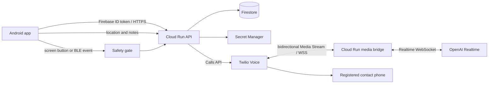

# LIFELiNK Implementation Plan

Last updated: 2026-09-26

> If you are resuming work in a new session, read `doc/en/handover.md` (invariants that must not be broken, environment/build/deploy/verification commands, known pitfalls) before this document. This document is the source of truth for the design; refer only to the chapters you need.

### Current priority decisions as of 2026-09-26 (these take precedence over the older phase descriptions below)

- **As of 2026-09-26 21:00: SOSV2-ambientMode (carrier 3-way conference) has been verified end-to-end and is now the default for Beacon.**
  Pressing +Beacon while locked → Discord emergency DM → the device calls the AI number (with a join code) → calls the contact → automatic conferencing — the user has confirmed this on a real device.
  The originating device stays silent with the screen off. The old method can be selected in Settings as `SOSV1-nope`, and if the phone app is not configured it automatically falls back to V1.
  Bullet points below labeled "not yet implemented / not yet verified" are kept for historical context. For the current state, see tasks P2-12 through P2-16 (DONE) and P2-17 onward.
- **2026-09-26 human decision**: With SOSV2, if the AI fails to join, we do not call the contact directly (because the SOS and location have already reached Discord).
  Consent wording for the Discord invitation (transcription, ambient audio) will be handled in the production version. On-device verification of the 60-second cutoff and the V1 fallback is PX.
- **Profile (frozen; part of P1-06a brought forward)**: `users/{uid}` gets `full_name: string | null` (1–80 characters), `birth_date: string | null` (`YYYY-MM-DD`),
  and `profile_updated_at`. Writes go through `PUT /v1/profile` (Firebase auth, backend-only write); reads go through `GET /v1/profile`.
  In its first utterance, the AI says "The person who pressed SOS is <full name>, born <birth date> (<age> years old)." If not set, it says nothing. It is not included in the Discord DM body (though it does flow through the transcript).
- **World ID revocation (P1-18, frozen)**: `POST /v1/world-id/revoke` (Firebase auth) removes the `human_verified` custom claim.
  The `world_id_nullifiers` binding is kept (to prevent the same human from reusing verification under a different account). Re-verification on the same account is possible via the existing flow. After revocation, `POST /v1/emergency-events` returns 403.
  Whether this is a re-verification is determined not by the claim but by "does this UID have entries in `world_id_nullifiers`"; if so, a unique action (`verify-emergency-caller-reverify-<uuid>`) is used.
  This is because World ID rejects a second proof from the same human under the same action with `nullifier_replayed` (hit on a real device on 2026-09-26, fixed in rev `00035-bsv`).
- **AI role configuration (2026-09-26 human decision, applies to both V1/V2)**: The person who pressed SOS may be unable to speak or may be hiding (do not make them answer by voice; do not treat silence as "safe").
  The phone contact is assumed to be **someone who can actually go help**, such as police or a security company, so information should be proactively conveyed. Discord is assumed to be **family/friends who are nearby**.
- **No user allow-list will be set up during the hackathon** (2026-09-26 human decision). We accept the risk that a third party issuing SOS via the APK could incur Twilio/OpenAI charges.
- **Periodic location updates (2026-09-26)**: Add `location` as a type to the watch FGS (`BeaconMonitorService`) (since it starts from the foreground, it stays within while-in-use constraints and does not need `ACCESS_BACKGROUND_LOCATION`),
  sending `POST /v1/locations` every 5 minutes even with the screen off/locked, and sending `location` updates to the event every 20 seconds while an SOS is in progress. As before, only prefecture-level location, accuracy, battery, and motion are persisted.
- MVP 0.1 (phone, Beacon, Discord) and P1-16/17/20 are complete. The situation store migration in Chapter 8a is postponed to PX-14–19 and will not be implemented during the hackathon.
- **Ambient audio via a carrier 3-way conference will be tried experimentally first.** The Galaxy + SoftBank manual "add call → merge → 3-way bidirectional audio → mic still reachable while locked" flow has been confirmed by the user.
  Twilio AI joining, making LIFELiNK the default dialer, automatic calling/merging, and Beacon route selection are not yet implemented/verified.
- The architecture we're adopting is a **carrier/IMS conference** via `ROLE_DIALER` + `InCallService` + `Call.conference(otherCall)`.
  **This is not a Twilio Conference.** Twilio provides a single AI call leg, connected to the existing Realtime setup via bidirectional Media Streams. No independent `AudioRecord` is needed.
- We reuse the existing Cloud Run (`maxScale=1`), the Firestore `emergency_events` / `updates` collections, and the existing Discord Bot/DM/reply mechanism.
  We preserve normal SOS and the current outbound number; the experimental number will be chosen only after confirming its purpose and ownership. We will not repurpose a number from an old project without checking.
- Order of work: **confirm the number/recovery criteria and contract → prepare an isolated event + inbound webhook → AI solo/manual conference via the standard dialer →
  a minimal ~2-screen dialer + experimental SOS → a Beacon SOS route setting in Settings (Existing as default / Carrier conference as opt-in)**.
  Since this also has to handle normal incoming calls, we will not settle for a superficial 2-screen role mapping.
- A webhook alone is not enough. Since the existing event-creation path makes an automatic outbound call, the experiment must not do that; instead we need a path that prepares the real event/DM, and a design that binds an inbound CallSid to an already-authenticated pending event exactly once.
  We will not authorize based on caller ID alone. We must avoid mistaking the mixed transcript for a specific speaker, and distinguish between the AI leg ending and the carrier conference ending.
- **New schema/API are not yet frozen.** Mode, time-limited one-time matching, SID/state, handing the registered number to the device, mixed-speaker labeling, and timeout/termination will be finalized in this document first under P2-12, before implementation. We avoid unauthorized double-dialing, and the initial experiment reverts to the old SOS manually on failure.
- Raw audio is not persisted, but call audio does flow through the carrier, Twilio, and OpenAI. We will confirm explanations to the user and consenting participants, Discord sharing, and output routes/audio leakage. The local recording idea (P2-09–11) is kept as a separate alternative and is not a prerequisite for the phone experiment.
- Investigation, evidence, staged gating, and rollback are in **`doc/en/ambient-verification.md` Chapter 0**; the experimental tasks are **P2-12–16**.

### Frozen contract for the carrier conference experiment (P2-12, 2026-09-26, human-approved)

The AI's listening number is Twilio `PNbe25648b5f32bd261cb3ac9039855fd3` (the number itself is stored in the Cloud Run env var `TWILIO_AI_INBOUND_NUMBER` and not written to the repo).

- `POST /v1/emergency-events` gains an optional `mode: "outbound" | "carrier_conference"` (default `outbound`, i.e., unchanged).
  With `carrier_conference`, the Discord notification behaves as before, but **no Twilio outbound call is made**. The response adds
  `ai_number`, `join_code` (6 digits), and `join_expires_at` (10 minutes later). If the same event ID is resubmitted, the code is reissued if unused.
  From P2-15, `contact_phone` (the E.164 number of the contact the user registered; included only in responses to the authenticated owner, and not newly written to logs or Firestore) is also returned, so a custom dialer can call the contact.
- Fields added to `emergency_events/{id}` (backend-only write):
  `mode`, `join_code_hash` (SHA-256; the plaintext is never stored or logged), `join_expires_at`, `join_used_at`.
  The meaning of the existing `state` is preserved: created as `accepted` → `in_progress` once the code matches (the AI's inbound CallSid is bound to `twilio_call_sid` exactly once) → `completed` when the AI leg ends.
- `POST /v1/twilio/inbound` (the number's Voice URL, signature-verified, requires `To` to be the AI number): uses `<Gather>` to request a 6-digit DTMF code.
- `POST /v1/twilio/inbound/join` (signature-verified): binds only an event whose hash matches, is unused, within the expiry window, unbound, and in state `accepted`, then connects it to the same `<Connect><Stream>` as before (with `<Parameter emergencyEventId>`). On mismatch, it hangs up without reading anything.
- `POST /v1/twilio/inbound/status` (the number's status callback, signature-verified): looks up the event by CallSid, and if the status is terminal, sets it to `completed`.
- The first utterance opens with "LIFELiNK's AI has joined this call. The caller and a trusted contact may be on the same call," and then continues with the existing situation briefing.
- `updates.type: transcript_contact` is unchanged. In carrier_conference mode it means **the caller's and contact's audio mixed together** (the Discord display remains the existing "Person on the call").
- Fallback if DTMF fails to get through (human-approved): treat the caller as verified based on caller ID alone. If that happens, this section must be revised first.
- **Disconnection policy (2026-09-26 human decision)**: Since the conference parent is the Galaxy, hanging up ends all legs when the caller does. If the caller doesn't hang up, that's an emergency call, so we do not auto-disconnect on silence or hold. There are exactly two exceptions: (1) the AI leg — backend closes the Stream and leaves after 60 minutes
  (a human-to-human carrier call is never disconnected/hung up by us; implemented in rev `00031-dfn`). (2) If the contact doesn't answer after 60 seconds of ringing, stop dialing.
  (2) cannot be controlled from the standard dialer, so it will be implemented in P2-15's custom dialer (`InCallService` calls `disconnect()` if DIALING lasts 60 seconds).
  Note that if voicemail answers, it may end up merged into the conference as-is.
- **AI instructions (rev `00031-dfn`)**: For carrier_conference, session instructions now include: "this is a 3-way call with mixed audio, so infer speakers (the first voice is likely the caller, a voice that joins later is likely the contact); do not respond to automatic hold announcements; describe ambient sounds only as possibilities." The English-language policy is unchanged.
- The first Android implementation simply places an "Experimental: conference SOS" button on Home, displays the code, and opens the standard dialer via `ACTION_DIAL` (`tel:<AI number>,,<code>`). The custom dialer (P2-15) and Beacon selection (P2-16) come after this.
- **Beacon SOS mode (2026-09-26 human decision, P2-16)**: In Settings, choose between `SOSV1-nope` (the old backend → contact flow) and `SOSV2-ambientMode` (carrier conference).
  **The default is SOSV2-ambientMode** (changed by human decision from the original plan of "default is existing"). This is a device-local setting (`beacon_sos_mode`).
  If LIFELiNK is not the default phone app, or `CALL_PHONE` is unavailable, Beacon automatically falls back to SOSV1 (to avoid a silent no-op).

## 1. Product Goals

When a user presses a button in a situation where they cannot speak, LIFELiNK places an AI-voiced call to a pre-registered contact and conveys, at the start of the call, whatever current location, address, and situation information could be collected before dialing.

This app is not a substitute for official emergency reporting. It does not automatically dial public emergency numbers such as police, fire, or ambulance services; it assists in contacting family, friends, or others the user has designated.

The core of this product is not the phone call alone. Pressing the button has the AI call a pre-registered party while, in parallel, notifying a consenting friend of the situation and receiving their reply as reference information for the emergency event. **The Discord individual DM/reply end-to-end flow is the remaining unfinished part of the hackathon MVP main line, following phone/iBeacon.** The real phone call and the iBeacon long-press call were verified on 2026-09-26; next is verifying Discord with real accounts. In-app friend linking and sharing UI between Google accounts is a future optional feature. Requiring every friend to install LIFELiNK is not a condition for Discord notifications.

## 1a. Key Use Cases (shared domain understanding, 2026-09-26)

Before revisiting the API and data structures, we first enumerate the use cases we need to support, to align understanding. For each item we note how well the current design addresses it and any gaps found.

1. **Initial linking and re-registration of the physical button**: During initial setup, the user links a physical button (Beacon or GATT) to their account. For Beacon, this means detecting advertisements and accurately registering the identifier (UUID/Major/Minor) of the specific unit they own. For GATT, this means a "pairing-equivalent" procedure of scan → connect → (bonding if needed) → service discovery. Both should be un-linkable and re-registerable later.
  - **Already implemented**: Android displays nearby iBeacon, GATT Service, Manufacturer, and Other advertisements as separate cards by type. Once a card is received, it is not removed for the rest of the app process's session; only the receive count, RSSI, and last-seen time (top right) for that same unit are updated. Cards are fixed in ascending order of display name within a type and are not reordered by receive order, so a specific physical button can still be selected even in a crowded environment. iBeacon cards show the UUID/Major/Minor and a device-local-only BLE address identifier; GATT candidates show the Service UUID; both can be linked/unlinked from the card.
  - **Remaining gap**: The current link information is stored locally on the device only; the API and Firestore schema to sync it to the user account are not yet implemented. In the next API/data implementation, the selected unit should be saved to a real document under `users/{uid}` so it can be restored after a reinstall. The Beacon's BLE address should remain limited to on-device identification aid and not be sent to the backend.
2. **Answering questions from the person on the call**: When the person on the call asks "where are you right now" or "is there anyone who knows the situation," gather relevant facts from the situation store and answer.
   - **Current status**: Broadly addressed by `get_current_situation`/`get_session_history`/`delegate_investigation` in Chapter 8a. However, a question like "does anyone know" implicitly expects a search for `facts.kind: friend_reply`, which is not explicitly called out in the Realtime instructions as a search target. Next time, we need to decide whether to explicitly include friend statements in the instructions and in the `topic` enum of `get_session_history`.
3. **Scope of information accumulated in the situation store**: For each emergency call, we accumulate (a) location information (for demo purposes, a place name rounded to prefecture level, but with the accuracy value `accuracy_m` itself kept exact), (b) information from friends via Discord or an in-app LIFELiNK-to-LIFELiNK link, (c) information from information providers added in the future, and (d) who is the primary user and who are friend users in the first place — and OpenAI Realtime can search/retrieve all of this to answer questions.
   - **Resolved (2026-09-26, schema)**: We restored `accuracy_m` to `facts.value` (`kind: location`) in Chapter 8a and to `state/current.location`. What should be discarded is latitude/longitude and street-level addresses — the accuracy value itself does not reveal location and can be kept. **Remaining work**: `sanitizeLocationForPersistence()` in `backend/src/server.ts`, which writes to the P0-side `users/{uid}/locations` and `emergency_events.location_snapshot`, still discards `accuracy_m`, and since this is a separate write path from the P2 `facts`/`state/current`, it needs to be fixed as well. This code change is deferred to next time so as not to conflict with the Discord main line (the same file is currently being edited).
   - **Resolved (2026-09-26, schema)**: Added `actor_name: string | null` to `facts.source` (Chapter 8a).
   - "Who is the primary user and who is a friend" is already expressed via `emergencySessions.owner_uid`/`participant_uids`, with no further gap.
4. **Notification path to friends**: When an emergency call occurs, friends can also be contacted via Discord or in-app sharing.
  - **Current status**: The real phone/iBeacon call flow is verified. The next MVP main line is real-account verification of Discord individual DMs and replies (P0-16–P0-20). App-to-app sharing is a future optional feature. Neither form of friend sharing has been implemented yet.
5. **Three tiers of authorization**: The app can be used without World ID proof-of-human (login and initial setup are possible), but proof of human is required for emergency calling. A Google account is required just to log into the app at all.
   - **Current status**: The Chapter 5 / Chapter 8a design, along with the two-stage `authenticate` (Google only) and `requireHumanVerification` (Google + World ID) implementation in `backend/src/auth.ts`, matches this three-tier authorization model exactly. No further gap.
6. **Friend linking starts with Discord**: Notification targets are registered via Discord identity with explicit consent. Mutual linking via Google accounts between LIFELiNK apps can also be considered in the future.
  - **Policy decision (updated 2026-09-26)**: Only the individual-DM end-to-end flow via `discordContacts` will be implemented first. The common abstraction of `friend_links` or `link_type: lifelink | discord` will not be implemented until it's actually needed. In-app friend linking is a future feature and is not a commitment to implement after Discord succeeds. A friend is not determined merely by manually typing in a Google email address.
7. **UI split across multiple screens**: Rather than cramming everything into one screen, features are split across screens, as shared in the uimock. This matters not just for initial registration but also for later update/re-registration operations (re-registering the physical button from item 1, unlinking a friend from item 6, etc.).
   - **Current status**: The screen inventory in Chapter 4a already adopts a multi-screen structure. However, there are places where a "register" screen exists but no explicit "unlink/re-register" screen/action (friend unlinking, physical button re-registration). The next round of screen design should explicitly add unlink/edit affordances to all registration-type screens.

Of the gaps above, account-linking of the physical button and `accuracy_m` will be considered in the next round of API/data design. Whether to build a dual in-app friend link system is a future re-evaluation item and should not hold up the current Discord schema.

8. **Live display of calls/situation (within our own app, added 2026-09-26)**: Separate from the sequential relay to Discord DMs (Chapter 4a), LIFELiNK's own app should also display the call transcript and information from friends in a chat-like format (Discord channel / WhatsApp-like appearance, closer to the uimock's style).
   - **Approach (decided 2026-09-26)**: No new schema is needed. The existing `emergency_events/{id}/updates` (`type: note|location|transcript_contact|transcript_ai|friend_comment|system`) can be subscribed to and displayed as a chronological chat directly from Android. This can be implemented before waiting for the migration to P2 (`emergencySessions`/`timeline`) (per the Chapter 3 principle of "no mocks, only real schema," the subscription target must be the real `emergency_events` only). After migrating to P2, the subscription target switches to `timeline`, but the UI message-formatting logic itself should be designed to be reusable.
9. **Accumulating situational awareness from nearby speakers/cameras (added 2026-09-26)**: Where possible, analyze surrounding audio/video to accumulate situation information so the AI can answer questions from the person on the call or from Discord friends.
  - **Approach (updated 2026-09-26)**: First, limit this to audio and evaluate it via the initial carrier-conference experiment (P2-12–16). The `facts.kind: ambient_observation` in Chapter 8a is a deferred future design, not a dependency. We use the existing `emergency_events` / `updates`; raw audio is not stored but is sent externally via the phone call. If we do independent recording, the idea of adding `updates.type: ambient` should be frozen first. Video capture is not included in this experiment.
10. **World ID re-verification, revocation, and Passport/Selfie support (added 2026-09-26)**: If verification expires, the user can re-verify from the settings screen, and there is also an operation to revoke verification itself. In addition to Proof of Human, Passport and Selfie Check should also be supported.
    - **Approach (decided 2026-09-26)**: On the IDKit side, this can be handled just by adding `passport`/`face` etc. to the `credential_types` policy (the SDK already supports this). Adding/removing the `human_verified` custom claim can reuse the two-stage authorization model (Google → World ID) from Chapters 5 and 8a as-is; we just need to add small APIs for re-verification/revocation to `backend/src/worldid.ts` (a separate file from `server.ts`/`config.ts`/`discord.ts`, which the Discord implementation touches). A new settings screen (roughly mock 1-6) will be created. Work on this begins after items 8 and 9 (see the execution order in the next paragraph).

**2026-09-26 execution order decision (human-confirmed, roughly 10 hours of remaining time)**: ⑧chat UI (keeping `emergency_events` as-is) → English/B2C-oriented UI polish (not a single phase, but done incrementally on whichever screens are touched from here on) → ⑨ambient information accumulation (P2 prerequisite) → ⑩World ID re-verification/revocation/Passport & Selfie.

We define the **completion criterion for the Discord-inclusive MVP main line** as: the following end-to-end flow succeeding at least once on a real Android device with a consenting real Discord account, with evidence retained. Steps 1–9 (phone/iBeacon dialing, bidirectional calling, and the happy path of in-call notes) are verified (real-call verification of location updates is separate). Steps 10–12 are not yet implemented/verified, and the DONE status of P0-15 should not be conflated with the DONE status of the overall MVP.

1. The user logs in on Android.
2. Android saves the current location, the time it was captured, and the accuracy.
3. The user registers an emergency contact, and the backend can reference it by `contact_id` rather than the raw phone number.
4. An explicit on-screen emergency button, or an existing BLE event, is passed to the Safety gate.
5. Only one call request is accepted per emergency event.
6. The backend resolves the authenticated user's `contact_id` and places a call from Twilio to the registered destination.
7. Twilio Media Streams and the OpenAI Realtime API are connected via a bidirectional WebSocket.
8. The AI first states that this is a call from an emergency-contact app, the prefecture-level current location, and the time (or elapsed time) since that information was captured. For the demo, it does not state GPS coordinates or a detailed address.
9. Notes or new location information sent from Android during the call are added to the AI's conversation context and can be conveyed to the other party.
10. The caller issues a one-on-one Discord invitation, the recipient completes identity verification and consents to emergency DMs / prefecture-level location sharing, and can be registered and unregistered as a contact.
11. A consenting recipient can actually receive and respond to the Bot's test DM, and success/failure of DM delivery in parallel with an SOS can be confirmed. Even if Discord is unavailable, the phone call continues.
12. A reply sent by a consenting recipient via a Discord button→modal, after verifying signature, speaker, and target event, is recorded exactly once as reference information on the same emergency event. Neither the call nor the DM is duplicated on retry.

A successful build, a mock call, generating TwiML, or registering secrets alone does not count as completing the MVP main line. The real phone call and iBeacon long-press are verified, but verification of real Discord DMs/replies is yet to come. Exhaustive failure-path coverage and long-duration lock testing are split off into P3, and this section confirms that calls continue even when Discord delivery fails.

## 3. MVP Scope

### Implemented this round

- Android login
- Getting/saving current location and reverse geocoding
- Registering/selecting an emergency contact
- An explicit on-screen emergency button
- Connecting to the same Safety gate when an existing BLE event is available
- Two-tier duplicate-call prevention (device and backend)
- Firebase Authentication, Firestore, Cloud Run, Secret Manager
- Proof of human via World ID / IDKit, and authorization of the calling API
- Twilio Programmable Voice, bidirectional Media Streams
- The AI's first utterance, ongoing conversation, and mid-call information injection via the OpenAI Realtime API
- A minimal UI on Android showing call state and failure reasons
- Structured logging needed to verify the real-call end-to-end flow
- One-on-one Discord invitations, the recipient's own `identify` and notification consent, and display/removal of approved contacts
- A Bot test DM from Cloud Run, a one-time DM in parallel with an SOS event, and saving the recipient's button/modal reply as an event
- Real-account end-to-end verification that treats Discord non-delivery/failure separately from the phone call, without making phone-call success depend on Discord

### Out of the MVP main line even after the phone/iBeacon real call succeeds

The following are not included in the completion criteria for the MVP main line (phone, iBeacon, Discord individual DM/reply).

- Google/Firebase friend linking between LIFELiNK apps and friend-facing sharing UI (future optional feature)
- Discord-like call/conversation history
- Relaying ambient audio from the Android microphone
- A GATT button with always-on response while locked (**2026-09-26 decision: a stretch goal, lowest priority on this list. Since iBeacon works on real hardware, this is taken up only if everything else is finished and time remains**)
- Play Store publishing readiness
- Call recording, long-term transcript storage

The real data structure and API boundary for Discord individual contacts must be finalized in this document first under P0-16, before implementation. We will not build inter-app `friend_links` or a Google friend UI as a prerequisite for Discord.

### Implementation order after the main line is complete (finalized 2026-09-26)

**2026-09-26 progress update**: P0-14a/P0-15 completed their happy path on real hardware (long-press → one phone call). Next is verifying **P0-16–P0-20 Discord individual contacts** end-to-end, ahead of P1/P2 and GATT. Exhaustive failure-path coverage has, per human decision, been split off into P3.

**Fundamental principle: don't build mocks — always build incrementally against the real schema and real data.** Rather than the false choice of "UI first vs. backend first," the rule is: "regardless of how complete the backend is, the UI only ever looks at real Firestore collections from the start." As long as this principle holds, no matter how much backend functionality is added later, the UI code needs no changes, and structurally we avoid "confusion between mocks and what's actually implemented." The fixed contract in Chapter 8a ("Authorization and Safety") for read/write paths (Android reads Firestore directly; writes always go through the backend API) underpins this principle and will not change going forward.

1. **P0-14a/P0-15: The real-hardware happy path for phone and iBeacon is complete.** Confirmed zero calls on short press/idle advertising, and exactly one real call on a single long press. Coverage of permission denial and external API failures is left to P3.
2. **P0-16–P0-20: Push the Discord individual-DM MVP main line through.** Freeze in `doc/en/plan.md` first the real data storage (private invitations/contacts, delivery state and replies to events) and API contract, then verify with real Discord accounts and Cloud Run/Firestore: identity-verified invitation → the recipient's explicit consent → a Bot test DM and button response → a DM when a real phone event actually occurs → saving the modal reply. The existing `emergency_events/{id}/updates` serves as the source of truth for these **real verification events**. No dummy or temporary UI fixtures will be created, though. Bot send failures, 429s, or timeouts must not stop the phone call, and duplicate DMs must be suppressed.
3. **After the Discord end-to-end flow is confirmed, implement P2's minimal write path.** Solidify writes of new real events to `emergencySessions`/`facts`/`state/current`/`timeline`, and have Discord replies land as `friend_reply` facts and `friend_message` timeline entries too. Existing `emergency_events` test data is not migrated. Any schema change must first be reflected in this document.
4. **From here, parallelize the Full UI, delegations, etc.** Android subscribes directly to the real P2 collections via Firestore, and the backend writes to the same schema. Google friend linking between LIFELiNK apps and friend-facing UI are deferred as a separate future decision, and third-party reply injection into the AI, GATT, and recording are handled as individual follow-on work. Unimplemented screens must clearly show "coming soon" rather than displaying a dummy.
5. **Remaining-time checkpoint**: The phone/iBeacon happy path has been passed. If Discord gets stuck on recipient consent or Bot DM delivery conditions, record the measured failure and fall back to a working phone+iBeacon demo. Once the Discord end-to-end flow succeeds, keep that result and spend the remaining time on Full UI/P2.

**Decisions (2026-09-26, human-confirmed)**:

- P2 will ultimately implement the full set including `delegations` (Responses delegation), but **the order of attack is "lock down the minimal write path (facts/state/timeline) first, then parallelize the UI and delegations onward from there."** We will not sequentially finish everything before starting the UI (see the discussion log at the end of this section for the reasoning process).
- The real device test data already present in P0's `emergency_events`/`updates` **will be left as-is with no migration script written**. After the P2 migration, only new events use the `emergencySessions`-family schema. Old events are kept purely as a record of real-hardware verification history, and the UI can be built assuming it only reads the new schema.
- Android's Full UI implementation will not start with mock data. It starts only once the backend has provided a minimal write path for `facts`/`state/current`/`timeline` and real documents have actually landed in Firestore.
- The Discord pre-verification is not a preliminary implementation of the Full UI. Delivery and replies are verified first against the existing, real `emergency_events`, and the switch to P2 happens later by changing the write boundary. The phone call's idempotency is unchanged.

## 4. User Flow

### Initial Setup

1. Log into the Android app.
2. Show the purpose of location use and obtain Foreground location permission.
3. Register the emergency contact's name and phone number.
4. The backend normalizes the phone number to E.164 format and stores it, returning a `contact_id` to Android.
5. Confirm the number and audio path are correct with a test call.

### Emergency Call

1. The user explicitly presses the on-screen emergency button, or a linked BLE event occurs.
2. Android obtains the freshest possible location and snapshots the already-captured address, accuracy, capture time, and notes.
3. The Safety gate checks for accidental activation, short-interval duplicates, and an event already in progress.
4. Android sends a unique `emergency_event_id` and the registered `contact_id` to the backend.
5. The backend verifies the Firebase ID token, ownership, contact, and event idempotency.
6. The backend persists the event and then creates exactly one Twilio call.
7. When the recipient answers, the Media Stream is connected to OpenAI Realtime, which speaks the location information first.
8. Android sends notes/location updates from the event screen, and the backend appends them to the corresponding call session.
9. After the call ends, the success/failure state and minimal audit information are saved.

### Discord-style UI screen flow (design finalized first; implementation from P1 onward)

On 2026-09-26 a full UI mock (`doc/uimock/`) was provided, and a screen inventory and open questions derived from the final target state were summarized in Chapter 4a. The content of this section has been merged into Chapter 4a, which is now the authoritative source.

## 4a. Full UI Screen Flow (worked backward from the final target state, per the UI mock, design finalized first / implementation from P1 onward)

Source: `doc/uimock/` (20 screenshot screens). Based on the policy (per user instruction) that, for a hackathon, it's worth seeing the complete UI vision before every component works, we finalize the screen flow and data requirements first without stopping the main line.

### Screen Inventory

| Mock ID | Screen | Key elements | Corresponding phase | Relationship to existing design |
| --- | --- | --- | --- | --- |
| 1-1 | App launch | Branding, Get started / Log in | P0 | Corresponds to the already-implemented Android launch screen |
| 1-2–1-4 | World ID registration (explanation → Proof of Human → verification result) | IDKit widget, `nullifier_hash`, `verified_at` display | P0-08A | Matches the World ID authorization design in Chapters 5/8a. The screen corresponding to the Android-side IDKit call |
| 1-4b | Verification failure | Failure reason, retry, (demo only) continue treated as verified | P0-08A | Failure display when `human_verified` is not set. The demo-only bypass path must not remain in production builds |
| 1-5 | Profile setup | Nickname, area, location-sharing toggle | P0/P1 | **New**: add `nickname`/`area` fields to `users/{uid}` (not yet in the Chapter 6 data model) |
| 1-6 | Alert voice settings | Speech language (Japanese/both/English), two-stage announcement wording for send/connect, Silent SOS toggle | P1 | **New feature**: separate from Chapter 8's "AI's first utterance spec," this is the device itself giving local TTS voice guidance. Details at the end of this section |
| 2-1–2-5 | Emergency contact registration (Discord invite → join → registration complete) | One-on-one consent-based invite link, list of registered recipients, test DM and removal | P1 | **Implemented first**: rather than a server-side participant list, this is a Discord individual contact explicitly approved by the invited party. Verified after the phone/iBeacon real-hardware confirmation. App-to-app linking follows |
| 3-1 | SOS button | Long-press to send | P0-09 | Matches the screen button and Safety gate under implementation |
| 3-2 | Alert stage 1 (on send) | Screen lights up + local voice: "Emergency alert. Calling your registered emergency contact. Location recorded." | P1 | **New feature**: a device-local on-send announcement. Separate from Chapter 8's "what the AI says to the recipient." Wording uses "your registered emergency contact" as the subject rather than "police" (decided under open question 1) |
| 3-3 | In-progress status | Checklist for location acquisition, reporting, member notification, and recording-share preparation | P0/P1 | Matches the existing Safety gate → backend call order. Only needs to be turned into UI |
| 3-4 | Alert stage 2 (on connect) | Local voice only fires when the call is actually connected: "Your call to the registered emergency contact has connected." | P1 | **New feature**: subscribes to Twilio `status: in-progress`/`answered` callbacks and fires only on actual connection |
| 3-5 | Parallel status (AI call + member notification) | Call timer, Discord notification delivery status shown in parallel | P1 | UI-ification of the `emergencySessions.status` transitions in Chapter 8a |
| 3-6 | Member-side Discord notification | Prefecture-level location and time, a "Reply with situation" button | P1 | Individual DM verified first. Coordinates, precise map links, and detailed addresses are not sent, per the demo privacy policy in Chapter 8 |
| 3-7–3-8 | Member-side: post-call recording/transcript sharing | Audio file playback, download, subtitle display, incident log | P1/P2 | **Conflicts with a constraint**: Chapter 12 currently states "the MVP does not record audio." If recording/sharing is to be done, retention period, consent, and a deletion flow need to be redesigned (Open Question 2 in Chapter 13) |

### New Feature: Two-Stage Local Voice Announcement on the Device

Independent of Chapter 8's "what the AI says to the call recipient," we add a local voice (Android TTS, which sounds even in silent mode) that lets the user's own device inform **people nearby** of the situation.

- The settings screen (1-6) lets the user toggle it on/off, choose language (Japanese/English/both), and enable Silent SOS (an alternative mode that fully mutes the announcement).
- **Stage 1 (on send)**: The device speaks the instant the button is pressed, right after the Safety gate passes. It does not wait for the backend response.
- **Stage 2 (on connect)**: Speaks only when the Twilio `status callback` reports `answered`/`in-progress`. It does not speak merely because a call was placed.
- If Silent SOS is enabled, both stages are silent, conveying state via the screen display only.
- Since this feature seems to contradict the product concept of "a situation where you can't speak," the default is voice ON (prioritizing the warning/deterrent effect on bystanders), and Silent SOS is an opt-in the user selects in advance depending on the situation.

### Open Questions (for humans to decide before implementation)

1. **How far to implement the "call the police" wording/functionality** — **Decided (2026-09-26, human judgment)**: Automatic reporting to the police is not a goal. All "calls the police"-style wording/buttons in the mock will be replaced with wording whose subject is "the pre-registered emergency contact" (e.g., mock 3-6's "Call [Nearest Police Station] Police" → "Call [Pre-registered Emergency Contact]"; the Stage 1/2 announcements too, saying "Calling your registered emergency contact" rather than "Reporting to the police"). The non-goal from Chapters 1/12 (no automatic dialing of public emergency numbers) is kept as-is and made the default in both implementation and copy.
2. **Whether to share call recordings/transcripts**: Mocks 3-7/3-8 assume sharing a recording file and transcript with friends. Chapter 12 states "the MVP does not record audio." If recording is enabled, we'd need consent capture, a retention period (potentially conforming to the 7-day default in Chapter 8a), a deletion path, and additional Twilio-side recording functionality (the `Record` verb or `<Start><Recording>`). Decide whether to enable recording as an in-scope item from P1 onward.
3. **Priority of friend sharing — Decided (updated 2026-09-26)**: Verify the Discord Bot's individual DM and the recipient's modal reply first. This is not a post to everyone on a Discord server. We do not require friends to install LIFELiNK. Mutual approval linking via Google/Firebase UIDs between LIFELiNK apps (Chapter 6a) and a friend-facing in-app live UI are deferred as **future options** and are not assumed for the hackathon. Location, recordings, and transcripts are not shared to Discord unconditionally.

### Adopted Design for Discord Individual Contacts (2026-09-26, P0-16–P0-20 MVP main line)

Within the app: "invite a Discord contact" → the recipient's identity verification and notification consent → display of approved contacts → the Bot sends an individual DM in parallel with the phone call → the recipient's reply is recorded as reference information on the emergency event. **This scheme is the MVP main line that follows completion of the phone/iBeacon happy path, and is still unimplemented.** The `contact_id` for the phone destination is preserved, and success of Discord notification is not a condition for phone-call success. The P0-14a/P0-15 verification gates have been passed.

Issuing the Portal app/Bot token and securely pre-registering it in Secret Manager is complete. Setting up the public Interactions endpoint will happen once signature verification/PING response is deployed; the test DM will be sent after the recipient's consent in P0-18. Investigation and procedures are recorded in `doc/en/discord-integration.md`.

2026-09-26: The user has noted the Application ID and Public Key, and registered the Bot token/OAuth Client Secret in Secret Manager. We confirmed, **without reading the values**, that version 1 of both Secrets is `enabled` for the target project. The Discord Portal's Redirect URLs/Installation/Interactions detailed settings and the Cloud Run Secret assignment have not been done yet. We have not confirmed Bot token validity or DM delivery via the API.

- **API constraints**: A regular OAuth2 `identify` only returns the logged-in user themself, and `connections` only returns linked external accounts. `relationships.read`, needed for a friends list, requires applying for Discord Social SDK usage. We will not implement "Join Discord → show all of the user's Discord Friends" without that approval. We will not call undocumented/private APIs using user tokens or self-bots. Official reference: https://docs.discord.com/developers/topics/oauth2#shared-resources-oauth2-scopes
- **Discord-side application burden (confirmed against official docs, 2026-09-26)**: Creating a small bot application, regular `identify` OAuth, the Bot DM REST API, and HTTP Interactions for buttons/modals do not require developer KYC, pre-approval, or a paid API tier under Discord's normal published procedures. You issue an app/Bot and token in the Developer Portal, and configure the OAuth redirect URI and a public HTTPS Interactions endpoint (signature verification and PING response). However, Bot DMs can fail or be restricted depending on the recipient's settings, shared servers, etc. — **OAuth approval alone does not guarantee send permission or delivery**. `relationships.read` requires a separate Social SDK application, so we will not use it. The privileged intent review for high-volume usage (the 10,000 visible-user threshold as of 2026-06-10) is not required for this HTTP Interactions approach. Official references: https://docs.discord.com/developers/topics/oauth2 · https://docs.discord.com/developers/resources/user#create-dm · https://docs.discord.com/developers/interactions/overview#configuring-an-interactions-endpoint-url · https://docs.discord.com/developers/gateway/getting-started-with-privileged-intent-review
- **Recommended registration experience**: The app's "Discord linking" is the caller's own `identify` (optional). "Invite a Discord contact" shares a time-limited, one-time invitation URL, and the **recipient themselves** authorizes Discord `identify` or runs the Bot's linking command. The server matches the issuer's Firebase UID and invitation, and obtains the recipient's Discord ID from the OAuth `state` or the signature-verified Interaction's `user.id`. Registration is complete only once the other party explicitly approves emergency notifications and location sharing. Typing in a username alone does not constitute identity verification. The app's list is labeled "linked/approved contacts," not called a full list of Discord friends. Choosing from a shared server also does not substitute for friend determination or the recipient's own consent.
- **Notifications and replies**: For a new event, the Bot attempts a one-time DM to each selected recipient containing only minimal prefecture-level location, capture time, necessary situation info, and a "Reply with situation" button tied to the event. Per the demo privacy policy (Chapter 8), GPS coordinates, precise map links, detailed addresses, and call recordings/transcripts are not sent. DMs can fail depending on the recipient's settings or lack of a shared server, etc. (e.g., `50007`, `50278`). A successful send does not mean it was read or that a notification arrived. We receive the reply via a signature-verified Discord Interaction button→modal, deduplicate by `interaction.id`, and after validating `event_id`, the authorized `discord_user_id`, and expiry, save it as `type: friend_comment`, `author_type: friend`, `source: discord`. The Bot is not permitted to create any event or operate the call. In the first round of verification, replies are only saved as reference information; automatic injection into the AI or reading them aloud to the phone party is a separate consent decision.
- **If free-text replies are required**: A persistent Gateway connection is needed separately to receive `MESSAGE_CREATE` for Bot DMs. DM body content is an exception under the `MESSAGE_CONTENT` privileged intent, but a free-text DM cannot be received via an HTTP Interaction endpoint alone. This is a poor fit with Cloud Run's scale-to-zero assumption, so we'll first choose signed HTTP Interaction modal replies as the candidate. Official references: https://docs.discord.com/developers/events/gateway#message-content-intent · https://docs.discord.com/developers/interactions/receiving-and-responding#receiving-an-interaction
- **Safety and verification**: The Bot token and OAuth client secret are confined to Secret Manager. Firestore holds the source-of-truth destination snapshot and notification delivery state (unsent/sent/failed, Discord message ID), to suppress duplicate notifications on retry/429/timeout. We distinguish sent/failed in the app display, and run a real-hardware test first through invite → recipient consent → test DM → reply → event display. Discord is not the sole path for emergency contact; the phone call remains the primary path. The scope of disclosure and the retention/deletion period for location, speech, and replies will be confirmed before starting P1.

Safe defaults for the initial verification: Discord linking is optional, the recipient is a pre-approved supporter independent of the phone contact, we test with one person first, replies are stored only, and we do not depend on Social SDK review. Multi-recipient delivery, DMing the phone contact themself, AI injection, and precise location sharing are separate decisions to be made later. The recipient's actual consent and the Bot's receive conditions need to be confirmed on real hardware/real accounts.

**Storage location (following the Chapter 6 principle)**: Since approved recipient registrations are private data read/written only by the owner, they go in `users/{uid}/discordContacts/{contact_id}` (roughly `discord_user_id`, `display_name_snapshot`, `consented_at`, `status: pending|active|revoked`). Invitations go in `users/{uid}/discordInvites/{invite_id}`, tied to the owner, storing a hash rather than the raw token, plus expiry and used state. Replies are written only by the backend into the real event's shared feed (`emergency_events/{id}/updates` during pre-verification, and `emergencySessions/{id}/facts` plus `timeline` after P2-ification). The destination-snapshot/delivery-state schema and the P0→P2 write-switchover contract are frozen in this document before implementation.

**P0-16 Frozen Schema/API (2026-09-26, revise this section before touching the code from now on)**

Non-secret IDs: `DISCORD_APPLICATION_ID=1553217776179486882`, `DISCORD_PUBLIC_KEY=ed97e676…fdb84` (both are `backend/src/config.ts` defaults). Secrets: `key-discord-bot-token`→`DISCORD_BOT_TOKEN`, `key-discord-oauth-client-secret`→`DISCORD_CLIENT_SECRET`. The OAuth redirect is `${BACKEND_URL}/v1/discord/oauth/callback`, and the Interactions endpoint is `${BACKEND_URL}/v1/discord/interactions`.

```yaml
users/{uid}/discordInvites/{invite_id}:      # issued by the caller, one-time use
  token_hash: sha256(hex)                    # the plaintext token is not stored
  created_at, expires_at: timestamp          # 24 hours
  used_at: timestamp | null
  used_by_discord_user_id: string | null
users/{uid}/discordContacts/{discord_user_id}:   # doc id = Discord user id (prevents duplicate registration)
  discord_user_id, display_name_snapshot: string
  status: active | revoked
  invite_id: string
  consented_at, created_at, updated_at: timestamp
  last_test_dm: { status: sent | failed, message_id?, error_code?, http_status?, attempted_at, acknowledged_at? } | null
emergency_events/{event_id}/discord_notifications/{discord_user_id}:   # destination snapshot and delivery state
  owner_uid, display_name_snapshot: string
  status: pending | sent | failed
  channel_id?, message_id?, error_code?, http_status?
  created_at, attempted_at: timestamp
emergency_events/{event_id}/updates/discord_{interaction_id}:   # reply (idempotent by interaction id)
  type: friend_comment, author_type: friend, source: discord
  author_uid: null, author_name: string, author_discord_user_id: string
  text: string (<= 500), payload: null, created_at, delivered_to_ai_at: null
```

| API | Auth | Role |
| --- | --- | --- |
| `POST /v1/discord/invites` | Firebase | Returns an invite URL (`/v1/discord/invite/{invite_id}.{token}`) and its expiry |
| `GET /v1/discord/invite/{id}.{token}` | None (token) | HTML showing what will be shared and the consent items. "Agree and verify identity via Discord" leads to OAuth (`identify`) |
| `GET /v1/discord/oauth/callback` | OAuth `state` (`uid.invite_id.token`) | Exchanges the code → `/users/@me` → in a transaction, marks the invite used and creates the contact as `active`. The OAuth token itself is not stored |
| `GET /v1/discord/contacts` | Firebase | List of the caller's own `active` contacts |
| `DELETE /v1/discord/contacts/{id}` | Firebase | Sets it to `revoked` |
| `POST /v1/discord/contacts/{id}/test` | Firebase | Sends the Bot's test DM (button `ack:{uid}`) and records `last_test_dm` |
| `POST /v1/discord/interactions` | Ed25519 signature | PING→PONG. `ack:*`→`acknowledged_at`. `reply:{event_id}`→modal. Modal submit → after matching the destination, saves into `updates` |

When an event is created (a new `POST /v1/emergency-events` creation), independently of the phone call and asynchronously, `discord_notifications` are `create`d for each `active` contact (skipped if one already exists), and then the DM is sent. DM failure does not affect the phone call. The DM body contains only "LIFELiNK Emergency Contact," "caller's name," "prefecture and capture time," and "situation notes."

**Decision (2026-09-26, human-confirmed)**: Discord replies are also conveyed to the AI during the call. When a modal is submitted, if the event is `dialing`/`in_progress` after the `updates` save, we inject into that event ID's Realtime session, "The caller's friend '<display name>' replied via Discord (unverified third-party information)," and record `delivered_to_ai_at`. If not on a call, it's stored only. **Preventing cross-event mixing**: the target event of a reply is determined by the button's `custom_id` (`reply:{event_id}`→`replymodal:{event_id}`), and acceptance requires (1) it's an Ed25519-signed Discord Interaction, (2) `emergency_events/{event_id}/discord_notifications/{the pressing person's Discord user id}` exists (i.e., that event's caller DM'd that person), and (3) that notification's `owner_uid` matches the event's `uid`. Storage and injection are keyed to that single `event_id`, and the Realtime session is looked up by `event_id` too. Someone who has not received a DM for a given event cannot write to that event. **Prerequisite for DM delivery**: since the Bot and recipient failing to share a server causes a `50278` failure, we operate a LIFELiNK server that both the Bot and recipients join, and we display the steps in the app. The current Realtime session table is in-instance memory, and because Cloud Run is `maxScale=1`, we assume Interactions and the call land on the same instance (if we scale out, we'll switch to Firestore-mediated delivery).

**Decision (2026-09-26, human-confirmed): real-time sharing of call content**: Since this is the whole point of the app, we automatically stream the call transcript into the DM. We take the other party's speech from Realtime's input-audio transcription (`gpt-4o-mini-transcribe`, `ja`) and the AI's speech confirmed via `response.output_audio_transcript.done`, save them into `emergency_events/{id}/updates` as `type: transcript_contact | transcript_ai` (`author_type: contact | ai`) with call end saved as `type: system`, and relay them in order into the DM channel of each recipient with `discord_notifications.status == sent` for that same event, prefixed `📞 Call participant:` / `🤖 AI:` (a per-event serial queue, retrying once after waiting on a 429). Each relay message and the reply-completion message carries "Reply with situation" / "Reply again" buttons, so friends can reply as many times as they like (each reply is stored and injected into the AI under a separate interaction id). For the demo, we do not add a notice to the call participant that "content is being shared" (revisit notice/consent at productization time). This decision overrides, for Discord recipients only, the "we don't share transcripts" statement in Chapter 4a open question 2 / Chapter 12. Audio files themselves are still not stored.

### Note on What Is Not Implemented

While it's worth seeing the complete UI vision up front, we finish real-hardware verification of phone and iBeacon first. Discord individual DM is verified immediately after that, with recording and LIFELiNK-to-LIFELiNK sharing UI following later.

### Android Screen Structure and Language Policy (P1-17, decided/implemented 2026-09-26)

- We dropped the single scrolling verification screen in favor of **three tabs: Home / Members / Settings** (matching the mock's tab bar). `MainActivity` keeps state in one place and switches display via `when (tab)`, leaving the calling logic, Safety gate, and Beacon monitoring untouched.
  - **Home**: A readiness checklist (signed in / World ID / emergency contact / button link / watch running), an SOS button (confirmed with 2 taps), a situation note, sending notes to the AI mid-call, and the live feed.
  - **Members**: The phone emergency contact and Discord members (invite, test DM, revoke).
  - **Settings**: Account, World ID, location, physical button (link, watch, battery optimization, send duration), Diagnostics (Beacon log), Backend URL.
- The theme is in `Theme.kt` / `Color.kt` (from the mock: primary = navy `#0E2A55`, error = emergency red `#E23B32`, background = `#F2F6FD`, pill-shaped buttons). `lightColorScheme` explicitly sets even `tertiaryContainer` and `surfaceContainer*` (leaving them unset causes M3's default pink to appear, turning all the feed's bubbles pink).
- Since `targetSdk 36` forces edge-to-edge, our own `topBar` requires `Modifier.statusBarsPadding()` (omitting it causes the logo to overlap the status bar).
- **Language policy (updated 2026-09-26)**: The app UI, **the AI's speech**, and the Discord DM/buttons/invite pages are all unified in English. `voice.ts`'s `instructions` describe an English-speaking AI, and the input-audio transcription is also `language: "en"`. We initially decided "since the recipient is a Japanese speaker, keep only the speech in Japanese," but this has since been overridden by explicit user instruction. If a Japanese-language demo is needed, this can be flipped back by switching just these three spots (`instructions` / `buildInitialMessage` / `transcription.language`).
- Copy remains as literals within Kotlin. Extraction into `values/strings.xml` will happen once multi-language support is actually needed (not undertaken during the hackathon).

## 5. System Architecture



### Android

- The Application ID / package name is `com.rtree.LIFELiNK`. Since Android and Firebase specifications allow uppercase letters, we honor the user's chosen name. Treat this as an identifier that cannot be changed once published.
- Kotlin and Jetpack Compose are the first choice.
- We use Firebase Authentication's Google login and send the ID token as a Bearer token to the backend.
- On 2026-09-25 we completed registering the Firebase Android app, registering the debug SHA-1, enabling the Google sign-in provider, placing `google-services.json` including the OAuth client, and building the debug APK. The `default_web_client_id` generated by the Google Services plugin is used by Credential Manager. The remaining work is confirming Google login on a real device.
- Google login is separated as authentication into the app, while World ID is separated as proof-of-human authorization for emergency calling. A user can complete initial setup without World ID verification, but cannot use the calling API without it.
- The MVP requests only Foreground location. It does not request continuous Background location.
- Both the button and BLE are converted into the same `EmergencyTrigger` interface and always pass through the same Safety gate.
- The location snapshot has `latitude`, `longitude`, `accuracy_m`, `captured_at`, `address`, and `geocoded_at`.

### Cloud Run Backend

- Verifies ID tokens with the Firebase Admin SDK.
- Places the API and the Twilio Media Stream WebSocket bridge in the same service, or whichever configuration keeps operations simplest in the initial implementation. Load separation is left for after the MVP.
- Partitions Firestore user data by UID, and always verifies server-side that a `contact_id` belongs to the authenticated user.
- References Twilio, OpenAI, and Google Maps secrets from Secret Manager at runtime.
- The Cloud Run service account is granted only Firestore access and the necessary Secret references it needs.

### Twilio and OpenAI Realtime

- The backend creates an outbound call via the Twilio Calls API.
- The TwiML `<Connect><Stream>` connects to the Cloud Run bridge over `wss://`.
- Verifies the `X-Twilio-Signature` on Twilio's WebSocket and rejects unverified connections.
- Assumes Twilio audio is G.711 μ-law, 8 kHz, mono. Specify `audio/pcmu` for the OpenAI Realtime session when possible too, to avoid unnecessary resampling. Only add conversion if the chosen model can't handle it directly.
- The OpenAI API key is held only by the server and is never passed to Android or Twilio parameters.
- Prioritizes delivering initial information over normal conversation until the first utterance is complete.
- Mid-call updates are matched against the target `emergency_event_id` and the Twilio Call SID before being injected as conversation items.
- Enables input-audio transcription in the session configuration (equivalent to a `session.audio.input.transcription` setting) so both parties' speech during the call can be turned into text and stored in the feed. The contact's speech, obtained via the transcript available from `response.done`/`conversation.item.done`, is written to the `updates` feed as `type: transcript_contact`, and the AI's speech, from `response.output_audio_transcript.done`, as `type: transcript_ai`.
- Friend-comment injection adds text to the ongoing conversation via `conversation.item.create` (`role: user`, `content: input_text`), immediately followed by a `response.create` to make the AI speak. This generalizes the same path used for location/note injection in Chapter 8, and is accompanied by `author_type: friend`, saved as the same kind of `updates` record.
- The backend processes the queue at a point when the AI's utterance reaches a natural break (after receiving `response.done`), to minimize interrupting friend comments. **Implemented 2026-09-26 (rev `00029-pfg`)**: while this wasn't implemented, sending `response.create` mid-utterance was actually rejected by Realtime, wiping out that entire turn's audio (to the other party it looked like "the voice suddenly cut out"). We track presence via `response.created`/`response.done`, and also clear the flag on `error`/`response.cancelled` so the queue never gets permanently stuck. Priority-injection rules for urgent keywords will be considered in P1.

## 6. Data Model Proposal

**Collection placement principle (finalized 2026-09-26; all future additions follow this)**: "Private data read/written by exactly one owner" is nested under `users/{uid}/...` (e.g. `contacts`, `locations`). "A shared resource involving 1 creator + N viewers (friends/participants)" gets a root-level collection with `owner_uid` (or `uid`) and `participant_uids` (`emergency_events`, `emergencySessions`, `friend_links`). Nesting the latter under a user would require "a list of other people's shared events" to use a collectionGroup query plus owner resolution via external webhooks, which makes the primary goal of sharing needlessly complex, so we avoid that (see Chapter 8a). When in doubt, ask "does someone other than the owner need to view this document?"

### `users/{uid}`

- `display_name`
- `created_at`
- `default_contact_id`

### `users/{uid}/contacts/{contact_id}`

- `name`
- `phone_e164`
- `enabled`
- `created_at`
- `updated_at`

Phone numbers are never shown in plaintext on screen or in logs; API responses mask all but the last digits.

### `users/{uid}/locations/{location_id}`

Per the 2026-09-26 privacy policy (Chapter 8), Android includes `latitude`/`longitude` in the API request, but the backend deletes them before saving. What remains in Firestore is:

- `address` (prefecture level, resolved via Android's `Geocoder.adminArea`)
- `accuracy_m`: location accuracy in meters. **Stored and spoken.** Because it conveys "how confident is this" without revealing coordinates (revised 2026-09-26; overturns the P0.5-09 judgment that "blanket discarding was excessive," implemented here at the user's request)
- `captured_at`
- `geocoded_at`
- `battery_percent`: an integer 0–100, or `null` if unavailable
- `battery_charging`: boolean, or `null` if unavailable
- `motion_state`: `still` | `moving` | `shaking`, or `null` if unavailable
- `motion_peak_g`: the peak acceleration observed in the most recent window (in G, excluding gravity), or `null` if unavailable

### Device State Contract (frozen 2026-09-26, P1-20)

Location, battery, and motion travel through **a single shared path**. No separate collection or update type is created.

```yaml
# Shared payload for POST /v1/locations and POST /v1/emergency-events/{id}/updates (type: location)
latitude: number         # sent but not stored
longitude: number        # sent but not stored
accuracy_m: number       # stored, spoken by the AI, included in the Discord DM
captured_at: string      # ISO8601
address: string | null   # prefecture level only
geocoded_at: string | null
battery_percent: integer | null   # 0..100
battery_charging: boolean | null
motion_state: still | moving | shaking | null
motion_peak_g: number | null
```

- All added fields are **optional**. Requests from older clients still go through unchanged.
- **Motion detection does not automatically trigger an alert.** `shaking` is stored, spoken, and DM'd purely as situational information. Concluding "emergency" from acceleration alone can't avoid false positives (in a bag, running, in a car), and a false emergency call in an app like this carries real cost. Adding auto-triggering would require separately measured thresholds and human judgment.
- Send interval (decided 2026-09-26): while the app is in the foreground, `POST /v1/locations` **once every 60 seconds**; while an emergency event is in progress (`accepted`/`dialing`/`in_progress`), send to that event's `updates` **once every 10 seconds**. There is no periodic background fetch (to avoid Play's location-policy restrictions and battery drain; if always-on background operation becomes necessary, adding an FGS type and redesign would be required).

### `users/{uid}/linkedTriggers/{trigger_id}` (design memo, 2026-09-26, addressing gap 1 in Chapter 1a, not yet implemented)

Currently Android stores the physical button (iBeacon) link information only locally on the device and it is not synced to `users/{uid}` (see Chapter 1a). We leave here the intended schema for when this part is next tackled. **This section is design only — no code implementation in `backend/src/server.ts` etc. has been done yet** (to avoid conflicting with the Discord main line, this round is documentation only).

```yaml
users/{uid}/linkedTriggers/{trigger_id}:
  type: beacon | gatt
  # for type: beacon, the list of slots observed at link time (multi-slot support per Chapter 6b)
  beacon_slots: [{ uuid: string, major_masked: integer, minor: integer }] | null
  # for type: gatt, the identifier of the device to reconnect to (consider a stable on-device identifier rather than the MAC address)
  gatt_device_identity: string | null
  label: string          # a user-facing display name (e.g. "living room button")
  linked_at: timestamp
  relinked_at: timestamp | null
  status: active | unlinked
```

- Per the Chapter 6b policy, the BLE address is not synced (it is limited to on-device identification aid and not sent to the backend).
- Designed on the assumption that one user can link multiple physical buttons (holding multiple `trigger_id`s). We do not assume a single fixed button.
- For unlinking/re-registering, whether to set the same `trigger_id`'s `status` to `unlinked` and then create a new document (keeping history instead of overwriting), or to update `relinked_at` and reuse the same document, is left to be chosen at implementation time. Either way, the invariant "there is exactly one currently active link with `status: active`" must not be broken.
- The API boundary proposal (Chapter 9) is expected to add `POST /v1/linked-triggers` / `DELETE /v1/linked-triggers/{id}`. This is not yet reflected in Chapter 9 (to avoid stopping the Discord main line; it will be added when implementation begins).

### `emergency_events/{emergency_event_id}`

- `uid`
- `participant_uids`: a snapshot taken at event creation time. Since P0 has not implemented friend sharing, this is always an empty array, but `firestore.rules`'s read authorization logic assumes this field exists, so it must always be written (fixed on 2026-09-26 after discovering it wasn't being written)
- `contact_id`
- `trigger_type`: `screen_button` or `ble`
- `trigger_source`: when `trigger_type` is `ble`, either `beacon` or `gatt` (the backend fills in `beacon` if the client doesn't send one; `null` for anything other than `ble`)
- `state`: `accepted`, `dialing`, `in_progress`, `completed`, `failed`
- `location_snapshot` (`address`/`accuracy_m`/`captured_at`/`geocoded_at`/`battery_*`/`motion_*`; does not include GPS coordinates)
- `initial_note`
- `twilio_call_sid`
- `created_at`
- `updated_at`
- `failure_code`

### `emergency_events/{emergency_event_id}/updates/{update_id}`

The first-version fields are as follows. The P0 implementation (P0-13) only needs to write within this scope.

- `type`: `note` or `location`
- `payload`
- `created_at`
- `delivered_to_ai_at`

## 6a. Friend Sharing and Live Feed Data Model (design finalized first, implementation in P1)

Pre-verification of Discord individual DM (Chapter 4a) and the future option of real-time sharing between LIFELiNK apps can coexist. The `friend_links`/`participant_uids` in this section are a proposal for if we later adopt inter-app linking, and will not be created for this round's Discord flow. We do not put a Discord ID into `participant_uids` as if it were a Firebase UID. Discord replies are saved only after the backend's signature verification and recipient authorization.

### `friend_links/{link_id}`

A root-level collection (not nested under `users/{uid}`).

- The document ID is a deterministic string `min(uidA, uidB)_max(uidA, uidB)`, preventing duplicate creation and double requests.
- `uid_a`, `uid_b`, `status` (`pending` | `accepted` | `blocked`), `requested_by`, `created_at`, `accepted_at`.
- Firestore rules judge via `request.auth.uid in [resource.data.uid_a, resource.data.uid_b]`, adding no extra `get()`.

### Additional Fields on `emergency_events/{emergency_event_id}`

- `participant_uids`: a snapshot array of the caller themself plus friend UIDs that were `accepted` at the time the event occurred.
- Even if friend links change (added/removed) after event creation, that event's `participant_uids` is not updated. This is to avoid showing past call content to someone who only became a friend afterward, and it also simplifies Firestore rules.
- Firestore rules: `allow read: if request.auth.uid in resource.data.participant_uids;`

### Extended `updates` Feed Schema (including fields used in P1)

The `updates` subcollection is treated as the single feed that serves both as the AI injection target and the Discord-style display.

- `type`: `note` | `location` | `friend_comment` | `transcript_contact` | `transcript_ai` | `system`
- `author_type`: `owner` | `friend` | `contact` | `ai` | `system`
- `author_uid`: the speaker's uid (`null` for `contact`/`ai`/`system`)
- `author_name`: a denormalized display name (for display only)
- `text`: plain text for display and AI injection
- `mentioned_uids`: friends @-mentioned within a friend comment
- `payload`: structured data such as location (for `note`/`location`, unchanged from before)
- `created_at`
- `delivered_to_ai_at`: the time the backend injected this into the AI (only for `friend_comment`/`note`/`location`)

The P0 implementation only needs to write `type: note` and `type: location`, and remains backward-compatible with this schema. In P1, adding just `friend_comment`, `transcript_contact`, and `transcript_ai` provides all the data needed for the Discord-style UI.

### Android Live Feed Implementation Policy (P1-16, decided 2026-09-26)

- Android **reads Firestore directly** rather than going through the backend API (writes remain backend-only, same fixed contract as Chapter 8a). No list-style API like `GET /v1/emergency-events` is added (judged unnecessary for now among Chapter 9's unimplemented items).
- The subscription target is "my own latest event as owner." We listen on `emergency_events` filtered by `uid == self` + `created_at DESC` + `limit(1)`, and listen on its `updates` ordered `created_at ASC`. Both screen-button and Beacon-triggered calls display via the same path, and the most recent event is restored even after an app restart. The composite index `uid + created_at DESC` already exists (`firestore.indexes.json`); `updates` is covered by Firestore's automatic single-field index.
- **Formatting is separated from the data source**: `EmergencyFeed.kt` holds a Firestore-type-independent display model (`EmergencyFeedEntry` / `EmergencyFeedKind`) and mapper, while `EmergencyFeedSource.kt` holds only the Firestore listener. When switching the subscription target to `timeline` for P2, only `EmergencyFeedSource.kt` needs to be swapped.
- The display uses WhatsApp-style bubbles (own notes/location right-aligned, call participant/AI/Discord friends left-aligned, `system` as small centered text). Per the P1-17 policy, wording is in English from new screens onward (the `author_name`/`system` text written by the backend remains in Japanese for now, so aligning the backend side too is part of P1-17's English-language work).
- The `LazyColumn` sits inside the parent's `verticalScroll`, so it's given an upper bound via `heightIn(max = 360.dp)` (using a fixed `height` leaves blank space when there are few messages).

### Firestore Rules Policy

- Reads on `emergency_events` are judged solely by the `participant_uids` array.
- Reads on the `updates` subcollection are judged by a single `get()` on the parent document's `participant_uids` (no nested `get()`s are added on top of that in the rules).
- Creating a `friend_comment` requires `request.auth.uid in participant_uids` and `request.resource.data.author_uid == request.auth.uid`.
- More simultaneous friend listeners means more read billing. Depending on scale after the MVP, consider paging or switching to a summarized display (the design assumes a handful of simultaneous viewers).

## 6b. BLE Trigger Design (Beacon → GATT two-stage rollout, implementation after the main line is complete)

Preparation of the physical button hardware is complete. The implementation order does not block the main line (achieving a real call from the on-screen button), but since the hardware spec is finalized, we record the design here.

- The rollout order is fixed at two stages: 1. Implement the Beacon path first. 2. Add the GATT path only after the main line and Beacon are both working end-to-end.
- The BLE layer's role is strictly limited to delivering a physical button long-press to Android as a single new event. Phone numbers, location, credentials, and Firebase/API secrets are never included in the BLE payload.
- Both Beacon and GATT are normalized on the Android side into the common `EmergencyTrigger`, setting `emergency_events.trigger_type = ble` and `trigger_source` (`beacon` or `gatt`) before passing through the same Safety gate.

### Beacon Path (Backup Trigger)

Beacon is used as a backup trigger for when a persistent connection can't be maintained.

Per Braveridge's "+Beacon Button" product spec sheet Version 1.0.0, we confirmed the product continuously sends iBeacon signals regardless of button operation, with a standard advertising interval of 2,000ms. Therefore, the receive count in the Android UI is the count of advertising packets, not the count of button presses. The same spec sheet does not document the correspondence between Button 1/2, short/long press, and UUID/Major/Minor, so we should not determine the operation type purely from changes in the observed advertisement. To pin down that correspondence, a separate software spec sheet or manufacturer configuration information is needed.

Also, low battery is signaled via the top bit of the Major value. When identifying the unit/operation, this bit is separated out as a state bit so we don't mistake it for a different device due to low battery.

**Operating state (IDLE/RUNNING) and button liveness (added 2026-09-26, spec Chapter 6)**: This product ships in a non-transmitting "stopped (IDLE)" state, and only starts advertising once switched to "running (RUNNING)" via NFC (the manufacturer's app, or `WSS=<pin>`). Removing/reinserting the battery does not change the state. If it returns to IDLE, from LIFELiNK's perspective it becomes "nothing arrives no matter how much you press it," and this cannot be distinguished on screen. As a countermeasure, we use the fact that the idle slot (Beacon0), while RUNNING, keeps advertising roughly once per second as a liveness signal: (1) add "confirm RUNNING, button-detection mode, 10-second send duration via the manufacturer app" to the initial-setup checklist, (2) while watching, show the last-seen time of the idle slot in the persistent notification and on screen, and if no packet is received for a certain duration (to be decided after measuring the receive gap with the screen off), warn "button not found (may be out of range, dead battery, or stopped)," (3) show the same warning for the low-battery bit too.

From the same on-device identifier `6FF9`, we observed at least the following typical candidates: `BB192440-...-A67CC2FE`, `581E31D6-...-CE475485`, and `AA82CE42-...-10116876`. This is likely not three separate devices but rather one physical product sending multiple advertising states. However, the correspondence to operations cannot be nailed down from the product spec sheet alone. Note that the observed Majors are all below `0x8000`, so these differences are not due to the low-battery bit.

On 2026-09-26, using the manufacturer app (`com.braveridge.pbeacon_button`, "Check/change settings via NFC" → READ), we read out the real device's settings and confirmed the following. The above "always sending, 2,000ms" is the product spec's standard value, not this unit's current setting.

- Device ID `49C6FC80585C0E3A`, FW 1.0.5, mode "button detection mode"
- Advertising interval 1 second, advertising send duration 60 seconds, TxPower 0dBm
- Beacon0: `BB192440-9E4F-497D-8ACE-7B2BA67CC2FE` / 11665 / 31295 (the value already adopted as the LIFELiNK trigger)
- Beacon1: `581E31D6-E7BA-407A-B12E-949...` / 7290 / 36652
- Beacon2: `AA82CE42-BFC7-4182-B760-1C...` / 12975 / 16823

So we interpret button-detection mode as: a press triggers sending the corresponding slot's iBeacon at 1-second intervals for 60 seconds. One press = one 60-second burst, so presses can be counted, but re-pressing within the same burst cannot be distinguished from the advertisement alone. Since which operation (Button 1/2, short/long press) each of Beacon0/1/2 corresponds to isn't shown in the app screen, we determined it empirically via state-transition logs.

**Measurement result (2026-09-26 09:31–09:35, dry-run state-transition log, confirmed)**:

| Operation | Advertised UUID | Major (raw value) | Minor |
| --- | --- | --- | --- |
| Idle (no operation) | Beacon0 `BB192440-9E4F-497D-8ACE-7B2BA67CC2FE` | 11665 | 31295 |
| Button 1 short press | Beacon1 `581E31D6-E7BA-407A-B12E-949ACE475485` | 7290 | 36652 |
| Button 1 long press | Beacon1 | 23674 (7290 + `0x4000`) | 36652 |
| Button 2 short press | Beacon2 `AA82CE42-BFC7-4182-B760-1CCA10116876` | 12975 | 16823 |
| Button 2 long press | Beacon2 | 29359 (12975 + `0x4000`) | 16823 |

- After a press, the corresponding slot is sent for about 60 seconds, then it returns to Beacon0 (idle). Major bit 14 (`0x4000`) signals a long press, bit 15 (`0x8000`) signals low battery, and the lower 14 bits are the configured value.
- **Correction of an earlier error**: We previously used Beacon0 as the calling trigger, but Beacon0 is the idle advertisement, and a calling candidate appeared at "the instant it returned to idle after the press burst ended" (confirmed 3 times in logs). The real call in P0-14 likely occurred via this path. The "dedicated UUID/Major/Minor" description below is voided by this correction.
- **New calling-trigger rule (per-user registration, spec proposal, to be finalized with the next round of real-hardware logs)**: There is no fixed default UUID; on an unlinked device, Beacon-based calling is disabled (so it doesn't react to someone else's button). At link time, all slots observed on that BLE address's card (UUID, lower 14 bits of Major, Minor) are saved; the user links after short-pressing Button 1 and 2 once each (if an unregistered slot is seen, "update link"). A call fires only when an advertisement matches one of the saved slots AND has the Major bit14 (long press) set. The BLE address is not used in the matching (so link doesn't break if the address changes). Slot values are configured per-device via the manufacturer app, and won't collide between users unless the same value is programmed. Link info currently stays device-local; syncing (slots only, not the BLE address) to `users/{uid}` is planned for the next round of API/data design, per Chapter 1a. Short presses and idle advertisements never trigger a call. The PendingIntent `ScanFilter` also requires bit14 via a manufacturer-data bit mask, re-verified in the Receiver too.
- Re-presses within the same 60-second burst cannot be distinguished. One long-press burst = one calling candidate (deduplicated within a 30-second window).
- We compared this to another team's PoC (PB-BTN-01, an exact-match filter including Major after a long press, observed within 10 seconds and at least 10 seconds since the last accept). Differences: (1) our implementation matches long press via a bit mask, so it doesn't fail to match even if the low-battery bit is set; (2) the PoC's "10 seconds since last accept" could accept up to 6 times within a 60-second burst, whereas ours keeps "one accept until the last matching packet has a 30-second gap"; (3) like the PoC, we discard matches whose `ScanResult.timestampNanos` is older than 10 seconds (to guard against batched/delayed delivery); (4) since link matching is by saved slot rather than BLE address, it doesn't break if the address changes. The PoC's finding that reception failed during long idle periods while locked is consistent with this section and Chapter 6c's "Beacon is not used for guaranteed delivery while locked."
- **Response speed (spec proposal, to be finalized with the next round of real-hardware logs)**: We measure time from press to API response, broken into (a) the device's own long-press detection time (difference between the manually recorded press time and the first long-press packet's time), (b) the wait due to the 1-second advertising interval (0.5 seconds average), (c) Android's scan-delivery latency (from `timestampNanos` to actual receipt, separately for the `foreground`/`pending_intent` paths), and (d) API duration. The target proposal is "within 3 seconds from the first long-press packet to the API response" with the screen on. We also switched the PendingIntent scan to `SCAN_MODE_LOW_LATENCY` (measuring with screen state noted, since the OS may throttle this with the screen off). (b) can be shortened via the manufacturer app's advertising interval setting, but at the cost of battery life.
- **Measurement logs**: Android's screen has a "Beacon log" (selectable/bulk copy, up to 300 entries) with the same content as logcat tag `LIFELiNK.BeaconLog`, plus `LIFELiNK.Beacon` per long-press packet, outputting scan-start conditions, state changes (packet time, receive delay, RSSI, screen/lock state), long-press acceptance (path, delay), discarding of stale matches, and API start/response/failure durations. Display/logging is scoped to just iBeacon and XIAO (advertisements whose name contains `XIAO`/`LIFELiNK`).
- **GATT hardware**: Seeed XIAO nRF52840 (Model: XIAO-nRF52840, FCC ID: Z4T-XIAONRF52840, Japan technical compliance (Giteki) 211-220207). Once the firmware's Service UUID is decided, we'll switch from name-based matching to UUID-based matching.
- **Measurement (2026-09-26 10:05–10:08, screen on, unlocked, dry run)**: Successfully linked 3 slots. 4 short presses accepted 0. The first long press accepted 1, with packet-to-app-receipt latency of 11ms (`pending_intent` about 5ms, `foreground` about 20ms, so PendingIntent arrived first). The switch to long-press state shows up in the log simultaneously with the button action. Meanwhile, 3 re-long-presses within 60 seconds of the first long press (Button 2 long press, then Button 1 long press ×2 with a short press in between) were all unaccepted under the "one accept until a 30-second gap" rule, because the long-press packets kept streaming without a gap. Each re-press extends the 60-second transmission (it returned to idle 57 seconds after the last long press). **Decision (2026-09-26, human-confirmed, option B)**: A press event is defined as "a transition into long-press state (a different slot's long press, or short-press/idle → long-press)" OR "a long press occurring after a 30-second gap in long-press packets." The PendingIntent filter ignores bit14/15 and receives all saved-slot states; the Receiver compares against the previous state (device-local). Consecutive long presses of the same button remain indistinguishable at the advertisement level. Double-dialing is prevented by the Safety gate's in-progress-event check plus the backend's idempotency.
- **Measurement, option B (2026-09-26 10:24–10:37, dry run)**: With the screen on, this fully matched expectations. 3 short presses accepted 0; long presses (idle/short-press→long-press) ×2 and a Button 2 long press (a slot switch) ×1 each accepted once; two consecutive same-button (Button 2) long presses accepted 0 (as expected). From the human-recorded press time (to the second) to the state-change packet took about 1–2 seconds; packet-to-accept took 5–8ms (`pending_intent` first). **Zero reception while the screen is locked**: right after locking (10:28:21), BLE scanning stopped (`BLE_GAP SCAN_STOP`), and at 10:29:25 Samsung Freecess froze the app (`FZ ... reason: LEV`), stopping the PendingIntent scan too. Long presses 45 seconds and 9 minutes after locking were both never delivered at all, consistent with the PoC's result. Receiving Beacon while locked requires, at minimum, avoiding freezing via a Foreground Service and excluding the app from Samsung's battery optimization (next task).
- **Measurement, always-on (2026-09-26 10:57–11:02, `connectedDevice` FGS + persistent notification + battery optimization exclusion, screen off/locked, dry run)**: The app was not frozen, the 60-second heartbeat kept running even while locked, and the persistent notification remained after unlocking (on the Galaxy, apps marked "unrestricted" don't show up as candidates for "never sleeping apps," but we confirmed via adb that it was registered in `deviceidle whitelist` and its standby bucket was EXEMPTED). Unfiltered foreground scanning stops with the screen off, but the filtered PendingIntent scan kept delivering. Both long presses while locked were accepted (receive latency 7–14ms). However, delivery while the screen is off is throttled, and time from press (human-recorded) to acceptance was about 3–7 seconds, with packet gaps within the same burst reaching up to about 42 seconds. As a result, one long-press acceptance occurred under the old "30-second gap" rule even though the button hadn't actually been pressed again (a false positive). **Countermeasure**: change the gap threshold to 75 seconds, longer than the button's burst length (60 seconds). Short-press packets while locked didn't arrive, and a long press with a short press sandwiched in between was accepted via the gap rule rather than a state transition. Always-on operation is mandatory, and Beacon's latency while locked (several seconds) is treated as longer than while the screen is on (about 2 seconds).
- **Real call (2026-09-26 11:10, always-on, screen on, dry run off, 75-second rule)**: A single Button 1 long press (human-recorded 11:10:15) → long-press packet at 11:10:17.18 → accepted in 8ms → API request sent at 568ms → API response `dialing` at 1,385ms (817ms API duration) → Twilio call started at 11:10:22, `completed` at 46 seconds. `POST /v1/emergency-events` fired exactly once; subsequent packets in the same burst were accepted 0 times. About 7 seconds from press to ringing. An earlier long press at 11:04:53 also placed one call, but the recipient didn't answer (`busy`); a re-press within that same burst (11:05:22) was correctly unaccepted. Note: reinstalling the APK (`adb install -r`) stops the watch service (though the PendingIntent scan remains), so watching must be restarted after an update.
- **Decision (2026-09-26, human-confirmed)**: Since panic situations lead to repeated pressing/holding, **any of Button 1/2, short/long press, triggers an immediate call** (over-triggering is accepted during the hackathon; to be re-tuned at productization). The firing condition is "the instant the state changes to anything other than the idle slot" OR "a press packet arriving after a gap of at least `send duration + 15 seconds` while in press state." The idle slot is estimated and stored at link time as whichever slot has the highest packet count; an unresolved link does not trigger calls. Even after a call ends, continued pressing may trigger another call (suppressed by the Safety gate while an event is in progress). Since the manufacturer app's send duration can be set to `continuous / 10 seconds / 60 seconds / 3600 seconds`, we'll measure with 10 seconds (25-second gap threshold), and adopt it if there's no missed detection while locked, reverting to 60 seconds (75 seconds) otherwise. The app-side send-duration setting must match the button's configured setting.
- **Measurement, 10-second setting (2026-09-26 11:34–11:41, always-on, dry run, fire on anything) → 10 seconds adopted**: The button returns to idle roughly 6–10 seconds after a press. Screen on: Button 1 short press, Button 2 long press, and Button 1 rapid presses each accepted once (rapid presses counted only once). Screen off/locked: 10 presses at 30-second intervals were **accepted 10/10, zero false positives**. All were detected via the idle→press state transition, about 2 seconds after the human-recorded press time, with packet-to-accept latency of 5–9ms. We did not see the large throttling observed with the screen off under the 60-second setting, and idle packets also arrived between presses. The app's default send-duration setting is also set to 10 seconds (25-second gap threshold).
- **Measurement of the reception gap with the screen off (2026-09-26 12:04–12:17, P3-03 phase 1, screen off 60s/on 15s ×10 cycles via adb, no button activity, charging via USB)**: The idle slot advertises roughly once per second, but only 5–14 packets arrived per 60 seconds while the screen was off, with reception clustering into a few seconds followed by gaps of 10–23 seconds. Time to first reception right after the screen turned off ranged 0.2–22.5 seconds, and the max gap per cycle ranged 11.0–23.1 seconds. With the screen on (until the lock screen auto-dims after 5–8 seconds), packets arrived every second. Estimating from these reception times, the probability that not a single packet of a 10-second burst arrives while the screen is off is **about 15%**, versus 0% for a 30-second burst. In other words, the 10/10 result from 11:37–11:41 was close to luck, and the miss at 11:50:39 was caused by this gap. It may get worse when not connected via USB.
- **Decision (2026-09-26, human-confirmed, option A)**: Prioritizing reliability, revert the send duration to **60 seconds** (75-second gap threshold). The app default is also 60 seconds. The calling condition remains "an immediate call the instant any of the 4 patterns (Button 1/2 × short/long press) transitions away from idle" (even within the 60 seconds, switching button or short↔long press still fires immediately). For repeated demo presses, use a different button (a separate unit).

**Correction (2026-09-26)**: This section previously stated "finalize a dedicated UUID/Major/Minor as a fixed value shared by all users," which was wrong and has been removed. Measurement showed `BB192440-...`/Major `11665`/Minor `31295` (Beacon0) is the idle advertisement, sent constantly while the button is *not* being pressed, not a press value. The correct calling-trigger rule is the "new calling-trigger rule (per-user registration)" described earlier in this section: there is no fixed UUID; per user, we save the slots observed at link time (UUID, lower 14 bits of Major, Minor), and only advertisements matching a saved slot with Major bit14 (long press) set become calling candidates.

```text
Long press -> advertises the UUID/Major/Minor of the linked slot
  -> received via Android's strict Filter/PendingIntent
  -> validated for identity, freshness, and duplicates in BeaconReceiver
  -> Safety gate
```

- Since Beacon advertisements have no per-event ACK, multiple receptions of the same advertisement are deduplicated as a single press.
- Android's Beacon path defaults to dry-run (no dialing), and only actually dials once explicitly turned off via a screen toggle. Even during dry run, the same processing runs through deduplication, and bursts that "would have been a calling candidate in production" are recorded to a diagnostic log.
- The measured procedure for linking/re-linking is as described earlier: the user short-presses Button 1 and 2 once each before registering. Android logs, with timestamps, the changes in received iBeacon identifier values into a "Beacon state-transition log" (in-process memory only, up to 100 entries, never sent to the backend).
- Kept as a fallback path that reliably works with the screen on; not used for guaranteed delivery while locked (guaranteed delivery while locked is GATT's role).
- Implemented in `core`'s iBeacon parser / `EventGate`, and in `bluetooth`'s `BeaconReceiver` / Filter / PendingIntent.

### GATT Path (Stretch Goal, Lowest Priority, only pursued once Beacon works and time remains)

**2026-09-26 decision**: Since the physical button path via iBeacon (+Beacon PB-BTN-01) works on real hardware, GATT is no longer the primary path. GATT remains as a design-only future improvement for cases where "guaranteed per-press delivery and ACK while locked" is desired, and **within the hackathon submission scope it is lower priority than all other work (Discord individual contacts, Full UI, P2 situation store, P3 failure-path verification)**. It will only be picked up if time remains after all of that is finished.

GATT Notify serves as an auxiliary path for the physical button. The XIAO nRF52840 acts as the Peripheral/GATT server, and Android as the Central/GATT client.

```text
Setup: Android scan -> connect -> service discovery -> subscribe to Notify -> READY
Press: XIAO detects long press -> Notify(epoch, eventId, action) -> Android validates -> ACK
```

- Android maintains the connection and Notify subscription from before any press occurs. It does not start scanning or connecting after a press.
- Notify is 17 bytes and ACK is 16 bytes, both big-endian.
  - Notify: `epoch` (8 bytes), `eventId` (8 bytes), `action` (1 byte, `1 = LONG_PRESS`)
  - ACK: `epoch` (8 bytes), `eventId` (8 bytes)
- `epoch` changes on every boot, and `eventId` increases monotonically within the same epoch. Android uses the Notify receipt time as the event time, and ACKs a valid Notify with the same epoch/eventId. An ACK is a receipt confirmation, not a guarantee that the call succeeded.
- Epoch mismatch, duplicates, past eventIds, stale events, undefined actions, presses while disconnected, and pre-reboot events are never treated as calling candidates.
- The XIAO side reads GPIO with `INPUT_PULLUP` and does long-press detection on-device. Even with a continuous hold, it generates `LONG_PRESS` only once, and only sends it if Android has subscribed to Notify. An already-ACKed event is not re-notified.
- The firmware lives in `firmware/xiao_gatt_button/`, and the Android-side GATT contract lives in `app/.../gatt_experiment/`.

## 6c. Detailed Design of Always-On GATT Monitoring (Android, to be applied when Phase 7 is implemented)

Detailed design of how far the Chapter 6b GATT path can be maintained with the screen off, locked, and in the background. This design does not change anything another team has already implemented, and is to be used when Phase 7 begins.

As a premise, "guaranteeing always-on reception" is not a goal. Delivery can be interrupted by any of Android/OEM, the Bluetooth controller, the radio environment, the peripheral, or user action. The goal is limited to these three points:

1. Treat GATT Notify as the primary path, maximally maintaining connection during a user-initiated 2-hour session.
2. Cover downtime of GATT only as much as reasonably possible, using strict-Filter PendingIntent BLE scan and Companion Device presence (the Beacon backup path is as in Chapter 6b).
3. Measure `READY` uptime rate, press-reception rate, and reconnection time from real-hardware logs, and decide feasibility from observed values, not from "it's supposed to work" assumptions.

### Adopted Architecture

| Mechanism | Adopted | Role | Not guaranteed |
| --- | --- | --- | --- |
| `connectedDevice` FGS | Required | Process priority, GATT owner, persistent notification | Process immortality, Notify delivery, OEM behavior |
| Connected GATT Notify | Primary path | Lowest latency, ACK possible | Survival across process death |
| Filtered PendingIntent scan | Required backup | Attempts to wake even when process is absent, via matching advertisement | Immediate delivery during Doze/force-stop |
| Companion Device presence | Conditionally recommended | System binding while present, reconnection trigger, aid for starting a background FGS | Does not perform GATT connection or CCCD subscription itself |
| `PARTIAL_WAKE_LOCK` | Adopted experimentally | Suppresses CPU sleep in normal operation | Does not avoid Doze (may be ignored during Doze) |
| Battery optimization exclusion | Adopted, pending distribution conditions | Loosens Doze/App Standby restrictions, background FGS start exception | Does not fully avoid OEM kill |
| `location` FGS type | Only if continuous location is needed | Background location acquisition | Does not by itself maintain the BLE connection |
| `START_STICKY`/boot auto-recovery | Not adopted in the first version | Candidate for future monitoring recovery | Does not restore arm state or enable safe auto-dialing |

Note: `BluetoothGatt` is process-bound, and the connection closes if the process is killed. None of FGS, wake lock, or PendingIntent scan preserve an existing GATT connection across process death. `SCAN_MODE_LOW_LATENCY` is recommended only while in the foreground; in the background, `LOW_POWER` may be forced. `PARTIAL_WAKE_LOCK` does not release Doze. API 34's `ALL_MATCHES_AUTO_BATCH` is not used since it forces at least a 10-minute batch interval with the screen off.

### Component Boundaries

```text
Activity / Compose UI
  - permission explanation, association, starting monitoring, arm, status display. Does not hold a BluetoothGatt

MonitoringService (connectedDevice FGS)
  - the sole owner of the MonitoringSession
  - owns GattController, BeaconRegistration, WakeLock, and the expiry timer, and updates the persistent notification

CompanionPresenceService (optional)
  - receives only presence callbacks. Does not own GATT
  - only hands a reconnection trigger to the running MonitoringService; does not arm on its own if no session exists

BeaconReceiver
  - parses and validates PendingIntent scan results. Does not call GATT/phone APIs directly
  - passes candidate events to the common TriggerIngress

TriggerIngress -> EventGate -> SafetyGate
  - common handling for GATT/Beacon, dedup, freshness, arm, cooldown. Only after passing through does it proceed to location capture and a backend request
```

A configuration where both `MonitoringService` and `CompanionPresenceService` call `connectGatt()` is prohibited. There is always a single owner, a single active `BluetoothGatt`, and a serialized GATT operation queue.

### Session State Model

```text
STOPPED -> STARTING -> CONNECTING -> CONNECTED -> DISCOVERING -> SUBSCRIBING -> READY
READY/CONNECTING/... -> DEGRADED(reason) -> RECONNECT_WAIT -> CONNECTING
any -> STOPPING -> STOPPED
```

Reaching `READY` requires ALL of the following: FGS is active and the persistent notification is displayed / the monitoring session is within its window / Bluetooth is ON and required permissions are held / the GATT connection to the target device is `STATE_CONNECTED` / service discovery succeeded and the expected service/characteristic UUID exists uniquely / `setCharacteristicNotification(..., true)` succeeded / the CCCD write of `ENABLE_NOTIFICATION_VALUE` succeeded with a success callback received / the peripheral's epoch is established as the current session's value / the GATT operation queue has no corruption or timeout. We do not go to `READY` on the connection callback alone, and we never treat as calling candidates: callbacks before re-subscribing CCCD, callbacks from a stale Gatt instance, or Notifies with a stale epoch.

Each connection attempt is tagged with a monotonically increasing `connectionGeneration`, and a callback is processed only if both the Gatt instance and generation match the current value. On stop/reconnect, the generation is bumped first, then `disconnect()`/`close()` is called. Each monitoring start issues a random `monitoringSessionId`, separate from the phone-call arm state; arm is not restored after process death/reboot.

### Connection/Reconnection Policy

- Initial connection: start the FGS while the UI is visible, calling `startForeground()` within 5 seconds; call `connectGatt()` on the known `BluetoothDevice`; always run GATT operations one at a time, proceeding in order: service discovery → MTU (only if needed) → Notify setup → CCCD write. We'll A/B test `autoConnect=true` vs. `false + manual backoff` on real hardware, deciding based on the target Samsung device's "recovery time after 10 minutes out of range" and "recovery time after Bluetooth OFF/ON."
- Bounded reconnect (only if `autoConnect` doesn't recover on its own): backoff of 1, 2, 4, 8, 16, 30, 30 seconds (±20% jitter); stop active retry after 7 consecutive attempts or 5 minutes, entering `DEGRADED(RECONNECT_EXHAUSTED)`. Even after stopping, until the session expires, Companion presence, filtered scan, Bluetooth turning ON, or the user tapping the notification can still trigger a retry. Simultaneous connection attempts are prohibited. While Bluetooth is OFF, retry counts are not consumed while waiting. Permission revocation, loss of association, or a service/characteristic mismatch stops safely without retry. GATT status 133 etc. is not individually treated as a "success"; status, newState, attempt number, and elapsed time are all logged.
- Peripheral (XIAO) requirements: it can resume connectable advertising as needed even while connected; it uses a stable public/static random address or a bonded Resolvable Private Address (avoid a rotating random MAC that the OS can't resolve, when using Companion presence together); it does not send Notify before CCCD is enabled; and it can deduplicate as the same event on the Android side even with retransmission due to ACK timeout. Whether to auto-send an un-ACKed old press on reconnect is "no" in the first version. If store-and-forward is adopted, event occurrence time and a freshness cap need to be added to the protocol.

### Integration with Beacon (Dedup Priority Order)

A fixed UUID/major/minor alone can't strictly prove identity with GATT's `epoch/eventId` as the same event. We integrate them in this priority order:

1. If the firmware can embed a shortened representation of the same epoch/eventId in the advertisement payload, dedup via an exact match.
2. If we can't change the iBeacon, use a short dedup window based on device identity + action + receive time, recording `dedupReason=temporal_fallback`.
3. If Beacon also arrives while GATT is `READY`, prefer GATT only when identity can be confirmed. Do not unconditionally discard an unknown event; rely on the Safety gate's single-arm constraint to prevent double-dialing.

Do not disconnect GATT merely because Beacon was received. Since starting a new FGS from a Beacon reception is not always allowed on Android 12+, limit this to input into a running session or recording via a short Worker.

### Adoption Criteria for Companion Device

Add association and presence observation only if all of the following hold: the user can explicitly associate the XIAO one unit at a time / a stable address or bonded RPA can be used / the target device has `FEATURE_COMPANION_DEVICE_SETUP` / `CompanionDeviceService` is usable on API 31+. Use the address-based `startObservingDevicePresence()` on API 31–35, and `ObservingDevicePresenceRequest` on API 36+. Companion association is not pairing/GATT connection; `CompanionPresenceService` only requests reconnection and does not create a monitoring session or arm.

### Permissions and Foreground Service Type

- Candidates: `BLUETOOTH_SCAN`/`BLUETOOTH_CONNECT` (API 31+), `BLUETOOTH`/`BLUETOOTH_ADMIN` (`maxSdkVersion=30`), `FOREGROUND_SERVICE`, `FOREGROUND_SERVICE_CONNECTED_DEVICE` (target 34+), `POST_NOTIFICATIONS` (API 33+, treated as mandatory in the product), `WAKE_LOCK`, location permissions (`ACCESS_BACKGROUND_LOCATION`/`FOREGROUND_SERVICE_LOCATION` only if continuous location acquisition is finalized), `REQUEST_IGNORE_BATTERY_OPTIMIZATIONS` (adopted after confirming Play policy compliance), and Companion-related permissions (only if adopted).
- Always minimize the service type. `connectedDevice` alone if only maintaining GATT. Only use `connectedDevice|location` if continuous location acquisition becomes a requirement, starting it while the UI is visible in anticipation of Android 14+'s while-in-use constraints.
- Pre-start checks: Bluetooth adapter availability, runtime Bluetooth permissions, notification permission, permissions for the chosen service type, (if applicable) location services and permission, association/device identity, battery optimization exclusion, and the Safety gate's dry-run default / arm state / destination safety. Merely returning from the settings screen does not start or arm monitoring.

### Persistent Notification

Information shown: connection status (`connected`/`ready`/`reconnecting`/`Bluetooth OFF`/`needs attention`), remaining time, a stop action. Information not shown: phone number, contact name, BLE address/UUID, eventId, location, detailed auth state, failure payloads. `READY` gain/loss is updated immediately, and MAX-level monitoring is not started in a state where the notification can't be shown.

### Stop/Recovery Policy

Stop procedure (common whether triggered by the 2-hour limit, the notification's stop action, the FGS Task Manager stop, permission revocation, loss of association, or a persistence failure):

```text
invalidate generation -> disarm -> stop scan -> GATT disconnect/close
-> stop presence (per product policy) -> release WakeLock
-> persist session state -> stop foreground -> stopSelf
```

| Situation | First-version behavior |
| --- | --- |
| Activity finishes | FGS/GATT continue |
| Task swipe | measure per-device differences. Do not auto re-arm in `onTaskRemoved()` |
| Bluetooth OFF | `DEGRADED`, retry stops, reconnect once back ON |
| Temporary out-of-range/GATT error | bounded reconnect |
| Process kill | GATT lost. No arm restoration even if a PendingIntent/CDM callback arrives |
| Force-stop | unrecoverable |
| Reboot | in the first version, both monitoring and arm restart manually |
| App update | auto-monitoring from `MY_PACKAGE_REPLACED` only after real-hardware/policy confirmation |
| FGS Task Manager stop | full stop and disarm; waits for the user to restart |

Monitoring continuity and call authorization remain completely separate state machines (using the same Safety gate as Chapters 6b/7). Starting monitoring does not arm; arm is a single 15-minute window from an explicit action; there is a 60-second cooldown after a call attempt; disarm always occurs on reboot/process death/service stop; dry-run is the default. Expired authentication need not immediately stop monitoring, but must reject calling and show only a safe state.

### Real-Hardware Test Plan

Target matrix: Samsung Galaxy real hardware (One UI), a Pixel or AOSP-leaning device, whichever of Android 12/14/16 is available, charging/not charging, battery optimization ON/OFF, Companion presence with/without, `autoConnect` true/false.

Main scenarios: reaching `READY` with the screen on and Notify/ACK exactly once; rejecting same/past eventId, epoch change, and stale-generation callbacks; presses at 1/10/30/60/120 minutes after the screen turns off/locks; measuring GATT/Beacon separately under forced Doze via `dumpsys deviceidle force-idle`; confirming App Standby via `am set-inactive`; recovery from moving out of range, Bluetooth OFF/ON, and peripheral reboot; Activity finish/task swipe/force-stop; various permission revocations; confirming full stop at the 2-hour limit; confirming no double-dialing on network outage/token expiry.

Initial pass criteria: `READY` uptime rate of 99%+ over a 2-hour session (under normal stationary conditions), 100/100 GATT press reception with zero duplicate calls while `READY`, 95%+ re-`READY` within 30 seconds, no guaranteed value set for Beacon alone (report p50/p95 delivery latency and miss rate per state instead), and zero reception after force-stop documented as the expected result. Do not label something "always-on" based on a handful of successes.

### Samsung-Specific Operation

For the target device, include the following in both user guidance and a startup health check: Battery and device care > Battery > Background usage limits, exclusion from Deep sleeping apps, addition to Never sleeping apps, setting the app's individual Battery to Unrestricted, and confirming the effect of Power saving/Adaptive battery/unused app permission reset. Since setting names and their actual effect change with OS updates, do not treat "settings applied" as a permanent guarantee — re-test after updates too.

### Work Division for Integration

To avoid conflicts with other teams, divide ownership into the following units:

1. `ble-core`: protocol parser, generation, state reducer, dedup (with Android-API-independent unit tests)
2. `gatt-android`: GattController and the operation queue (does not touch Service/UI/backend)
3. `monitoring-service`: FGS, notification, WakeLock, expiry, stop path
4. `beacon-android`: ScanFilter, PendingIntent, Receiver (up through TriggerIngress)
5. `companion-android`: experimental feature flag for association/presence
6. `firmware`: address policy, advertising, Notify/ACK, event identity
7. `device-test`: adb harness, log collection, matrix results

### From Android to the Phone Call (common to Beacon/GATT)

```text
BLE event
  -> dedup/freshness validation
  -> dry-run / arm / cooldown / consent check
  -> save the latest location
  -> create a backend call session using the registered contact_id
```

The BLE layer never calls the phone API or Firebase directly. Only events that have passed through the Android Controller's Safety gate are handed to the backend.

### Completion Criteria

- Beacon: a single long press becomes a single valid event on Android.
- GATT: maintains `CONNECTED -> SUBSCRIBED -> READY`, and a single long press produces exactly one Notify, one reception, and one ACK.
- Duplicates, past eventIds, epoch changes, and stale events after disconnection never become calling candidates.
- Dry-run, a single 15-minute arm window, a 60-second cooldown, and disarm after reboot are all maintained.
- The Beacon path remains usable even when GATT is unavailable.
- The XIAO nRF52840 and Beacon hardware in use have confirmed Japanese technical compliance (Giteki). Do not mix up the target model numbers on real hardware.

## 7. Safety Gate and Exactly-Once Dialing

"Exactly once" does not rely on the device alone; the backend is the final guarantee point.

1. Android generates a UUID `emergency_event_id` exactly once per trigger.
2. Android does not issue a new ID from the same action while an event is in progress.
3. The backend creates the event as `accepted` exactly once, using a Firestore transaction.
4. A retransmission of the same `emergency_event_id` returns the existing state and does not re-invoke the Twilio Calls API.
5. The Twilio Call SID is saved to the event, and the design allows the status callback to be applied idempotently as well.
6. Even if Android retries due to a timeout or connectivity loss, it reuses the same event ID.

Because an external API sits between a device crash and the backend's Twilio call, a strict distributed transaction cannot be built. In the MVP, we use event state, the Twilio Call SID, and a query/retry rule, prioritizing "treat as unknown state and re-confirm with a human" over double-dialing when a failure occurs.

## 8. AI's First-Utterance Specification

**Location privacy policy (2026-09-26, as a hackathon submission policy)**: GPS coordinates (latitude/longitude) and location accuracy are accepted when sent from Android to the backend, but are never stored in Firestore (neither `users/{uid}/locations`, nor `emergency_events.location_snapshot`, nor `updates.payload` — only address and time are kept). The address itself is only resolved down to the prefecture level (`adminArea`) via Android's `Geocoder`; detailed addresses including city/ward and street number never leave the device. The reason is not safety in real-world use, but to avoid exposing the presenter's own real location during the ETHGlobal Tokyo demo/broadcast. If pinpoint location sharing becomes necessary for real-world use, this restriction should be explicitly relaxed via a separate decision (see Chapter 12).

The first utterance follows a fixed order, and never guesses at a missing value.

1. "This is an automated call from the LIFELiNK emergency contact app."
2. The prefecture-level current location. If unavailable: "The prefecture of the current location could not be obtained."
3. The freshness of the information. E.g., "This location was captured 45 seconds ago."
4. The situation note the user entered before the call.
5. "I will let you know as soon as new information comes in."

An old location is never asserted as the current one. If freshness exceeds a threshold, it is phrased as "the last confirmed location." Address and time are not left to the model to freely generate; the backend assembles the first message from structured data. GPS coordinates and street-level addresses and location accuracy are never included, either in the first utterance or in mid-call updates.

## 8a. Detailed Design of the Situation Store and Responses Delegation (GPT Live, design finalized first, implementation in P2)

The main line (P0's simple model based on `emergency_events`/`updates`) is unchanged. Here we design ahead of time the endpoint for situation management that won't break down as information volume grows, so the P0 implementation isn't rebuilt from scratch in P2.

### Why Not Use the Realtime Conversation Alone as the Source of Truth

OpenAI Realtime's conversation is strong for low-latency conversation and judgment during a call, but is not well suited as a permanent source of truth, for searching long history, for strict authorization, or for tracing provenance. A session lasts at most 60 minutes, and as information volume grows, important facts get buried in the conversation history, making it hard to distinguish old from new information, to reuse after the connection ends, or to answer detailed questions with grounded evidence. So we use a three-layer structure.

1. **Firestore**: the permanent source of truth holding all facts, history, provenance, freshness, and authorization.
2. **OpenAI Realtime**: a low-latency working memory during the call, holding only a compressed current-state summary and the immediate conversation.
3. **Responses delegation**: an investigation layer orchestrated by Cloud Run, handling long-history organization, integrating multiple facts, external lookups, etc. — questions that can't be answered by a synchronous tool — and returning the result to the same in-progress Realtime session. "Responses delegation" is the name of this Cloud Run-side mechanism; it is not a feature where Realtime automatically delegates to another API.

```text
Android observations
  -> Cloud Run validation / normalization
  -> Firestore facts + current situation
  -> OpenAI Realtime working memory
  -> Twilio Media Stream
  -> callee

callee asks a detailed question
  -> Realtime function call
  -> Cloud Run authorization / routing
  -> Firestore direct lookup OR Responses delegation
  -> function_call_output
  -> Realtime audio answer
  -> Twilio -> callee
```

### Relationship to P0's `emergency_events`/`updates`

To be explicit about how this maps onto the P0 implementation so it isn't broken:

- `emergency_events/{id}` is the predecessor of this section's `users/{uid}/emergencySessions/{session_id}`; at P2 migration time, the same id scheme is carried over (`emergency_event_id` ≈ `session_id`).
- `emergency_events/{id}/updates/{update_id}` (the `type`/`author_type` schema extended in Chapter 6a) is the predecessor of what will be split into this section's `facts` (the source of truth for facts) and `timeline` (history for display/speech). At P2 migration, each `updates` record is sorted into `facts` and `timeline` according to its `kind`.
- P0's `location_snapshot`/`initial_note` correspond to this section's `location`/`address`/`user_notes` under `state/current`. In P2, `state/current` becomes a materialized view maintained via a Cloud Run transaction.
- P0 injects location/notes directly into the Realtime conversation via `conversation.item.create` (Chapter 5). This same path remains in P2, but the injected source changes from "raw data from Android" to "curated information via Firestore `state/current`/`facts`."

**Policy on collection placement (2026-09-26, reconsidered and reversed)**: We once changed this to "nest under the owner (`users/{uid}`)," but on reconsidering ease of sharing, we're reverting to a root-level `emergencySessions/{session_id}`. Reasons:

- The `emergency_events`/`emergencySessions` handled in this section are shared resources with "1 creator, N viewers (friends)," inherently not the property of a single user. The operation of a friend listing "events where I am not the owner" (a key use case in Chapter 6a) can be done with a normal query on `emergency_events`/`emergencySessions` at the root (`participant_uids array-contains uid`), but nesting under `users/{uid}` would additionally require a `collectionGroup` query, a dedicated composite index, and `match /{path=**}/...`-style Firestore rules patterns — making nesting more complex than the root-level approach for the primary goal of sharing.
- Twilio's status callback and the Media Stream's customParameter often can only carry the event/session ID. At the root level, a single ID reaches `db.collection("emergencySessions").doc(id)` directly. With nesting, every callback issuer would need to consistently also carry `owner_uid`, adding an extra layer of complexity to references coming from external webhooks.
- P0's `emergency_events` is likewise already implemented and deployed at the root level for the same reason. Keeping the collection-placement philosophy consistent between P0 and P2 makes future migration and code reuse easier.

Ownership is still determined via the `owner_uid` field (equivalent to P0's `emergency_events.uid`), and friend status via the `participant_uids` array (the same pattern as Chapter 6a). The "view all my own events" operation on user deletion is handled via a `where("owner_uid", "==", uid)` query (the implementation cost is the same whether or not it's nested under `users/{uid}`).

### Firestore Structure (P2 endpoint, root level)

```text
emergencySessions/{session_id}
  state/current
  facts/{fact_id}
  timeline/{event_id}
  delegations/{delegation_id}

users/{uid}/state/location
users/{uid}/emergencyContacts/{contact_id}
```

#### `emergencySessions/{session_id}`

```yaml
session_id: string
owner_uid: string
participant_uids: [string]
contact_id: string
trigger_event_id: string
status: preparing | calling | connected | ended | failed
started_at: timestamp
connected_at: timestamp | null
ended_at: timestamp | null
twilio_call_sid: string | null
realtime_session_id: string | null
last_sequence: integer
schema_version: integer
expires_at: timestamp
```

All reads/writes are authorized via `owner_uid` and `participant_uids` (the same idea as Chapter 6a). `trigger_event_id` is used as the idempotency key, so a single press never results in multiple calls. The phone number is resolved from the contact document, and client input is never stored directly. Status updates and `last_sequence` numbering are done in a transaction.

#### `facts/{fact_id}`

Facts obtained from Android, Cloud Run, friends, and external APIs are stored append-only.

```yaml
sequence: integer
kind: location | address | user_note | device_state | ambient_observation | friend_reply | call_state
value: map
source:
  actor: android | backend | user | friend | provider | system
  actor_id: string | null
  actor_name: string | null   # added 2026-09-26. Denormalized display name so friends etc. can be answered about by name
  provider: string | null
observed_at: timestamp
received_at: timestamp
accuracy: map | null
confidence: number | null
fresh_until: timestamp | null
supersedes_fact_id: string | null
sensitivity: normal | location | health | audio
correlation_id: string
idempotency_key: string
created_at: timestamp
```

A stored fact is never modified. A correction adds a new fact, linked via `supersedes_fact_id`. `observed_at` (the device's/etc. observation time) and `received_at` (the backend's receive time) are kept separate. AI-generated content is never stored as a sensor fact. An address holds the corresponding location fact ID, provider, and capture time. Location, health, and audio information get shorter retention periods (see the retention section below).

`value` uses a fixed shape per `kind` (kept as fixed shapes, not a free-form `map`; when adding a new `kind`, add its shape here before using it).

```yaml
# kind: location
value: { prefecture: string, latitude: null, longitude: null, accuracy_m: number | null } # per the Chapter 8 policy, coordinates are always null. Accuracy (accuracy_m) is kept because it's a number that does not reveal the location itself (addressing the Chapter 1a gap, 2026-09-26)
# kind: address
value: { text: string, provider: string }
# kind: user_note
value: { text: string }
# kind: device_state
value: { battery_percent: number | null, network: online | offline | unknown }
# kind: ambient_observation
value: { text: string, provider: string }
# kind: friend_reply
value: { text: string, discord_user_id: string | null }
# kind: call_state
value: { twilio_status: string }
```

#### `state/current`

A materialized view for instant answers during a call, updated via a Cloud Run transaction each time a fact is added.

```yaml
version: integer
last_sequence: integer
generated_at: timestamp
location: { fact_id: string | null, prefecture: string | null, accuracy_m: number | null, observed_at: timestamp | null, freshness: fresh|stale|unavailable }
address: { fact_id: string | null, text: string | null, provider: string | null, resolved_at: timestamp | null }
situation: { summary: string, fact_ids: [string], confidence: number | null }
user_notes: { latest_text: string | null, fact_ids: [string] }
device: { battery_percent: number | null, network: online|offline|unknown, last_seen_at: timestamp | null }
active_alerts: [{ code: string, severity: info|warning|critical, text: string, fact_id: string | null, created_at: timestamp }]
recent_fact_ids: [string]
briefing_text: string
```

Per the Chapter 8 policy, `location` does not have latitude/longitude fields, only the prefecture (`prefecture`).

`briefing_text` is a short factual summary handed to Realtime when the call starts, and it always keeps its supporting `fact_id`s. Even if AI is used to generate the snapshot, the original facts are never overwritten — only the summary is updated. Realtime checks `version`/`generated_at` before answering instantly.

#### `timeline/{event_id}`

The source of truth for the Discord-style history shown to Android and the friend app (the P2 version of Chapter 6a's `updates`/feed).

```yaml
sequence: integer
kind: session_status | app_context | callee_transcript | assistant_transcript | tool_call | tool_result | delegation_status | friend_message | error
actor: caller | callee | assistant | friend | system
text: string | null
fact_ids: [string]
delegation_id: string | null
realtime_item_id: string | null
realtime_response_id: string | null
occurred_at: timestamp
delivery: pending | injected | spoken | interrupted | failed
correlation_id: string
created_at: timestamp
```

Audio deltas are not stored one by one; only confirmed transcripts or whole turns are stored. The callee transcript is a search aid and is displayed with lower confidence than the audio itself. Only content the AI has actually finished playing is marked `spoken`. On interruption, unplayed audio is cleared on Twilio's side, `conversation.item.truncate` is sent to Realtime, and the timeline entry is marked `interrupted`.

#### `delegations/{delegation_id}`

The persistent job ledger for Responses delegation.

```yaml
delegation_id: string
realtime_call_id: string
question: string
scope: current_state | session_history | external_lookup
status: queued | in_progress | completed | failed | cancelled | expired
requested_at: timestamp
started_at: timestamp | null
completed_at: timestamp | null
deadline_at: timestamp
snapshot_version: integer
input_fact_ids: [string]
transcript_event_ids: [string]
openai_response_id: string | null
result:
  answer: string | null
  supporting_fact_ids: [string]
  unknowns: [string]
  confidence: number | null
  data_as_of: timestamp | null
error_code: string | null
delivered_to_realtime_at: timestamp | null
created_at: timestamp
expires_at: timestamp
```

`realtime_call_id` is used as the idempotency key so the same tool call executes exactly once. The fact IDs and snapshot version passed to Responses are fixed, so provenance can be reproduced afterward. Responses' free-form text alone is never re-stored as a fact.

### Realtime Session Configuration

When the call connects, `session.update`'s `instructions` direct the model to: identify itself as the AI from the emergency contact app / never guess information not in Firestore tool results / state time, accuracy, and freshness explicitly / answer briefly and wait for the other party to speak / use a tool if more detail is needed / when investigating, communicate the hold exactly once. `tool_choice: auto`, `tools: [get_current_situation, get_session_history, delegate_investigation]`.

Included in the initial conversation: the `session_id` and the authorized owner identifier, `state/current.briefing_text` with its snapshot version and supporting fact IDs, high-priority fact diffs that occurred after the call started, the current conversation turn between the callee and AI, and function call/output. **Not included**: the full location history, the full timeline, raw Firestore documents, phone numbers or other unneeded personal information, API keys/auth tokens, and facts that have already been superseded.

### Realtime Tools

- **`get_current_situation`** (`detail: brief|full`, `sections: [location, address, notes, device, alerts]`): Cloud Run synchronously fetches `state/current`, checks authorization/freshness, and returns within a target of roughly 300ms. Normal questions like "where are you now" or "what's the current status" are answered immediately with this, without delegating to Responses. Output: `{ status, snapshot_version, data_as_of, facts, supporting_fact_ids }`.
- **`get_session_history`** (`topic: movement|notes|conversation|all`, `since`, `limit`): Cloud Run filters facts/timeline server-side and returns synchronously with a limit on max count/length. Used for "what did you just say" or "when did you move."
- **`delegate_investigation`** (`question`, `scope: current_state|session_history|external_lookup`, `urgency: normal|high`): Used only for questions that can't be answered by a synchronous tool, such as comparing multiple facts, summarizing long history, or cross-referencing external sources.

### Responses Delegation Flow

1. The callee asks a detailed question.
2. Realtime issues a `function_call(delegate_investigation)`.
3. Cloud Run validates the session, tool name, arguments, and authorization.
4. A Firestore transaction creates `delegations/{id}` keyed by `call_id`.
5. Realtime, via an out-of-band response with `conversation: "none"`, speaks "One moment please, I'll check on that" exactly once (stops if the other party interrupts, and never promises a known ETA).
6. Cloud Run starts the Responses API with `background: true`.
7. A worker polls `queued`/`in_progress` until a terminal state or the deadline.
8. The result is schema-validated and saved into the delegation's `result`.
9. If the call is still active, the bridge sends `function_call_output` using the same `call_id`.
10. A `response.create` is sent, and Realtime explains the result by voice.
11. The timeline records each of requested/holding/completed/spoken states.

Cloud Run assembles only a minimal input for Responses: a fixed emergency-investigation policy, the callee's question, the current-situation snapshot, selected facts with provenance/freshness, and relevant transcript excerpts. Responses is never given Firestore or external-service credentials. If external lookup is needed, Cloud Run exposes an allowlisted tool and stores the result with provenance. `store: false` is used, and OpenAI's own Conversation is never used as the permanent source of truth. A result completed after the call has ended is not injected as audio — it is stored only in Firestore and the app history.

### Routing Rules

1. If the initial snapshot or Realtime's recent conversation is sufficient, answer immediately.
2. If the latest snapshot is needed, use `get_current_situation`.
3. For specific past events, use `get_session_history`.
4. For inference across multiple pieces of information, long summaries, or external cross-referencing, use `delegate_investigation`.
5. On tool failure, respond with "I couldn't confirm that. Here's what I currently know…" and return only known information.
6. Never rephrase stale/unavailable information as fresh.

### Sync, Conflicts, and Deduplication

Per-session `sequence` is monotonically increased via a Firestore transaction. Android events are deduplicated via `idempotency_key`. `state/current.version` increases with every fact added. The bridge only injects into Realtime facts newer than `last_injected_sequence`. Tool calls are idempotent via the Realtime `call_id`; Responses jobs are idempotent via `delegation_id`. If delegation completion and call termination race, a transaction checks the session status before deciding whether to inject. On Firestore listener disconnect, we refetch from the last sequence to fill any gap.

### Retention Period (P2 endpoint, overrides the general Chapter 6a policy with detailed values)

The session header and timeline default to 30 days, deletable by the user. Precise-location, health, and ambient-audio-derived facts default to within 7 days. Delegation input/output share the session's expiry. Raw audio is not stored by default. World ID replay-prevention nullifiers are kept in a separate collection (see Chapter 10). Since Firestore TTL doesn't cascade-delete subcollections, a session-deletion worker also deletes facts/timeline/delegations.

### Authorization and Safety

**Read/write paths (fixed contract, 2026-09-26; not to be changed going forward)**: Android/the friend app **reads `emergencySessions` (`state`/`facts`/`timeline`/`delegations`) directly via the Firestore client SDK** (authorized solely via owner/participant checks in `firestore.rules`, already deployed). **Writes never go directly to Firestore, and always go through the authenticated backend API** (the same pattern as P0's `emergency_events`/`updates`). This asymmetry (client-direct reads, API-mediated writes) lets the UI assume, regardless of how much the backend's write logic is expanded later, that the UI code never needs to change.

Every stage — the Android API, Firestore lookup, Realtime tool, and Responses worker — checks `session_id` against owner/participant. It never blindly uses a document path, UID, or phone number specified by Realtime. Tool arguments are constrained by a fixed JSON Schema, enums, character limits, item counts, and time ranges. Android notes, friend replies, addresses, and transcripts are JSON-encoded as data rather than instructions, so prompt injection embedded within them cannot alter tool permissions or search scope. We verify that a Responses result's `supporting_fact_ids` actually exist and belong to that session. Phone numbers, coordinates, addresses, transcripts, and tokens are never logged. Delegation count, tool-call count, history size, and external-API call count are rate-limited per session.

### Behavior on Failure

If a synchronous Firestore fetch fails, we convey the retained snapshot with a timestamp, explicitly noting that the latest confirmation failed. A Responses timeout marks the job `expired` and conveys "The detailed check didn't complete in time." A Responses failure answers with known facts only, without guessing. On Realtime disconnect, we do not silently continue — the call state is updated to `failed`. On Twilio disconnect, the Responses background job is cancelled, with the result kept in history only if needed. On injection failure of a tool output, it's kept undelivered and resent exactly once with the same `call_id`.

### Implementation Units (P2, for dividing work)

```text
backend/src/situationStore.ts     facts append / current materialization / sequence / authorization
backend/src/timelineStore.ts      transcript and UI history
backend/src/realtimeTools.ts      tool schema / routing / function_call_output
backend/src/delegationStore.ts    delegation lifecycle and idempotency
backend/src/responsesDelegate.ts  Responses background create / poll / cancel / validate
backend/src/realtimeBridge.ts     tool event handling / OOB holding / result injection / truncation
```

(The Media Stream bridge portion of the existing `backend/src/voice.ts` is expected to evolve and split into `realtimeBridge.ts`. The P0 implementation itself is unchanged.)

### Completion Criteria (P2)

An Android fact is saved to Firestore exactly once and reflected in `state/current`. When a call starts, the briefing snapshot enters Realtime, and it can speak address, prefecture, and freshness. A latest-status question can be answered instantly via `get_current_situation`. A past question can be answered via `get_session_history` with supporting fact IDs. During a detailed investigation, a single holding utterance is spoken, and the call can be answered after Responses completes. A result completed after the call ends is stored in history only, not injected as audio. The timeline can be displayed chronologically in the app. Duplicate events/tool calls/delegations do not cause double-saving, double-speaking, or double-dialing. Stale, unknown, timeout, and failure states are shown honestly, never fabricated.

## 9. API Boundary Proposal

- `POST /v1/contacts` - register a contact
- `GET /v1/contacts` - fetch masked contacts
- `POST /v1/locations` - save location and address
- `POST /v1/emergency-events` - idempotently create an event and dial
- `GET /v1/emergency-events/{id}` - fetch the call state
- `POST /v1/emergency-events/{id}/updates` - add the owner's own notes/location. Discord replies are not exposed directly here; they arrive via a separate signature-verified Interaction path and are saved by the backend. An in-app friend-comment API is a future item
- `GET /v1/emergency-events` - the owner's list of events. A list of in-app friends via `participant_uids` will be added only if it becomes necessary
- `POST /v1/twilio/voice` - return TwiML
- `POST /v1/twilio/status` - receive call-status callbacks
- `WSS /v1/twilio/media` - receive bidirectional Media Streams
- `POST /v1/friends/invitations`, `POST /v1/friends/invitations/{code}/accept`, `GET /v1/friends` - only if in-app friend linking is adopted in the future. Separate from Discord's invitation API

All Android APIs require a Firebase ID token. Twilio webhooks and the WebSocket verify the Twilio signature. Logs never record Authorization headers, phone numbers, API keys, or audio payloads.

## 10. External Resources and Secrets

### Agent Handles by Default

Once the user has set up GCP credentials and a billing account, the Agent builds as much as possible via CLI, API, and MCP without stopping.

- Enabling required GCP APIs
- The Firestore database and security rules
- Cloud Run service, deployment, revisions
- The runtime service account and least-privilege IAM
- Creating Secret Manager secret containers and assigning them to Cloud Run
- Registering the Firebase Android app and placing `google-services.json` when obtainable
- Creating an OAuth client, or whatever part of Firebase Auth setup can be automated
- Configuring the Twilio webhook URL and TwiML
- Reflecting the backend URL, GCP project number, and Cloud Run revision name into non-secret configuration
- Creating the World ID Developer Portal app, RP, and action at the stage of implementing World ID

### Likely to Require a Human

- Choosing the GCP/Firebase billing account, agreeing to terms of service, lifting organization policies
- Creating/verifying Google, Twilio, OpenAI, and World ID accounts
- Purchasing a Twilio phone number, and regulatory info/Business Profile/permitted destination regions
- OAuth consent screen branding and external publishing review
- Final decisions on the Android package name, display name, and the target GCP project/billing account
- Consent from the real emergency contact who will receive calls
- Granting permissions on a real Android device, BLE pairing, confirming reception of the real call

### Values Stored in Secret Manager

- Twilio Account SID: Secret `key-twilio-sid`
- Twilio Auth Token: Secret `key-twilio-authToken`
- Twilio outbound number (ending 1880): Secret `key-twilio-from-number`
- OpenAI API key: Secret `key-openai-ethglobaltokyo-nolimit`
- Google Maps Geocoding API key
- World ID RP signing key: Secret `key-world-id-rp-signing` (version 1 registered. Referenced on Cloud Run as `WORLD_ID_RP_SIGNING_KEY`; the value itself is not recorded)

Secret values are never included in chat, Git, the README, `doc/en/plan.md`, or command output. If the Agent generates a secret or receives one only once, it is saved directly to Secret Manager without being displayed, then used from there. Cloud Run uses the service account's Application Default Credentials, avoiding creating a service-account JSON key wherever possible.

### Non-Secret Identifiers Tracked

- GCP/Firebase project name: `ethglobalTokyo2026LIFELiNK`
- GCP/Firebase project ID: `ethglobaltokyo2026lifelink`
- GCP/Firebase project number: `1023311564471`
- Firebase Android package name: `com.rtree.LIFELiNK`
- Firebase Android app ID: `1:1023311564471:android:b4e6ad83334551f40e0732`
- Cloud Run service: `lifelink-backend`, region: `asia-northeast1`
- Cloud Run URL: `https://lifelink-backend-1023311564471.asia-northeast1.run.app`
- Cloud Run revision: `lifelink-backend-00022-s5d`
- Firestore database ID: `(default)`, region: `asia-northeast1`
- Cloud Run service account: `lifelink-backend@ethglobaltokyo2026lifelink.iam.gserviceaccount.com`
- Secret names and versions (values not recorded)
- Twilio Phone Number SID, Call SID (phone numbers/tokens not recorded)
- World ID `app_id`, `rp_id`, action, environment (signing key not recorded)
- World ID app ID: `app_30fbdcf47be73f8a3603f0633b8aeb7c` (LIFELiNK, production external)
- World ID RP ID: `rp_f73bfaa54987b8ce` (managed; both production and staging registered)

## 11. Implementation Phases

### Phase 0: Human Decisions and Cloud Setup

- The Android package name, GCP project, Firebase login method, Cloud Run region, and Firestore location are decided.
- Confirm GCP billing, and Twilio/OpenAI availability.
- Set up Secret Manager first, then register external-service secret values.
- Completion criteria: the Agent can access the target project via CLI and use secret values for deployment without displaying them. On 2026-09-25, Firebase, Firestore, Cloud Run, and the runtime service account were configured, and HTTP 200 was confirmed at Cloud Run's `/health`.

### Phase 1: Android and Data Registration

- Implement Android login, location acquisition, location saving, and contact registration.
- Implement backend Firebase token verification and Firestore ownership checks.
- Completion criteria: log in on a real device and re-fetch the registered location and contact.

### Phase 2: Exactly-Once Dialing

- Implement the screen button, `EmergencyTrigger`, Safety gate, and backend idempotent event creation.
- Connect the Twilio Calls API and status callback.
- Completion criteria: even with repeated presses or HTTP retries, exactly one real call rings.

### Phase 3: AI Bidirectional Call

- Bridge Twilio Media Streams and OpenAI Realtime.
- Implement the structured first utterance and normal conversation.
- On 2026-09-25, deployed to Cloud Run: outbound calling, Twilio signature verification, G.711 μ-law Media Streams, and the OpenAI Realtime bridge. Audio confirmation via an actual received call has not yet been performed.
- Completion criteria: the recipient hears the initial information and can converse bidirectionally with the AI.

### Phase 4: Mid-Call Updates

- Add notes and new location from Android to the event, injecting them into the in-progress Realtime session.
- Completion criteria: an added note or location update is conveyed by voice to the other party without ending the call.

### Phase 5: BLE Beacon Connection and Real-Call Verification (happy path complete)

- Connect the Beacon path (Chapter 6b) to the same Safety gate. Set `trigger_type: ble`, `trigger_source: beacon`.
- 2026-09-26: confirmed zero calls on short press/idle advertising, and one event / one real call on a single long press. Exhaustive failure-path coverage and long-duration lock testing are split off into P3.
- Completion criteria: a single long press becomes exactly one valid event on Android, resulting in a real call to the consenting recipient (achieved).

### Phase 6: Discord Individual Contact MVP Main Line (P0-16–P0-21, complete)

- Verified with real accounts: opt-in invitation and identity verification for the recipient, a Bot test DM, a one-time DM in parallel with a real phone event, saving a modal reply as an event, and sequential DM relay of the call transcript.
- 2026-09-26: preserved as MVP 0.1 (tag `mvp-0.1`, `doc/en/mvp0.1.md`). Phone/iBeacon remains the primary path, and Discord failures are shown as non-fatal delivery failures.

World ID / IDKit is implemented not as a deferred feature but as calling-authorization ahead of the real call. Using the `world-id-idkit` Skill and the Developer Portal MCP, the RP signing key is saved directly into Secret Manager without passing through conversation or logs.

### Phase 7: After MVP 0.1 (the main line through submission, in order)

Follows the execution-order decision in Chapter 1a (2026-09-26, roughly 10 hours of remaining time).

1. In-app chat-style live display (subscribing directly to `emergency_events/{id}/updates`, no new schema, `doc/en/tasks.md` P1-16).
2. English-language/B2C-oriented UI polish (no dedicated phase — done incrementally on whichever screens are touched. P1-17).
3. Preliminary evaluation of ambient audio (P2-12–16 under P2-07, carrier conference + Twilio AI). See the priority decisions at the top and `doc/en/ambient-verification.md`. The old P2-01/02 situation-store migration is not needed; local recording P2-09–11 is the alternative.
4. World ID re-verification/revocation and Passport/Selfie support (P1-18 → P1-19).

### Phase X: GATT Migration (Stretch Goal, Lowest Priority. Only if Phase 7, P2, and P3 are done and time remains)

Tasks are PX-06–PX-13 in `doc/en/tasks.md`.

- Add the GATT path (Chapter 6b), connecting `trigger_source: gatt` to the Safety gate.
- Implement `CONNECTED -> SUBSCRIBED -> READY` connection maintenance, epoch/eventId-based event validation, and ACK handling.
- Completion criteria: all completion criteria in Chapter 6b are met, with fallback to the Beacon path when GATT is unavailable.

## 12. Key Constraints and Decisions

- Twilio Programmable Voice is never used to dial public emergency numbers. (This constraint takes priority over the full-UI mock's "auto-dial the police" wording until a human finalizes it in Chapter 4a's "Open Question 1.")
- A Twilio trial account may restrict outbound calls to verified numbers only. Confirm the account and destination-region status before a real call.
- Android's Background location is excluded from the MVP due to the permission/Foreground Service/Google Play review burden. Always-on GATT connection targets delivery while locked and is handled under a separate constraint from Background location (Chapter 6b).
- The BLE payload never includes phone numbers, location, credentials, or secrets. BLE is used purely for event notification; location collection and the calling decision happen in the Android Controller after passing the Safety gate.
- Location, phone numbers, and conversation content are treated as sensitive information, minimizing storage volume and retention period. The MVP does not record audio. (See Chapter 4a's "Open Question 2" for the requirements if recording/friend sharing is done.)
- GPS coordinates and location accuracy are never stored in Firestore and are never read aloud by the AI. Addresses are only resolved/stored down to the prefecture level (see Chapter 8). This policy exists to avoid exposing the presenter's real location during the hackathon demo/broadcast; if pinpoint sharing becomes necessary for real-world use, an explicit relaxation decision should be made.
- To keep the AI from fabricating a location, the location wording is generated by the backend.
- The call recipient is told explicitly at the start that this is an automated call by AI.
- Test calls to real numbers are made only after confirming the recipient's prior consent and an appropriate time of day.
- Viewing permission for friend-shared events is determined by the `emergency_events.participant_uids` snapshot taken at event creation time; adding/removing friends afterward does not change the visibility of past events.

## 13. Open Items

The following items need a human decision before implementation begins. For everything else, the Agent chooses a reasonable default and appends the decision to this document.

- The Twilio test-recipient number and the recipient's consent
- After how many minutes location should be treated as "stale"
- Whether the accidental-activation-prevention UI uses long-press, a confirmation countdown, or a slide gesture
- The retention period for events, location, and notes
- Chapter 4a's "Open Question" 2 (whether to share call recordings/transcripts). Whether to implement inter-app friend linking/UI is itself to be decided later. Automatic police reporting is a non-goal, and pre-verifying Discord DM is a settled decision

Items to decide before starting Phase 7 (GATT) (see Chapter 6c):

- minSdk and the target Samsung model/One UI version
- The firmware's MAC address approach and whether bonding is possible
- Whether the Beacon advertisement can carry an event identity shared with GATT
- Whether to use the `location` Foreground Service Type from the start of monitoring, or only fetch location after an alert
- Companion Device permission and Play policy stance on battery optimization exclusion
- Whether to fully stop after 2 hours, or offer a manual extend-monitoring-only UI

## 14. Official References

- Android location permissions: https://developer.android.com/develop/sensors-and-location/location/permissions
- Android BLE background communication: https://developer.android.com/develop/connectivity/bluetooth/ble/background
- Android Foreground service types: https://developer.android.com/develop/background-work/services/fgs/service-types
- Android Restrictions on starting FGS from background: https://developer.android.com/develop/background-work/services/fgs/restrictions-bg-start
- Android API `BluetoothLeScanner`: https://developer.android.com/reference/android/bluetooth/le/BluetoothLeScanner
- Android API `ScanSettings`: https://developer.android.com/reference/android/bluetooth/le/ScanSettings
- Android API `CompanionDeviceManager`: https://developer.android.com/reference/android/companion/CompanionDeviceManager
- Android API `CompanionDeviceService`: https://developer.android.com/reference/android/companion/CompanionDeviceService
- Android Doze and App Standby: https://developer.android.com/training/monitoring-device-state/doze-standby
- Samsung official Sleeping apps on Galaxy: https://www.samsung.com/us/support/answer/ANS00088422/
- Firebase Authentication for Android: https://firebase.google.com/docs/auth/android/start
- Firebase ID token verification: https://firebase.google.com/docs/auth/admin/verify-id-tokens
- Firestore security rules: https://firebase.google.com/docs/firestore/security/get-started
- Cloud Run Secret Manager integration: https://cloud.google.com/run/docs/configuring/services/secrets
- Google Maps Geocoding API: https://developers.google.com/maps/documentation/geocoding/overview
- Twilio outbound Call resource: https://www.twilio.com/docs/voice/api/call-resource
- Twilio bidirectional Media Streams: https://www.twilio.com/docs/voice/media-streams
- Twilio `<Connect><Stream>`: https://www.twilio.com/docs/voice/twiml/connect
- Twilio request validation: https://www.twilio.com/docs/usage/security#validating-requests
- OpenAI Realtime API: https://developers.openai.com/api/docs/guides/realtime
- OpenAI Realtime conversations: https://developers.openai.com/api/docs/guides/realtime-conversations
- World ID IDKit integration: https://docs.world.org/world-id/idkit/integrate
- Discord OAuth2 scopes and bot users: https://docs.discord.com/developers/topics/oauth2
- Discord Create DM and restrictions: https://docs.discord.com/developers/resources/user#create-dm
- Discord HTTP Interactions endpoint and signature validation: https://docs.discord.com/developers/interactions/overview#configuring-an-interactions-endpoint-url
- Discord privileged intent review thresholds: https://docs.discord.com/developers/gateway/getting-started-with-privileged-intent-review

## 15. Change Management

- Update this document whenever goals, scope, architecture, external services, or key decisions change.
- Implementation tasks, dependencies, ownership, and completion criteria are managed in `doc/en/tasks.md`.
