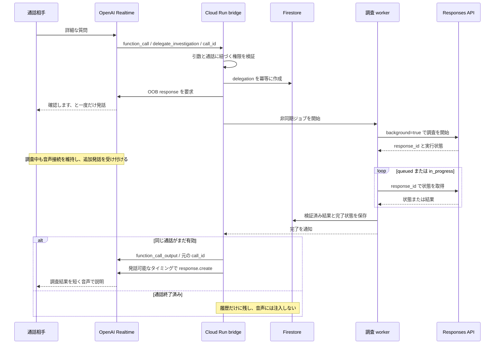

# OpenAI Realtime から非同期ルーチンを呼ぶ予定だった仕組み

作成: 2026-10-07。2026-09-26 時点の設計を切り出した記録。**設計のみ・未実装**であり、今回もコードやデプロイは変更しない。

## 1. 結論

予定していたのは、**Realtime の function calling を入口に、backend が時間のかかる処理を別ジョブとして動かし、完了後に同じ通話の Realtime session へ結果を返す**方式。

Realtime 自体が任意のコードを実行したり、自動的に Responses API を呼んだりするわけではない。Realtime は「この関数を、この引数で呼びたい」というイベントを出すだけで、実行・認可・ジョブ管理・結果の返送は Cloud Run 側が担当する。

LIFELiNK ではこの仕組みを **Responses delegation** と呼び、重いルーチンの実行先として Responses API の `background: true` を使う予定だった。任意の外部 API や独自の非同期処理を実行する場合でも、入口と結果返送の仕組みは同じ。Responses は必須ではない。

「非同期」は次の 2 つを分けて考える。

- **会話側の非同期**: tool の結果を待つ間も、音声接続を維持し、相手の追加発話を受け付ける。対応モデルの async function calling を前提とし、待機中の会話方針も指示する。
- **処理側の非同期**: backend が別ジョブを開始し、完了を後で受け取る。元の音声イベント処理の中でジョブ完了まで待ち続けない。

JavaScript の関数に `async` を付けるだけで、会話継続・永続化・結果配信が自動的に実現するわけではない。

## 2. 三層の役割分担

| 層 | 担当 | 保持するもの |
| --- | --- | --- |
| Firestore | 永続的な正本 | 観測事実、出典、時刻、履歴、現在状況、ジョブ状態と結果 |
| Realtime | 低遅延の音声会話 | 最新状況の短い要約、直近の会話、tool call と結果 |
| Cloud Run + Responses | 時間のかかる調査 | 選択した事実の比較、長い履歴の要約、許可済み外部情報の照合 |

全履歴を Realtime の conversation に詰め込まず、必要な情報だけ backend の tool から取得するのが狙いだった。Firestore の配置・完全なスキーマは [doc/ja-jp/plan.md](plan.md#L816) 8a 章を正本とする。

## 3. 会話から結果返送まで

具体的な手順は次のとおり。

1. `session.update` で tool の名前・説明・引数の JSON Schema と `tool_choice: auto` を設定する。
2. 詳細質問に対して Realtime が `delegate_investigation` の `function_call` を出す。
3. backend は引数が確定したイベントを受け、`name`・`arguments`・`call_id` を取得する。`response.done` の `response.output` に含まれる確定済み call を使える。引数の delta ごとにジョブを起動しない。
4. backend が引数と権限を検証し、Firestore transaction でジョブ台帳を作る。同じ call の重複受信で再実行しない。
5. `response.create` の `response.conversation: "none"` を使う out-of-band（OOB）response で、確認中だと一度だけ伝える。実際のアプリの発話は英語で、例は “One moment please, I'll check on that.”。完了時間は約束しない。
6. backend が最小限の入力を組み立て、Responses API を `background: true` で開始し、返された response ID を台帳へ保存する。
7. worker が状態を poll する。`queued` / `in_progress` の間だけ継続し、期限超過・失敗・キャンセルも処理する。terminal state だから成功、とは判定しない。
8. 成功結果を schema と根拠 ID の両方で検証し、Firestore へ保存する。
9. 通話が有効なら `conversation.item.create` に `item.type: "function_call_output"`、**元の `call_id`**、JSON 文字列の `output` を設定して Realtime へ返す。
10. `response.create` で結果に基づく発話を要求する。tool 結果の追加だけでは、結果を説明する発話を明示的に開始したことにはならない。

重要なのは **Realtime の `call_id` と Responses の response ID を混同しない**こと。前者は「どの関数呼び出しへの返答か」、後者は「どの調査ジョブを取得・キャンセルするか」を表す。

当時の案は、受付時に `function_call_output` として「受付済み」を返して call を閉じる方式ではなく、**最終結果を元の call に返す**方式だった。ジョブ ID を即時返し、後で通常メッセージとして通知する方式は別設計になる。

## 4. どの質問を非同期へ回すか

| tool | 用途 | 処理 |
| --- | --- | --- |
| `get_current_situation` | 「今どこ」「現在の状況は」 | `state/current` を直接取得。概ね 300ms は目標値であり実測値ではない |
| `get_session_history` | 「さっき何と言った」「いつ更新された」 | 件数・文字数・期間を限定し、事実と履歴を直接取得 |
| `delegate_investigation` | 複数事実の比較、長い経緯の整理、外部照合 | 非同期ジョブへ委譲 |

手元の短い要約で答えられる質問は即答する。何でも Responses に送るのではなく、必要なときだけ重い調査を起動する。

`delegate_investigation` の予定引数は `question`、`scope: current_state | session_history | external_lookup`、`urgency: normal | high`。検索対象の session や owner はモデルの自由入力から決めず、認可済みの通話コンテキストから backend が解決する。

## 5. ジョブ台帳と入力・出力

配置はルート直下の `emergencySessions/{session_id}/delegations/{delegation_id}`。完全なスキーマは plan 8a 章にあり、ここでは役割だけを抜粋する。

- **関連付け**: `delegation_id`、`realtime_call_id`、`openai_response_id`。
- **状態**: `queued | in_progress | completed | failed | cancelled | expired` と開始・完了・期限の時刻。
- **入力の根拠**: `question`、`scope`、`snapshot_version`、`input_fact_ids`、`transcript_event_ids`。
- **結果**: `answer`、`supporting_fact_ids`、`unknowns`、`confidence`、`data_as_of`。
- **配信記録**: `delivered_to_realtime_at`。ジョブ完了と通話への配信は別の状態。

Responses に渡すのは固定の調査ポリシー、質問、現在状況 snapshot、選択済み fact とその出典・鮮度、関連 transcript 抜粋だけ。Firestore の全 document や認証情報をそのまま渡さない。外部照合も backend の allowlist 済み tool に限定する。

結果は回答候補であり、センサーが観測した事実にはしない。根拠 ID が実在し、その session に属することを検証する。古い情報を現在の事実として話さず、未確認事項は未確認のまま返す。

## 6. 音声の競合・通話終了・失敗への対処

- **調査待ちと発話中は別**: ジョブが pending でも会話接続は維持する。一方、結果到着時に通常 response が生成中なら、追加の `response.create` を無条件に重ねず発話要求をキューする。
- **OOB は発話の衝突まで解決しない**: `conversation: "none"` は出力を通常 conversation に追加しない設定。Twilio の同じ音声回線へ複数音声を同時送信してよい、という意味ではない。OOB と通常 response は response ID / metadata で区別し、音声配信を制御する必要がある。
- **相手の割り込み**: 保留発話や結果発話を止め、Twilio の未再生音声を clear する。通常 conversation の未再生部分は `conversation.item.truncate` と履歴の `interrupted` を整合させる予定だった。
- **通話終了**: 未完了ジョブはキャンセルを試みる。終了と完了が競合しても音声は注入せず、既に得られた結果は必要に応じて履歴だけに保存する。DB の状態確認後にも切断し得るため、送信直前の socket / session 確認も必要。
- **期限・失敗**: `expired` / `failed` を記録し、確認できなかったことと既知情報だけを伝える。推測で穴埋めしない。
- **重複・再送**: `call_id` でジョブ作成を冪等化し、結果配信も記録する。当時の案は未配信結果を同じ `call_id` で一回だけ再送するもの。ただし送信成功と受領確認は別であり、二重発話を防ぐ ACK / 再送境界は実装前に詰める必要がある。

## 7. 実装済みのものとは何が違うか

[backend/src/voice.ts](../../backend/src/voice.ts) にある `injectEmergencyUpdate()` / `flushPendingInjections()` は、**外から届いたメモや Discord 返信を通常の user message として追加し、音声で伝える**実装。

`responseActive` と `pending` で注入をキューし、`response.done` などを契機に流す土台はある。しかし、次は未実装。

- 上記 3 tool の登録と function call の処理。
- Responses API の background ジョブ開始・poll・キャンセル。
- `delegations` の永続台帳と結果 schema 検証。
- `function_call_output` による元の call への結果返送。
- OOB 保留発話と通常 response を区別した音声制御。

したがって、既存の「非同期に届いた情報の注入」と、予定していた「AI が起動した非同期ルーチンの結果返却」は別機能。

2026-09-26 に提出前の音声 bridge を不安定にしないため、状況ストア移行とまとめて実装を延期した。追跡は [doc/ja-jp/tasks.md](tasks.md) の **PX-14〜PX-19**、特に **PX-17（非同期委譲）・PX-18（bridge）**。この切り出しによって実装再開へ変更したわけではない。

## 8. 再開前に確認すること

以下は当時の設計をそのまま実装可能と断定せず、今回の切り出しで明示した確認点。

1. **モデルと待機中の会話**: 使用する Realtime モデルで async function calling が使えるか確認し、未完了 call の間の追加質問・割り込み・結果返送を実際の通話で試す。
2. **worker の実行基盤**: 当時は「worker が poll」までで、耐障害性のあるキューや実行サービスの選定は未確定。OpenAI 側でジョブが継続しても、Cloud Run の再起動後に結果回収・配信が自動復旧するわけではない。台帳からの再開と、通話 bridge への配送方法を決める。
3. **OpenAI 側の保持**: 当時の案は `store: false`。2026-10-07 に確認した公式 Background mode 文書では、この設定でも非同期実行・poll のために response data が一時保存されると説明されている。**`store: false` を「OpenAI 側に一切保存されない」と解釈しない**。採用時点の保持仕様と利用プロジェクトのデータ設定を再確認する。
4. **結果の陳腐化**: 調査開始時の snapshot を固定する設計なので、完了時には現状が変わり得る。`data_as_of` と現在の version を比較し、古い結果を「現在の状況」として読み上げない。
5. **配信の寿命とスケール**: 現行 bridge はプロセス内の session map に依存し、Cloud Run の `maxScale=1` は維持する。永続台帳を追加しただけで複数インスタンスへ安全にスケールできるわけではない。

## 9. 出典

- 当時の設計の正本: [doc/ja-jp/plan.md](plan.md#L816) 8a 章。
- 未実装・延期の判断: [doc/ja-jp/tasks.md](tasks.md)、[doc/ja-jp/handover.md](handover.md)。
- 現行 bridge の照合: [backend/src/voice.ts](../../backend/src/voice.ts)。
- OpenAI 公式 [Realtime conversations](https://developers.openai.com/api/docs/guides/realtime-conversations): function calling、`function_call_output`、OOB response、割り込み（2026-10-07 確認）。
- OpenAI 公式 [Background mode](https://developers.openai.com/api/docs/guides/background): background 開始、poll、cancel、一時保存（2026-10-07 確認）。

本書は当時の独自オーケストレーション案の説明であり、後から追加された API 機能を当時の採用案として扱うものではない。