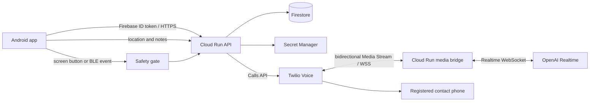

# LIFELiNK 実装計画

最終更新: 2026-09-25

## 1. プロダクトのゴール

声を出せない状況でユーザーがボタンを押すと、LIFELiNK が事前登録済みの連絡先へ AI 音声で電話し、発信前までに収集できた現在地・住所・状況を通話の最初に伝える。

このアプリは公的な緊急通報の代替ではない。警察、消防、救急などの緊急番号へ自動発信するものではなく、ユーザーが指定した家族・友人などへの連絡を補助する。

このプロダクトの核心は発信そのものだけではない。ボタンを押した瞬間から、(1) 通話相手との会話は AI が代理で行い、(2) その通話の様子（発話内容・位置・メモ）は事前に相互リンクした友人の同じアプリへ Discord 風のライブ画面としてリアルタイムに共有され、(3) それを見た友人がその場でコメントを書き込むと、backend が AI 経由でそのコメントを通話相手へ音声で伝える、という一連の体験が一体になっている。実通話 1 本を成立させる MVP 主線の実装順序は変えないが、この体験を後から作り直さずに済むよう、データ構造・画面遷移・OpenAI Realtime の使い方は本文書で先に確定させる。

## 2. ハッカソン MVP の成功条件

実 Android 端末から次の縦断フローが一度以上成功し、証跡を残せることを MVP 完了条件とする。

1. ユーザーが Android でログインする。
2. Android が現在位置、取得時刻、精度を保存する。
3. ユーザーが緊急連絡先を登録し、backend は電話番号そのものではなく `contact_id` で参照できるようにする。
4. 画面上の明示的な緊急ボタン、または既存 BLE イベントを Safety gate に渡す。
5. 同じ緊急イベントでは発信要求が一度だけ受理される。
6. backend が認証済みユーザーの `contact_id` を解決し、Twilio から登録先へ発信する。
7. Twilio Media Streams と OpenAI Realtime API を双方向 WebSocket で接続する。
8. AI が最初に「緊急連絡アプリからの電話であること、住所、緯度・経度、精度、情報の取得時刻または経過時間」を話す。
9. 通話中に Android から送ったメモまたは新しい位置情報を AI の会話コンテキストへ追加し、相手へ伝えられる。

ビルド成功、モック通話、TwiML の生成だけでは MVP 完了としない。Twilio の実番号から事前登録した実番号へ発信し、双方向音声と追加情報の注入を確認する。

## 3. MVP の対象範囲

### 今回実装する

- Android ログイン
- 現在位置の取得・保存と逆ジオコーディング
- 緊急連絡先の登録・選択
- 画面上の明示的な緊急ボタン
- 既存 BLE イベントを受け取れる場合の同一 Safety gate への接続
- 端末と backend の二段階の重複発信防止
- Firebase Authentication、Firestore、Cloud Run、Secret Manager
- World ID / IDKit による人間性証明と発信 API の認可
- Twilio Programmable Voice、双方向 Media Streams
- OpenAI Realtime API による初回発話、会話、通話中の追加情報注入
- 発信状態と失敗理由を Android へ表示する最低限の UI
- 実通話の縦断確認に必要な構造化ログ

### 実通話成立まで主線から外す

以下はコード上の拡張点と設計判断を残すが、上記の実通話が成立するまで実装のために主線を止めない。

- 友人共有
- Discord 風の通話・会話履歴
- Android マイクからの周辺音声中継
- GATT ボタンとロック中の常時反応
- Play Store 公開対応
- 通話録音、長期トランスクリプト保存

上記は実装に着手する順序を後回しにするだけであり、データ構造・API 境界・画面遷移は主線と並行して本文書内（6 章「友人共有とライブフィードのデータモデル」、4 章「Discord 風 UI 画面遷移」、5 章の OpenAI Realtime 拡張）で先に確定する。主線実装者は、これらの設計に反しない範囲でフィールド名・コレクション構造を選ぶこと。

### 主線完了後の実装順序（提案、2026-09-26、議論・確定待ち）

前回この節に「P1/P2 はハッカソン提出物として実装しない」と書いたが、これは誤り。正しくは **P0-15（実機縦断確認）が通り次第、フル実装へ舵を切る**。ただし P1 の UI を今の P0 の単純なモデル（`emergency_events`/`updates`）の上に作ってしまうと、8a 章で設計済みの P2 の本物のデータストア（`emergencySessions`/`facts`/`timeline`/`delegations`）へ後で移行するときに UI を作り直す二度手間になる。したがって提案する順序は次のとおり。

1. **P0-15 で主線（実通話・Safety gate・World ID・Beacon）が実機で動くことを確認する。** ここまでは今までどおり最優先。
2. **P2 の本物のデータストアを先に実装する**（`situationStore.ts`/`timelineStore.ts` を中心に、`facts` の append・`state/current` の materialization・`timeline` 書き込みができる状態にする。`delegationStore.ts`/`responsesDelegate.ts` の Responses delegation は後回しでよい）。既存 `backend/src/voice.ts` の Media Stream bridge は、この本物のストアを読み書きする形へ発展させる（8a 章「実装単位」参照）。
3. **P1 のフル UI を、P2 のデータストアの上に直接実装する。** `emergency_events`/`updates` ベースの中間 UI は作らない。友人共有画面・通話履歴（4a 章の画面インベントリ）は最初から `facts`/`timeline` を読む。
4. **主線部分（発信〜通話〜位置更新〜終話）の稼働確認を再度行ってから**、友人共有・Discord 連携・GATT などの追加機能に着手する。
5. 4 が通った後で、初めて 4a 章の未決論点（録音共有、Option A/B、Discord 個別連絡）や GATT（P1-08〜P1-15）などの追加機能に順番を決めて着手する。

**まだ決めていないこと（チームで議論したい点）**:

- P2 のどこまでを「最小限の本物」とするか。`facts`/`state/current`/`timeline` だけで P1 UI は動くか、`delegations`（Responses delegation）も P1 UI に必要か。
- P0 の `emergency_events`/`updates` に既に入っている実データ（実機テストで作られたイベント）をどう扱うか。移行スクリプトを書くか、P2 移行後は新規イベントだけ新スキーマにするか。
- P1 のフル UI 実装は Android 側の別チームと並行できるか、それとも P2 の backend 実装を待つ必要があるか。
- Discord 連携（Option A/B、または 4a 章の個別オプトイン方式）は P1 の初回スコープに含めるか、その次の段階にするか。

この節の結論が出るまで、P2/P1 の実装着手は保留する。結論が出次第、`doc/tasks.md` の P1/P2 セクションを実装順に並べ直す。

## 4. ユーザーフロー

### 初期設定

1. Android アプリにログインする。
2. 位置情報の利用目的を表示し、Foreground location 権限を得る。
3. 緊急連絡先の名前と電話番号を登録する。
4. backend が電話番号を E.164 形式へ正規化して保存し、Android には `contact_id` を返す。
5. テスト発信で番号と音声経路が正しいことを確認する。

### 緊急発信

1. ユーザーが画面上の緊急ボタンを明示的に押す、またはリンク済み BLE イベントが発生する。
2. Android が可能な範囲で最新位置を取得し、取得済みの住所、精度、取得時刻、メモをスナップショット化する。
3. Safety gate が誤操作確認、短時間の重複、進行中イベントを検査する。
4. Android が一意な `emergency_event_id` と登録済み `contact_id` を backend へ送る。
5. backend が Firebase ID token、所有者、連絡先、イベントの冪等性を検証する。
6. backend がイベントを永続化してから Twilio 発信を一度だけ作成する。
7. 相手が応答すると Media Stream を OpenAI Realtime へ接続し、最初に位置情報を発話する。
8. Android はイベント画面からメモ・位置更新を送信し、backend は該当する通話セッションへ追加する。
9. 終話後、成功・失敗状態と最小限の監査情報を保存する。

### Discord 風 UI 画面遷移（設計を先に確定、実装は P1 以降）

2026-09-26 にフル UI モック（`doc/uimock/`）が提供され、最終系から逆算した画面インベントリと未決の論点を 4a 章にまとめた。本節の内容は 4a 章に統合され、以後は 4a 章を正とする。

## 4a. フル UI 画面遷移（最終系からの逆算、UI モック準拠、設計を先に確定・実装は P1 以降）

参照元: `doc/uimock/`（20 画面のスクリーンショット）。ハッカソンでは全部品が動く前に UI 全体の完成形を先に見る価値があるという方針（ユーザー指示）に基づき、主線を止めずに画面遷移とデータ要件を先に確定する。

### 画面インベントリ

| モック ID | 画面 | 主な要素 | 対応フェーズ | 既存設計との関係 |
| --- | --- | --- | --- | --- |
| 1-1 | アプリ起動 | ブランド、Get started / Log in | P0 | 実装済みの Android 起動画面に相当 |
| 1-2〜1-4 | World ID 登録（説明→Proof of Human→検証結果） | IDKit widget、`nullifier_hash`、`verified_at` 表示 | P0-08A | 5 章・8a 章の World ID 認可設計と一致。Android 側 IDKit 呼び出しに対応する画面 |
| 1-4b | 検証失敗 | 失敗理由、再試行、（デモ用）検証済み扱いで続行 | P0-08A | `human_verified` が立たない場合の失敗表示。デモ用バイパス導線は本番ビルドに残さない |
| 1-5 | プロフィール設定 | ニックネーム、エリア、位置情報共有トグル | P0/P1 | **新規**: `users/{uid}` に `nickname`・`area` フィールドを追加する（6 章のデータモデルに未収録） |
| 1-6 | アラート音声設定 | 発話言語（日本語/両方/英語）、送信時・接続時の 2 段階アナウンス文言、Silent SOS トグル | P1 | **新規機能**: 8 章「AI の初回発話仕様」とは別に、端末自身がローカル TTS で音声案内する機能。詳細は本節末尾 |
| 2-1〜2-5 | 緊急連絡先登録（Discord 招待→参加→登録完了） | Discord サーバー招待リンク、参加確認、登録済みメンバー一覧 | P1 | **未決**: 6a 章の「アプリ内 Discord 風 UI」（Option A）と、本モックの「実 Discord をそのまま使う」（Option B）のどちらを採るか要決定。下記参照 |
| 3-1 | SOS ボタン | 長押しで送信 | P0-09 | 実装中の画面ボタン・Safety gate と一致 |
| 3-2 | アラート段階 1（送信時） | 画面点灯＋ローカル音声で「緊急警報。登録済みの緊急連絡先へ発信中。位置情報を記録済み」 | P1 | **新規機能**: 端末ローカルの送信時アナウンス。8 章の「AI が相手に話す内容」とは別物。文言は「警察」ではなく「登録済みの緊急連絡先」を主語にする（未決の論点 1 で決定済み） |
| 3-3 | 送信中ステータス | 位置取得・通報・メンバー通知・録音共有準備のチェックリスト | P0/P1 | 既存の Safety gate → backend 呼び出し順序と一致。UI 化のみ必要 |
| 3-4 | アラート段階 2（接続時） | 通話が実際につながった時だけローカル音声で「登録済みの緊急連絡先への発信がつながりました」 | P1 | **新規機能**: Twilio `status: in-progress`/`answered` callback を購読し、実接続時のみ発火させる |
| 3-5 | 並行ステータス（AI 通話＋メンバー通知） | 通話タイマー、Discord 通知配信状況を並列表示 | P1 | 8a 章の `emergencySessions.status` 遷移を UI 化したもの |
| 3-6 | メンバー側 Discord 通知 | 位置、座標、地図、「Call [登録済み緊急連絡先]」「Open map」ボタン | P1 | 文言は「警察」ではなく登録済みの緊急連絡先を指す（未決の論点 1 で決定済み）。最寄り警察署の逆ジオコーディングは不要になった |
| 3-7〜3-8 | メンバー側: 通話終了後の録音・書き起こし共有 | 音声ファイル再生、ダウンロード、字幕表示、インシデントログ | P1/P2 | **制約と衝突**: 12 章は現状「MVP では音声を録音しない」。録音・共有を行うなら保持期間・同意・削除導線の再設計が必要（13 章の論点 2） |

### 新規機能: 端末ローカルの 2 段階音声アナウンス

8 章の「AI が通話相手に話す内容」とは独立に、ユーザー自身の端末が **その場にいる人へ** 状況を知らせるためのローカル音声（Android TTS、サイレントモードでも鳴動）を追加する。

- 設定画面（1-6）で有効/無効、言語（日本語/英語/両方）、Silent SOS（アナウンスを完全に無音化する代替モード）を選べる。
- **段階 1（送信時）**: ボタン押下の瞬間、Safety gate 通過後すぐに端末が発話する。backend 応答を待たない。
- **段階 2（接続時）**: Twilio `status callback` が `answered`/`in-progress` を報告した時だけ発話する。発信しただけでは発話しない。
- Silent SOS が有効な場合は両段階とも無音にし、画面表示のみで状態を伝える。
- この機能は「声を出せない状況」という製品コンセプトと一見矛盾するため、既定値は音声 ON（周囲への警告・威嚇効果を優先)、Silent SOS はユーザーが状況に応じて事前に選ぶ opt-in とする。

### 未決の論点（実装前に人間が決めること）

1. **「警察に通報する」という文言・実装をどこまで実現するか** — **決定済み（2026-09-26、人間の判断）**: 警察への自動通報は目標として設定しない。モックの "calls the police" 系の文言・ボタンはすべて「事前登録した緊急連絡先」を主語にした文言へ差し替える（例: 3-6 の「Call [最寄り警察署] Police」→「Call [事前登録した緊急連絡先]」、Stage 1/2 のアナウンスも「警察へ通報しています」ではなく「登録済みの緊急連絡先へ発信しています」等）。1 章・12 章の非目標（公的緊急番号への自動発信はしない）をそのまま維持し、実装・コピーの両方でこれを既定とする。
2. **通話録音・書き起こしの共有可否**: モック 3-7/3-8 は録音ファイルと書き起こしを友人へ共有する前提。12 章は「MVP では音声を録音しない」としている。録音する場合は同意取得、保持期間（8a 章の 7 日既定に準拠可能）、削除導線、Twilio 側の録音機能（`Record` verb や `<Start><Recording>`）の追加実装が必要になる。P1 以降のスコープとして録音を有効化するかを決める。
3. **友人共有 UI の実装方式（Option A vs Option B）**:
   - **Option A（6a 章、既存設計）**: LIFELiNK アプリ内に Discord 風のネイティブ画面を作る。`friend_links`・`participant_uids`・Compose UI が必要。友人も LIFELiNK アプリのインストールが要る。
   - **Option B（本モック）**: 実際の Discord サーバー・Bot を使う。友人は Discord に参加するだけでよく（README のストレッチゴールと一致）、位置・地図・音声・書き起こしは Discord の埋め込み/添付として bot が投稿する。実装は Discord Developer Portal での bot 作成、bot token を Secret Manager 管理、Discord API（メッセージ送信、ボタン付き Embed、必要なら Interactions）の実装に置き換わる。
   - Option B はアプリインストール不要という強い訴求点を実現でき、UI 実装量も Compose の自作チャットより少ない可能性が高い。ただし Discord 側のレート制限・bot 権限・サーバー運用（招待リンクの発行・失効）という新しい外部依存が増える。どちらを採るかで P1 のタスク内容が大きく変わるため、着手前に決定する。

### Discord 個別連絡の候補設計（2026-09-26、提案段階・P1 の判断待ち）

ユーザー希望: アプリから Discord を接続し、緊急連絡したい友人を登録し、電話発信と並行して Bot が状況を伝え、返信を `emergency_events/{id}/updates` の参考情報に残す。これは従来の「サーバー全員に投稿する Option B」と異なる **個別のオプトイン済み Discord 連絡先** 方式であり、P1-01 で公開範囲・通話先との関係を確定する。P0 の電話先 `contact_id` は維持し、Discord 通知の成功は電話発信成功の条件にしない。

- **API 制約**: 通常の OAuth2 `identify` はログインした本人だけ、`connections` は外部連携アカウントだけを返す。友人一覧用 `relationships.read` は Discord Social SDK の利用申請が必要。承認なしに「Join Discord → Discord の全 Friends を表示」は実装しない。ユーザートークンや self-bot で非公開 API を呼ばない。公式資料: https://docs.discord.com/developers/topics/oauth2#shared-resources-oauth2-scopes
- **推奨登録体験**: アプリの「Discord 連携」は発信者本人の `identify`（任意）。「Discord の連絡先を招待」で期限付き・一回限りの招待 URL を共有し、**受信者本人** が Discord `identify` を認可するか Bot のリンク用コマンドを実行する。サーバー側で発行者の Firebase UID と招待を照合し、OAuth `state` または署名検証済み Interaction の `user.id` から受信者の Discord ID を取得する。相手が緊急通知と位置共有を明示承認して初めて登録完了。ユーザー名の手入力だけでは本人確認にならない。アプリ画面の一覧は「連携済み・承認済み連絡先」とし、Discord 全友人一覧とは呼ばない。共通サーバーから選ぶ案も友人判定や本人の受信同意の代わりにはならない。
- **通知と返信**: 新規イベントに対し選択済みの受信者ごとに一回だけ Bot の DM を試み、最小限の位置・時刻・状況と地図リンク、イベントに紐づく「状況を返信」ボタンを送る。DM は相手の設定や共通サーバーの有無等で失敗し得る（例: `50007`、`50278`）。送信成功は既読・通知到達を意味しない。署名検証済み Discord Interaction のボタン→モーダルで返信を受け、`interaction.id` で重複排除し、`event_id`・許可済み `discord_user_id`・有効期限を検証後 `type: friend_comment`、`author_type: friend`、`source: discord` として保存する。Bot は全イベントの作成や電話操作を許可しない。参考情報として通話中の AI に渡す場合も、未確認の第三者情報として区別し、AI への自動注入・電話先への読み上げは別途同意を決める。
- **自由文返信を求める場合**: Bot DM の `MESSAGE_CREATE` を受ける Gateway 常時接続が別途必要。DM 本文は `MESSAGE_CONTENT` privileged intent の例外だが、HTTP Interaction endpoint だけでは自由文 DM を受信できない。Cloud Run のスケールゼロ前提とは相性が悪いため、まずは署名付き HTTP Interaction のモーダル返信を候補にする。公式資料: https://docs.discord.com/developers/events/gateway#message-content-intent ・ https://docs.discord.com/developers/interactions/receiving-and-responding#receiving-an-interaction
- **安全性・検証**: Bot token と OAuth client secret は Secret Manager に限定。Firestore 正本に宛先スナップショット・通知配送状態（未送信/送信済み/失敗、Discord message ID）を持ち、再試行・429・タイムアウト時の重複通知を抑える。送信済み/失敗をアプリに区別表示し、事前に実機で招待→受信同意→テスト DM→返信→イベント表示を通す。Discord は緊急連絡の唯一の経路にせず、電話を主経路とする。位置・発話・返信の公開範囲と保存/削除期間は P1 着手前に確認する。

未決: (1) 電話相手と Discord の受信者は同一人物か別の支援者か、何名までか、(2) Discord 連携を必須にするか任意にするか、(3) 返信を参考情報の保存のみとするか通話中 AI にも渡すか、(4) Social SDK の審査申請を試すか。これらが確定するまで実装方式としては採用済みとみなさない。

**保存場所（6 章の原則に従う）**: 承認済みの受信者登録は本人だけが読み書きする私的データなので `users/{uid}/discordContacts/{contact_id}`（`discord_user_id`、`display_name_snapshot`、`consented_at`、`status: pending|active|revoked` 程度）に置く。招待トークンも同じ理由で `users/{uid}/discordInvites/{invite_id}` に置き、ルート直下には置かない。一方、DM 経由の返信そのものは 6a 章の `updates` と同じ理由でイベントの共有フィード（`emergency_events/{id}/updates`）に書く（上記の「通知と返信」のとおり）。

### 実装しない場合の注記

UI 全体の完成形を先に見る価値はあるが、本節の P1/P2 項目は主線（P0）を止めない。論点 1 は決定済みだが、論点 2・3 が未決のままでも P0 の画面・データ設計には影響しない。

## 5. システム構成



### Android

- Application ID / package name は `com.rtree.LIFELiNK` とする。Android と Firebase の仕様上は大文字を利用できるため、ユーザー指定を優先する。一度公開すると変更できない識別子として扱う。
- Kotlin と Jetpack Compose を第一候補とする。
- Firebase Authentication の Google ログインを使い、ID token を backend の Bearer token として送る。
- 2026-09-25 に Firebase Android app登録、debug SHA-1登録、Google sign-in provider有効化、OAuth clientを含む`google-services.json`配置、debug APK buildまで完了した。Google Services pluginが生成する`default_web_client_id`をCredential Managerで使用する。残作業は実端末でのGoogleログイン確認である。
- Google ログインはアプリへの認証、World ID は緊急発信権限の人間性証明として分離する。World ID 未証明でも初期設定はできるが、発信 API は利用できない。
- MVP は Foreground location のみを要求する。継続的な Background location は要求しない。
- ボタンと BLE は同じ `EmergencyTrigger` インターフェースへ変換し、必ず同じ Safety gate を通す。
- 位置スナップショットは `latitude`、`longitude`、`accuracy_m`、`captured_at`、`address`、`geocoded_at` を持つ。

### Cloud Run backend

- Firebase Admin SDK で ID token を検証する。
- API と Twilio Media Stream の WebSocket bridge を同じサービスに置くか、初期実装で運用が単純になる構成を選ぶ。負荷分離は MVP 後とする。
- Firestore のユーザーデータを UID で分離し、`contact_id` が認証ユーザーに属することを必ずサーバー側で確認する。
- Twilio、OpenAI、Google Maps の秘密情報は Secret Manager から実行時に参照する。
- Cloud Run のサービスアカウントには Firestore 利用と必要な Secret 参照だけを許可する。

### Twilio と OpenAI Realtime

- backend が Twilio Calls API で outbound call を作成する。
- TwiML の `<Connect><Stream>` から `wss://` の Cloud Run bridge へ接続する。
- Twilio WebSocket の `X-Twilio-Signature` を検証し、未検証接続を拒否する。
- Twilio の音声は G.711 μ-law、8 kHz、mono を前提とする。OpenAI Realtime セッションも可能なら `audio/pcmu` を指定し、不要な再サンプリングを避ける。採用モデルで直接扱えない場合だけ変換を追加する。
- OpenAI API key はサーバーだけが保持し、Android や Twilio のパラメータへ渡さない。
- 初回発話を完了するまでは通常会話より初期情報の伝達を優先する。
- 通話中の更新は対象 `emergency_event_id` と Twilio Call SID を照合してから会話アイテムとして注入する。
- 通話の両者の発話をテキスト化してフィードへ保存できるよう、セッション設定で入力音声の transcription を有効にする（`session.audio.input.transcription` 相当の設定）。相手（`contact`）の発話は `response.done`/`conversation.item.done` から取得できるトランスクリプトを `type: transcript_contact` として、AI の発話は `response.output_audio_transcript.done` を `type: transcript_ai` として `updates` フィードへ書き込む。
- 友人コメントの注入は、進行中の会話へ `conversation.item.create`（`role: user`、`content: input_text`）でテキストを追加し、直後に `response.create` を送って AI に発話させる。これは 8 章の位置・メモ注入と同じ経路を一般化したものであり、`author_type: friend` を伴わせて同じ `updates` レコードとして残す。
- backend は AI の発話が一区切りついたタイミング（直前の `response.done` 受信後）でキューを処理し、友人コメントの割り込みを最小限にする。緊急性の高い語を含む場合の優先注入ルールは P1 で検討する。

## 6. データモデル案

**コレクション配置の原則（2026-09-26 確定、以後の追加はこれに従う）**: 「1 人の所有者だけが読み書きする私的データ」は `users/{uid}/...` 配下にネストする（`contacts`、`locations` など）。「作成者 1 人 + 閲覧者 N 人（友人・参加者）が絡む共有リソース」はルート直下のコレクションに `owner_uid`（または `uid`）と `participant_uids` を持たせる（`emergency_events`、`emergencySessions`、`friend_links`）。後者をユーザー配下にネストすると「共有されている他人のイベント一覧」が collectionGroup クエリと外部 webhook 経由の owner 解決を必要とし、共有という主目的に対してかえって複雑になるため避ける（8a 章参照）。迷ったら「この document を他人が閲覧する必要があるか」で判定する。

### `users/{uid}`

- `display_name`
- `created_at`
- `default_contact_id`

### `users/{uid}/contacts/{contact_id}`

- `name`
- `phone_e164`
- `enabled`
- `created_at`
- `updated_at`

電話番号は画面やログへ平文で出さず、API 応答では末尾のみをマスク表示する。

### `users/{uid}/locations/{location_id}`

2026-09-26 のプライバシー方針（8 章）により、Android は `latitude`/`longitude`/`accuracy_m` を API リクエストには含めるが、backend は保存前に削除する。Firestore に残るのは次のとおり。

- `address`（都道府県レベル、Android の `Geocoder.adminArea` で解決）
- `captured_at`
- `geocoded_at`

### `emergency_events/{emergency_event_id}`

- `uid`
- `contact_id`
- `trigger_type`: `screen_button` または `ble`
- `trigger_source`: `trigger_type` が `ble` のときのみ `beacon` または `gatt`
- `state`: `accepted`、`dialing`、`in_progress`、`completed`、`failed`
- `location_snapshot`（`address`/`captured_at`/`geocoded_at` のみ。GPS 座標・精度は含まない）
- `initial_note`
- `twilio_call_sid`
- `created_at`
- `updated_at`
- `failure_code`

### `emergency_events/{emergency_event_id}/updates/{update_id}`

第 1 版のフィールドは次のとおり。P0 実装（P0-13）はこの範囲だけを書き込めばよい。

- `type`: `note` または `location`
- `payload`
- `created_at`
- `delivered_to_ai_at`

## 6a. 友人共有とライブフィードのデータモデル（設計を先に確定、実装は P1）

主線の実装順序は変えないが、後から作り直さないように、友人向けリアルタイム共有と Discord 風 UI に必要なデータ構造を先に決める。

### `friend_links/{link_id}`

ルート直下のコレクションとする（`users/{uid}` のサブコレクションにしない）。

- ドキュメント ID は `min(uidA, uidB)_max(uidA, uidB)` の決定的な文字列にし、重複作成と二重リクエストを防ぐ。
- `uid_a`、`uid_b`、`status`（`pending` | `accepted` | `blocked`）、`requested_by`、`created_at`、`accepted_at`。
- Firestore rules は `request.auth.uid in [resource.data.uid_a, resource.data.uid_b]` で判定し、追加の `get()` を増やさない。

### `emergency_events/{emergency_event_id}` への追加フィールド

- `participant_uids`: 発信者本人 + イベント発生時点で `accepted` だった友人 uid のスナップショット配列。
- イベント作成後に友人リンクが増減しても、そのイベントの `participant_uids` は更新しない。後から友人になった人に過去の通話内容を見せないためであり、Firestore rules も単純化できる。
- Firestore rules: `allow read: if request.auth.uid in resource.data.participant_uids;`

### `updates` フィードの拡張スキーマ（P1 で使うフィールドを含む）

`updates` サブコレクションを、AI への注入対象と Discord 風表示を兼ねる唯一のフィードとして扱う。

- `type`: `note` | `location` | `friend_comment` | `transcript_contact` | `transcript_ai` | `system`
- `author_type`: `owner` | `friend` | `contact` | `ai` | `system`
- `author_uid`: 発言者の uid（`contact`/`ai`/`system` は null）
- `author_name`: 表示名のデノーマライズ（画面表示専用）
- `text`: 表示・AI 注入用のプレーンテキスト
- `mentioned_uids`: 友人コメント内の @mention 対象
- `payload`: 位置情報など構造化データ（`note`/`location` 用、既存のまま）
- `created_at`
- `delivered_to_ai_at`: backend が AI へ注入した時刻（`friend_comment`/`note`/`location` のみ）

P0 実装は `type: note` と `type: location` だけを書き込めばよく、このスキーマのまま後方互換になる。P1 では `friend_comment`、`transcript_contact`、`transcript_ai` を追加するだけで Discord 風 UI に必要なデータが揃う。

### Firestore rules の方針

- `emergency_events` の read は `participant_uids` 配列のみで判定する。
- `updates` サブコレクションの read は親ドキュメントの `participant_uids` を 1 回 `get()` して判定する（rules のネストした `get()` は増やさない）。
- `friend_comment` の create は `request.auth.uid in participant_uids` かつ `request.resource.data.author_uid == request.auth.uid` を要求する。
- 友人の同時 listener 数が増えると読み取り課金が増える。MVP 後の規模次第でページングや要約表示への切り替えを検討する（数名規模の同時視聴を前提にした設計）。

## 6b. BLE トリガー設計（Beacon → GATT の二段階、実装は主線完了後）

物理ボタン機器の準備は完了済み。実装順序は主線（画面ボタンでの実通話成立）を止めないが、機器仕様は確定しているためここに設計を残す。

- 導入順序は 2 段階固定とする。1. まず Beacon 経路を実装する。2. 主線と Beacon が完動してから GATT 経路を追加する。
- BLE 層は物理ボタンの長押しを一回の新規イベントとして Android へ届けるだけの役割に限定する。電話番号、位置情報、認証情報、Firebase/API の秘密情報は BLE payload に一切含めない。
- Beacon・GATT のどちらも Android 側で共通の `EmergencyTrigger` へ正規化し、`emergency_events.trigger_type = ble` と `trigger_source`（`beacon` または `gatt`）を設定してから同じ Safety gate を通す。

### Beacon 経路（予備トリガー）

Beacon は接続を維持できない場合の予備トリガーとして使う。

専用 UUID/Major/Minor は次のとおり確定済み（2026-09-26、Agent が生成し本節へ記録）。この値は今後変更しない固定識別子として扱い、`BeaconReceiver` の `ScanFilter` はこの完全一致だけを受理する（ワイルドカードや部分一致は実装しない）。

- UUID: `D93DBA9A-40E6-4C73-A0DA-BF416BFE0DBF`（LIFELiNK 専用に新規生成。他社ビーコンや別プロダクトと衝突しない）
- Major: `1`（トリガー種別 = 緊急ボタン。将来別種の Beacon を追加する場合はここを変える）
- Minor: `1`（個体識別の初号機。複数デバイスを配布する場合は個体ごとに採番する）

```text
長押し -> 専用 UUID/Major/Minor を広告
  -> Android の厳密 Filter/PendingIntent で受信
  -> BeaconReceiver で ID・鮮度・重複を検証
  -> Safety gate
```

- Beacon 広告にはイベントごとの ACK がないため、同じ広告の複数受信は一回の押下として重複排除する。
- 画面 ON で確実に動く退避経路として保持し、ロック中の配送保証には使わない（ロック中の確実な配送は GATT 側の役割）。
- 使用箇所は `core` の iBeacon parser / `EventGate` と、`bluetooth` の `BeaconReceiver` / Filter / PendingIntent とする。

### GATT 経路（主経路、Beacon 完動後に追加）

GATT Notify を物理ボタンの主経路とする。XIAO nRF52840 が Peripheral/GATT server、Android が Central/GATT client となる。

```text
準備: Android scan -> connect -> service discovery -> Notify 購読 -> READY
押下: XIAO 長押し判定 -> Notify(epoch, eventId, action) -> Android 検証 -> ACK
```

- Android はボタン押下前から接続と Notify 購読を維持する。押下後に scan や connect を開始しない。
- Notify は 17 byte、ACK は 16 byte で、どちらも big-endian とする。
  - Notify: `epoch`（8 byte）、`eventId`（8 byte）、`action`（1 byte、`1 = LONG_PRESS`）
  - ACK: `epoch`（8 byte）、`eventId`（8 byte）
- `epoch` は boot ごとに変更し、`eventId` は同じ epoch 内で単調増加させる。Android は Notify 受信時刻をイベント時刻として使い、有効な Notify へ同じ epoch/eventId を ACK する。ACK は受信確認であり、電話発信成功を意味しない。
- epoch 不一致、重複、過去 eventId、古いイベント、未定義 action、切断中の押下、再起動前のイベントは発信候補にしない。
- XIAO 側は GPIO を `INPUT_PULLUP` で読み、長押し判定も XIAO 側で行う。押しっぱなしでも `LONG_PRESS` は一回だけ生成し、Android が Notify 購読済みの場合だけ送信する。ACK 済みイベントは再通知しない。
- firmware は `firmware/xiao_gatt_button/`、Android の GATT 契約は `app/.../gatt_experiment/` に置く。

## 6c. GATT 常時監視の詳細設計（Android、Phase 7 実装時に適用）

6b 章の GATT 経路を、画面 OFF・ロック中・バックグラウンドでどこまで維持するかの詳細設計。他チームの実装済み範囲は変更せず、Phase 7 着手時にこの設計を使う。

前提として「常時受信を保証する」ことは目標にしない。Android/OEM、Bluetooth controller、無線環境、Peripheral、ユーザー操作のいずれでも配送は途切れ得る。目標は次の 3 点に限定する。

1. GATT Notify を主経路として、ユーザー開始後の 2 時間セッション中に接続を最大限維持する。
2. GATT が切れている時間を、厳密 Filter の PendingIntent BLE scan と Companion Device presence で可能な範囲だけ補う（Beacon 予備経路は 6b 章のとおり）。
3. 実機ログから `READY` 時間率・押下受信率・再接続時間を測り、観測値で可否を決める。「動いているはず」という前提では判断しない。

### 採用構成

| 手段 | 採用 | 役割 | 保証しないこと |
| --- | --- | --- | --- |
| `connectedDevice` FGS | 必須 | プロセス優先度、GATT owner、常駐通知 | プロセス不死、Notify 配送、OEM 挙動 |
| 接続済み GATT Notify | 主経路 | 最低遅延、ACK 可能 | process death 後の維持 |
| filtered PendingIntent scan | 必須の予備 | process 不在時にも一致広告で起動を試みる | Doze/force-stop 中の即時配送 |
| Companion Device presence | 条件付き推奨 | presence 時の system binding、再接続契機、背景 FGS 開始の補助 | GATT 接続・CCCD 購読の代行 |
| `PARTIAL_WAKE_LOCK` | 実験的に採用 | 通常時の CPU sleep 抑制 | Doze 回避（Doze 中は無視され得る） |
| battery optimization 除外 | 配布条件を確認して採用 | Doze/App Standby 制限の緩和、背景 FGS 開始例外 | OEM kill の完全回避 |
| `location` FGS type | 継続的に位置を取る場合のみ | 背景位置取得 | BLE 接続維持そのもの |
| `START_STICKY`/boot 自動復旧 | 初版不採用 | 将来の監視復旧候補 | arm 復元、安全な自動発信 |

補足: `BluetoothGatt` は process-bound であり、プロセスが kill されると接続は閉じる。FGS・wake lock・PendingIntent scan のどれも既存 GATT を process death 越しに保存しない。`SCAN_MODE_LOW_LATENCY` は foreground 中のみ有効化が推奨され、background では `LOW_POWER` が強制され得る。`PARTIAL_WAKE_LOCK` は Doze を解除しない。API 34 の `ALL_MATCHES_AUTO_BATCH` は画面 OFF 時に最低 10 分 batch になるため使わない。

### コンポーネント境界

```text
Activity / Compose UI
  - 権限説明、association、監視開始、arm、状態表示。BluetoothGatt は保持しない

MonitoringService (connectedDevice FGS)
  - MonitoringSession の唯一の owner
  - GattController、BeaconRegistration、WakeLock、期限 timer を所有し、常駐通知を更新する

CompanionPresenceService (任意)
  - presence callback だけを受ける。GATT は所有しない
  - 実行中 MonitoringService へ再接続契機を渡すだけで、セッションが無ければ勝手に arm しない

BeaconReceiver
  - PendingIntent scan 結果を parse・検証する。GATT/電話 API を直接呼ばない
  - 共通 TriggerIngress へ候補イベントを渡す

TriggerIngress -> EventGate -> SafetyGate
  - GATT/Beacon の共通化、重複排除、鮮度、arm、cooldown。通過後だけ位置取得と backend 要求へ進む
```

`MonitoringService` と `CompanionPresenceService` の両方が `connectGatt()` を呼ぶ構成は禁止する。常に一つの owner、一つの active `BluetoothGatt`、直列化された GATT operation queue とする。

### セッション状態モデル

```text
STOPPED -> STARTING -> CONNECTING -> CONNECTED -> DISCOVERING -> SUBSCRIBING -> READY
READY/CONNECTING/... -> DEGRADED(reason) -> RECONNECT_WAIT -> CONNECTING
any -> STOPPING -> STOPPED
```

`READY` の条件はすべて AND とする: FGS が有効で常駐通知を表示済み／監視セッションが期限内／Bluetooth ON かつ必要権限あり／対象 device との GATT 接続が `STATE_CONNECTED`／service discovery 成功で期待する service/characteristic UUID が一意に存在／`setCharacteristicNotification(..., true)` 成功／CCCD へ `ENABLE_NOTIFICATION_VALUE` を write して成功 callback 受信／Peripheral epoch を現在セッションの値として確立／GATT operation queue に破損・timeout がない。接続 callback だけで `READY` にせず、CCCD 再購読前の callback・旧 Gatt instance からの callback・旧 epoch の Notify は発信候補にしない。

各接続試行に単調増加の `connectionGeneration` を付け、callback は Gatt instance と generation の両方が現行値に一致するときだけ処理する。stop/reconnect 時は先に generation を更新してから `disconnect()`/`close()` する。各監視開始にランダムな `monitoringSessionId` を発行し、これは電話の arm とは別で、process death/reboot 後に arm を復元しない。

### 接続・再接続ポリシー

- 初回接続: UI 表示中に FGS を開始して 5 秒以内に `startForeground()`、既知の `BluetoothDevice` へ `connectGatt()`、GATT operation は必ず一つずつ実行し、service discovery → 必要な場合のみ MTU → Notify 設定 → CCCD write の順で進める。`autoConnect=true` と `false + 手動 backoff` を実機で A/B 比較し、どちらを採用するかは対象 Samsung 実機の「圏外離脱 10 分後の復帰時間」と「Bluetooth OFF/ON 復帰時間」で決める。
- bounded reconnect（`autoConnect` が回復しない場合のみ）: backoff は 1・2・4・8・16・30・30 秒（jitter ±20%）、連続 7 回または 5 分で active retry を停止し `DEGRADED(RECONNECT_EXHAUSTED)` とする。停止後もセッション期限までは Companion presence・filtered scan・Bluetooth ON・ユーザーの通知操作を再試行契機にできる。同時接続試行は禁止。Bluetooth OFF 中は回数を消費せず待機する。権限取消・association 消失・service/characteristic 不一致は retry せず安全停止する。GATT status 133 等を個別の「成功扱い」にせず、status・newState・試行番号・経過時間を記録する。
- Peripheral（XIAO）側要件: 接続中も必要に応じて connectable advertising を再開できること、stable public/static random address または bond 済み Resolvable Private Address を使うこと（Companion presence 併用時は OS が解決できない rotating random MAC を避ける）、CCCD 有効前は Notify を送らないこと、ACK timeout による再送でも Android 側で同一 event として重複排除できること。再接続時に未 ACK の旧押下を自動送信するかは初版では「送らない」。store-and-forward を採る場合はイベント発生時刻と鮮度上限を protocol へ追加する。

### Beacon との統合（重複排除の優先順）

固定 UUID/major/minor だけでは GATT の `epoch/eventId` と厳密に同一イベントだと証明できない。次の優先順で統合する。

1. firmware が広告 payload に同じ epoch/eventId の短縮表現を載せられるなら完全一致で重複排除する。
2. 変更できない iBeacon なら、device identity + action + 受信時刻による短い dedup window を使い `dedupReason=temporal_fallback` を記録する。
3. GATT `READY` 中に Beacon も届いた場合、同一性を確認できるときだけ GATT を優先する。不明なイベントを無条件に捨てず、Safety gate の arm 一回制約で二重発信を防ぐ。

Beacon 受信を理由に GATT を切断しない。Beacon 受信から Android 12 以降に新規 FGS を起動できるとは限らないため、実行中セッションへの入力か短い Worker での記録に限定する。

### Companion Device の採用条件

次を満たす場合のみ association と presence observation を追加する: XIAO をユーザーが一台ずつ明示関連付けできる／stable address または bond 済み RPA を使える／対象端末が `FEATURE_COMPANION_DEVICE_SETUP` を持つ／API 31 以上で `CompanionDeviceService` を利用できる。API 31〜35 では address 版 `startObservingDevicePresence()`、API 36 以上では `ObservingDevicePresenceRequest` を使う。Companion association は pairing/GATT connection ではなく、`CompanionPresenceService` は再接続を依頼するだけで監視セッションも arm も生成しない。

### 権限と Foreground Service Type

- 候補: `BLUETOOTH_SCAN`/`BLUETOOTH_CONNECT`（API 31+）、`BLUETOOTH`/`BLUETOOTH_ADMIN`（`maxSdkVersion=30`）、`FOREGROUND_SERVICE`、`FOREGROUND_SERVICE_CONNECTED_DEVICE`（target 34+）、`POST_NOTIFICATIONS`（API 33+、製品上必須扱い）、`WAKE_LOCK`、位置権限（継続位置取得が確定した場合のみ `ACCESS_BACKGROUND_LOCATION`/`FOREGROUND_SERVICE_LOCATION`）、`REQUEST_IGNORE_BATTERY_OPTIMIZATIONS`（Play policy 適合性を確認して採用）、Companion 関連 permission（採用時のみ）。
- service type は常に最小化する。GATT 維持だけなら `connectedDevice`。継続位置取得が要件になった場合のみ `connectedDevice|location` とし、Android 14+ の while-in-use 制約に備え UI 表示中に開始する。
- 開始前チェック: Bluetooth adapter 利用可能、runtime Bluetooth 権限、通知権限、選択した service type の permission、（該当時）位置サービスと位置権限、association/device identity、battery optimization 除外、Safety gate の dry-run 初期値・arm 状態・登録先の安全性。設定画面から戻っただけでは開始・arm しない。

### 常駐通知

表示する情報: 接続状態（`接続中`/`準備完了`/`再接続中`/`Bluetooth OFF`/`要確認`）、残り時間、停止 action。表示しない情報: 電話番号、連絡先名、BLE address/UUID、eventId、位置、認証状態の詳細、失敗 payload。`READY` の喪失・復帰は即時更新し、通知を出せない状態では MAX 監視を開始しない。

### 停止・復旧ポリシー

停止手順（2 時間到達・通知の停止 action・FGS Task Manager からの停止・権限取消・association 消失・永続化失敗のいずれでも共通）:

```text
generation 無効化 -> disarm -> scan 停止 -> GATT disconnect/close
-> presence 停止（製品方針による） -> WakeLock 解放
-> session 状態保存 -> foreground 停止 -> stopSelf
```

| 状況 | 初版の挙動 |
| --- | --- |
| Activity 終了 | FGS/GATT を継続 |
| task swipe | 端末差を測定。`onTaskRemoved()` で勝手に再 arm しない |
| Bluetooth OFF | `DEGRADED`、retry 停止、ON 後に再接続 |
| 一時圏外/GATT error | bounded reconnect |
| process kill | GATT 喪失。PendingIntent/CDM callback が届いても arm 復元なし |
| force-stop | 復旧不可 |
| reboot | 初版は監視・arm とも手動再開 |
| app update | `MY_PACKAGE_REPLACED` からの自動監視は実機・ポリシー確認後 |
| FGS Task Manager の停止 | 完全停止・disarm、ユーザー再開待ち |

監視継続と発信許可は完全に別 state machine のままとする（6b・7 章と同じ Safety gate を使う）。監視開始で arm しない、arm は明示操作から 15 分一回限り、発信試行後 60 秒 cooldown、reboot/process death/service 停止で必ず disarm、dry-run が初期値。認証切れは監視を直ちに切る理由にしなくてよいが、発信は拒否して安全な状態だけ表示する。

### 実機試験計画

対象 matrix: Samsung Galaxy 実機（One UI）、Pixel または AOSP 寄り端末、Android 12/14/16 のうち利用可能な実機、充電中/非充電、battery optimization ON/OFF、Companion presence 有/無、`autoConnect` true/false。

主なシナリオ: 画面 ON での `READY` 到達と Notify/ACK 一回性、同一/過去 eventId・epoch 変更・旧 generation callback の拒否、画面 OFF/ロック後 1・10・30・60・120 分での押下、`dumpsys deviceidle force-idle` による Doze 強制時の GATT/Beacon 別測定、`am set-inactive` による App Standby 確認、距離離脱・Bluetooth OFF/ON・Peripheral reboot からの復帰、Activity 終了/task swipe/force-stop、各種権限取消、2 時間期限での全停止確認、ネットワーク断・token 失効時の二重発信なし確認。

初期合格案: 2 時間セッションの `READY` 時間率 99% 以上（通常据置条件）、`READY` 中の GATT 押下受信 100/100 かつ重複発信 0、30 秒以内の再 `READY` 95% 以上、Beacon 単独は保証値を置かず状態別 p50/p95 配送遅延と欠落率を報告、force-stop 後 0 受信を期待結果として明記。少数回成功だけで「常時」と表示しない。

### Samsung 運用

対象端末では次をユーザー案内と開始時 health check に含める: Battery and device care > Battery > Background usage limits、Deep sleeping apps からの除外、Never sleeping apps への追加、アプリ個別 Battery を Unrestricted に、Power saving/Adaptive battery/unused app permission reset の影響確認。設定名・実効性は OS update で変わるため、設定済みを保証根拠にせず update 後も再試験する。

### 統合時の作業分割

他チームとの競合を避けるため、担当を次の単位で分ける。

1. `ble-core`: protocol parser、generation、state reducer、dedup（Android API 非依存の unit test 付き）
2. `gatt-android`: GattController と operation queue（Service/UI/backend を触らない）
3. `monitoring-service`: FGS、通知、WakeLock、期限、stop path
4. `beacon-android`: ScanFilter、PendingIntent、Receiver（TriggerIngress まで）
5. `companion-android`: association/presence の実験 feature flag
6. `firmware`: address 方針、advertising、Notify/ACK、event identity
7. `device-test`: adb harness、ログ収集、matrix 結果

### Android から通話への接続（Beacon/GATT 共通）

```text
BLE event
  -> 重複・鮮度検証
  -> dry-run / arm / cooldown / consent 確認
  -> 最新位置保存
  -> 登録済み contact_id で backend call session 作成
```

BLE 層から電話 API や Firebase を直接呼ばない。Android Controller が Safety gate を通過したイベントだけを backend へ渡す。

### 完了条件

- Beacon: 長押し一回が Android で一回の有効イベントになる。
- GATT: `CONNECTED -> SUBSCRIBED -> READY` を維持し、長押し一回が Notify 一回、受信一回、ACK 一回になる。
- 重複、過去 eventId、epoch 変更、切断後の古いイベントが発信候補にならない。
- dry-run、15 分一回の arm、60 秒 cooldown、再起動後 disarm を維持する。
- GATT が使えない場合も Beacon 経路を利用できる。
- 使用する XIAO nRF52840 と Beacon 機器は技適確認済み。実機の対象型番を取り違えない。

## 7. Safety gate と一回だけの発信

「1回だけ」は端末だけに依存せず、backend を最終的な保証点とする。

1. Android はトリガーごとに UUID の `emergency_event_id` を一度だけ生成する。
2. Android は進行中イベントがある間、同じ操作から新しい ID を発行しない。
3. backend は Firestore transaction でイベントを `accepted` として初回だけ作成する。
4. 同じ `emergency_event_id` の再送には既存状態を返し、Twilio Calls API を再実行しない。
5. Twilio Call SID をイベントへ保存し、状態 callback も重複適用できる設計にする。
6. タイムアウトや通信断で Android が再送しても、同じイベント ID を使う。

端末クラッシュと backend の Twilio 呼び出しの間には外部 API を含むため、厳密な分散トランザクションは作れない。MVP ではイベント状態、Twilio Call SID、照会・再試行規則を使い、障害時に二重発信より「状態不明として人間に再確認」を優先する。

## 8. AI の初回発話仕様

**位置情報のプライバシー方針（2026-09-26、ハッカソン提出物としての方針）**: GPS 座標（緯度・経度）と位置精度（accuracy）は Android から backend へ送られる際に受理はするが、Firestore へは一切保存しない（`users/{uid}/locations`、`emergency_events.location_snapshot`、`updates.payload` のいずれも住所と時刻のみ）。住所自体も Android の `Geocoder` で都道府県レベル（`adminArea`）までしか解決せず、市区町村・番地を含む詳細住所は端末から一歩も外に出さない。理由は実利用時の安全性ではなく、ETHGlobal Tokyo のデモ・配信で発表者自身の実位置情報が公開されてしまうことを避けるため。実運用でピンポイントの位置共有が必要になった場合は、この制限を明示的に緩める判断を別途行うこと（12 章参照）。

初回発話は次の順序を固定し、欠けている値を推測しない。

1. 「これは LIFELiNK 緊急連絡アプリからの自動電話です」
2. 都道府県レベルの現在地。取得できない場合は「現在地の都道府県は取得できていません」
3. 情報の鮮度。例: 「この位置は 45 秒前に取得されました」
4. ユーザーが発信前に入力した状況メモ
5. 「新しい情報が入り次第お伝えします」

古い位置を現在地と断定しない。鮮度が基準を超えた場合は「最後に確認できた位置」と表現する。住所、時刻はモデルに自由生成させず、backend が構造化データから初回メッセージを組み立てる。GPS 座標・番地レベルの住所・位置精度は初回発話にも通話中更新にも含めない。

## 8a. 状況ストアと Responses delegation の詳細設計（GPT Live、設計を先に確定、実装は P2）

主線（P0 の `emergency_events`/`updates` による単純なモデル）は変更しない。ここでは、情報量が増えた後も破綻しない状況管理の到達点を先に設計し、P0 実装が P2 で作り直しにならないようにする。

### なぜ Realtime の conversation だけを正本にしないか

OpenAI Realtime の conversation は通話中の低遅延な会話と判断には強いが、永続的な正本、長い履歴の検索、厳密な認可、根拠追跡には向かない。session は最大 60 分で、情報量が増えるほど重要な事実が会話履歴へ埋もれ、古い情報と最新情報の区別、接続終了後の再利用、詳細質問への根拠ある回答が難しくなる。そのため三層構成にする。

1. **Firestore**: 全事実・履歴・根拠・鮮度・認可を保持する永続的な正本。
2. **OpenAI Realtime**: 圧縮された最新状況と直近会話だけを持つ、通話中の低遅延な作業メモリ。
3. **Responses delegation**: Cloud Run がオーケストレーションする調査層。長い履歴の整理・複数事実の統合・外部照合など、同期 tool では答えられない質問を処理し、結果を通話中の同じ Realtime session へ戻す。「Responses delegation」は Cloud Run 側の仕組みの名称であり、Realtime が自動で別 API へ委譲する機能ではない。

```text
Android observations
  -> Cloud Run validation / normalization
  -> Firestore facts + current situation
  -> OpenAI Realtime working memory
  -> Twilio Media Stream
  -> callee

callee asks a detailed question
  -> Realtime function call
  -> Cloud Run authorization / routing
  -> Firestore direct lookup OR Responses delegation
  -> function_call_output
  -> Realtime audio answer
  -> Twilio -> callee
```

### P0 の `emergency_events`/`updates` との関係

P0 実装を壊さないための対応関係を明示する。

- `emergency_events/{id}` は本節の `users/{uid}/emergencySessions/{session_id}` の前身であり、P2 移行時は同じ id 体系（`emergency_event_id` ≒ `session_id`）を引き継ぐ。
- `emergency_events/{id}/updates/{update_id}`（6a 章で拡張した `type`/`author_type` スキーマ）は、本節の `facts`（事実の正本）と `timeline`（表示・音声用の履歴）に分離される前身である。P2 移行時は `updates` の各レコードを `kind` に応じて `facts` と `timeline` へ振り分ける形で移行する。
- P0 の `location_snapshot`/`initial_note` は本節の `state/current` の `location`/`address`/`user_notes` に相当する。P2 では `state/current` が Cloud Run transaction で維持する materialized view になる。
- P0 は Realtime の conversation へ直接 `conversation.item.create` で位置・メモを注入している（5 章）。この経路自体は P2 でも残り、注入元が「Android からの生データ」から「Firestore `state/current`/`facts` 経由の選別済み情報」に変わる。

**コレクション配置についての方針（2026-09-26、再検討して撤回）**: 一度は「所有者（`users/{uid}`）の下にネストする」構成へ変更したが、共有のしやすさを検討し直してルート直下の `emergencySessions/{session_id}` へ戻す。理由:

- この節が扱う `emergency_events`/`emergencySessions` は「作成者 1 人・閲覧者 N 人（友人）」の共有リソースであり、本質的に単一ユーザーの所有物ではない。友人が「自分が owner ではないイベント」を一覧する操作（6a 章の主要ユースケース）は、ルート直下なら `emergency_events`/`emergencySessions` への通常のクエリ（`participant_uids array-contains uid`）で済むが、`users/{uid}` 配下にネストすると `collectionGroup` クエリと専用の合成インデックス、Firestore rules の `match /{path=**}/...` パターンが追加で必要になり、共有という主目的に対してはネストの方が複雑になる。
- Twilio の status callback や Media Stream の customParameter は event/session ID しか運べない場合が多く、ルート直下なら ID 一発で `db.collection("emergencySessions").doc(id)` に到達できる。ネストだと callback 発行元が毎回 `owner_uid` も一緒に運ぶ設計を徹底する必要があり、外部 webhook 経由の参照が一段階複雑になる。
- P0 の `emergency_events` も同じ理由でルート直下のまま実装・デプロイ済みである。P0/P2 でコレクション配置の考え方を統一しておいた方が、後日の移行やコードの使い回しがしやすい。

所有者判定は引き続き `owner_uid`（P0 の `emergency_events.uid` に相当）フィールドで行い、友人判定は `participant_uids` 配列で行う（6a 章と同じパターン）。ユーザー削除時の「自分の全イベントを見る」操作は `where("owner_uid", "==", uid)` のクエリで対応する（`users/{uid}` 配下に無くても実装コストは変わらない）。

### Firestore 構造（P2 到達点、ルート直下）

```text
emergencySessions/{session_id}
  state/current
  facts/{fact_id}
  timeline/{event_id}
  delegations/{delegation_id}

users/{uid}/state/location
users/{uid}/emergencyContacts/{contact_id}
```

#### `emergencySessions/{session_id}`

```yaml
session_id: string
owner_uid: string
participant_uids: [string]
contact_id: string
trigger_event_id: string
status: preparing | calling | connected | ended | failed
started_at: timestamp
connected_at: timestamp | null
ended_at: timestamp | null
twilio_call_sid: string | null
realtime_session_id: string | null
last_sequence: integer
schema_version: integer
expires_at: timestamp
```

`owner_uid` と `participant_uids`（6a 章と同じ考え方）で全 read/write を認可する。`trigger_event_id` を idempotency key にし、同じ押下から複数発信しない。電話番号は連絡先 document から解決し、クライアント入力を直接保存しない。status 更新と `last_sequence` 採番は transaction で行う。

#### `facts/{fact_id}`

Android、Cloud Run、友人、外部 API から得た事実を append-only で保存する。

```yaml
sequence: integer
kind: location | address | user_note | device_state | ambient_observation | friend_reply | call_state
value: map
source:
  actor: android | backend | user | friend | provider | system
  actor_id: string | null
  provider: string | null
observed_at: timestamp
received_at: timestamp
accuracy: map | null
confidence: number | null
fresh_until: timestamp | null
supersedes_fact_id: string | null
sensitivity: normal | location | health | audio
correlation_id: string
idempotency_key: string
created_at: timestamp
```

保存済み fact は変更しない。訂正は新 fact を追加し `supersedes_fact_id` でつなぐ。`observed_at`（端末等の観測時刻）と `received_at`（backend 受信時刻）を分離する。AI 生成内容はセンサー事実として保存しない。address は対応する location fact ID・provider・取得時刻を持つ。位置・健康・音声情報は保持期限を短くする（後述の保持期間）。

#### `state/current`

通話中の即答用 materialized view。fact 追加時に Cloud Run transaction で更新する。

```yaml
version: integer
last_sequence: integer
generated_at: timestamp
location: { fact_id, latitude, longitude, accuracy_meters, observed_at, freshness: fresh|stale|unavailable }
address: { fact_id, text, provider, resolved_at }
situation: { summary, fact_ids, confidence }
user_notes: { latest_text, fact_ids }
device: { battery_percent, network: online|offline|unknown, last_seen_at }
active_alerts: [map]
recent_fact_ids: [string]
briefing_text: string
```

`briefing_text` は通話開始時に Realtime へ渡す短い事実要約であり、必ず根拠 `fact_id` を保持する。snapshot 生成に AI を使う場合も元 fact は上書きせず summary だけ更新する。Realtime が即答する前に `version`/`generated_at` を確認する。

#### `timeline/{event_id}`

Android と友人アプリに表示する Discord 風履歴の正本（6a 章の `updates`/feed の P2 版）。

```yaml
sequence: integer
kind: session_status | app_context | callee_transcript | assistant_transcript | tool_call | tool_result | delegation_status | friend_message | error
actor: caller | callee | assistant | friend | system
text: string | null
fact_ids: [string]
delegation_id: string | null
realtime_item_id: string | null
realtime_response_id: string | null
occurred_at: timestamp
delivery: pending | injected | spoken | interrupted | failed
correlation_id: string
created_at: timestamp
```

音声 delta を一件ずつ保存せず、確定 transcript または turn 単位で保存する。callee transcript は検索補助であり、音声そのものより信頼度が低いことを表示する。AI が実際に再生し終えた範囲だけ `spoken` にする。割り込み時は Twilio へ未再生音声を clear し、Realtime へ `conversation.item.truncate` を送り、timeline を `interrupted` にする。

#### `delegations/{delegation_id}`

Responses delegation の永続 job 台帳。

```yaml
delegation_id: string
realtime_call_id: string
question: string
scope: current_state | session_history | external_lookup
status: queued | in_progress | completed | failed | cancelled | expired
requested_at: timestamp
started_at: timestamp | null
completed_at: timestamp | null
deadline_at: timestamp
snapshot_version: integer
input_fact_ids: [string]
transcript_event_ids: [string]
openai_response_id: string | null
result: { answer, supporting_fact_ids: [string], unknowns: [string], confidence, data_as_of }
error_code: string | null
delivered_to_realtime_at: timestamp | null
created_at: timestamp
expires_at: timestamp
```

`realtime_call_id` を idempotency key として同じ tool call を一度だけ実行する。Responses へ渡した fact ID と snapshot version を固定し、後から根拠を再現できるようにする。Responses の自然文だけを事実として再保存しない。

### Realtime session 構成

通話接続時に `session.update` の `instructions` で次を指示する: 緊急連絡アプリからの AI と名乗る／Firestore tool 結果にない情報を推測しない／時刻・精度・freshness を明示する／短く回答して相手の発話を待つ／詳細が必要なら tool を使う／調査中は一度だけ保留を伝える。`tool_choice: auto`、`tools: [get_current_situation, get_session_history, delegate_investigation]`。

初期 conversation へ入れるもの: `session_id` と認可済み owner 識別子、`state/current.briefing_text` と snapshot version・根拠 fact ID、通話開始後に発生した高優先度 fact 差分、callee と AI の現在の会話 turn、function call/output。**入れないもの**: 全位置履歴、全 timeline、生の Firestore document 群、電話番号や不要な個人情報、API key・認証 token、既に supersede された古い fact。

### Realtime tools

- **`get_current_situation`**（`detail: brief|full`、`sections: [location, address, notes, device, alerts]`）: Cloud Run が `state/current` を同期取得し認可・freshness を確認して概ね 300ms を目標に返す。通常の「今どこ」「現状は」はこれで即答し、Responses へ委譲しない。出力: `{ status, snapshot_version, data_as_of, facts, supporting_fact_ids }`。
- **`get_session_history`**（`topic: movement|notes|conversation|all`、`since`、`limit`）: Cloud Run が fact/timeline を server-side で絞り込み、最大件数・最大文字数を制限して同期返却する。「さっき何と言った」「いつ移動した」に使う。
- **`delegate_investigation`**（`question`、`scope: current_state|session_history|external_lookup`、`urgency: normal|high`）: 複数 fact の比較・長い履歴の要約・外部照合など、同期 tool で答えられない質問だけに使う。

### Responses delegation フロー

1. callee が詳細な質問をする。
2. Realtime が `function_call(delegate_investigation)` を発行する。
3. Cloud Run が session・tool 名・引数・認可を検証する。
4. Firestore transaction が `delegations/{id}` を `call_id` で作成する。
5. Realtime が `conversation: "none"` の out-of-band response で「少々お待ちください。確認します」を一度だけ発話する（相手が割り込んだら停止し、既知の ETA は約束しない）。
6. Cloud Run が Responses API を `background: true` で開始する。
7. worker が `queued`/`in_progress` を poll し、terminal state または deadline まで待つ。
8. 結果を schema 検証して delegation の `result` に保存する。
9. 通話が有効なら同じ `call_id` で `function_call_output` を bridge が送る。
10. `response.create` を送り、Realtime が結果を音声で説明する。
11. timeline に requested/holding/completed/spoken の各状態を記録する。

Responses への入力は Cloud Run が最小限だけ組み立てる: 固定の緊急調査ポリシー、callee の質問、現在状況 snapshot、provenance・freshness 付きの選択済み fact、関連 transcript 抜粋。出力 schema は `{ answer, supporting_fact_ids: [string], unknowns: [string], confidence, data_as_of }`。Responses に Firestore や外部サービスの認証情報を渡さない。外部検索が必要な場合も Cloud Run が allowlist 済み tool を公開し、結果を provenance 付きで保存する。`store: false` とし、OpenAI 側の Conversation を永続正本に使わない。通話終了後に完了した結果は音声注入せず、Firestore とアプリ履歴にのみ保存する。

### Routing 規則

1. 初期 snapshot または Realtime の直近会話で十分なら即答する。
2. 最新 snapshot が必要なら `get_current_situation`。
3. 過去の具体的な出来事なら `get_session_history`。
4. 複数情報の推論・長い要約・外部照合なら `delegate_investigation`。
5. tool 失敗時は「確認できませんでした。現在確認できているのは…」と既知情報だけを返す。
6. stale/unavailable を fresh として言い換えない。

### 同期・競合・重複排除

session ごとの `sequence` を Firestore transaction で単調増加させる。Android event は `idempotency_key` で重複排除する。`state/current.version` は fact 追加ごとに増加させる。bridge は `last_injected_sequence` より新しい fact だけ Realtime へ追加する。tool call は Realtime `call_id`、Responses job は `delegation_id` で冪等化する。delegation 完了と通話終了が競合した場合、transaction で session status を確認してから注入可否を決める。Firestore listener 切断時は最後の sequence から再取得して欠落を埋める。

### 保持期間（P2 到達点、6a 章の一般方針を上書きする詳細値）

session header と timeline は既定 30 日でユーザー削除可能。精密位置・健康・周辺音声由来 fact は既定 7 日以内。delegation input/output は session と同じ期限。生音声は既定で保存しない。World ID replay 防止 nullifier は別 collection（10 章参照）で保持する。Firestore TTL は subcollection を cascade 削除しないため、session 削除 worker が facts/timeline/delegations も削除する。

### 認可・安全

Android API・Firestore lookup・Realtime tool・Responses worker の全段で `session_id` と owner/participant を照合する。Realtime が指定した document path・UID・電話番号をそのまま使わない。tool 引数は固定 JSON Schema・enum・文字数・件数・期間で制限する。Android メモ・友人返信・住所・transcript は命令ではなく data として JSON 化し、そこに含まれる prompt injection で tool 権限や検索範囲を変更しない。Responses result の `supporting_fact_ids` が実在し、そのセッションに属することを検証する。ログに電話番号・座標・住所・transcript・token を出さない。delegation 数・tool 回数・履歴件数・外部 API 回数を session 単位で rate limit する。

### 障害時の動作

Firestore 同期取得失敗時は保持中の snapshot を時刻付きで伝え、最新確認失敗を明示する。Responses timeout は job を `expired` にし「詳しい確認が時間内に完了しませんでした」と伝える。Responses failure は既知 fact だけで回答し推測しない。Realtime 切断時は無言継続せず通話状態を `failed` へ更新する。Twilio 切断時は Responses background job を cancel し、結果は必要なら履歴だけに残す。tool output 注入失敗時は未配信のまま保持し、同じ `call_id` で一回だけ再送する。

### 実装単位（P2、担当分割の目安）

```text
backend/src/situationStore.ts     facts append / current materialization / sequence / authorization
backend/src/timelineStore.ts      transcript and UI history
backend/src/realtimeTools.ts      tool schema / routing / function_call_output
backend/src/delegationStore.ts    delegation lifecycle and idempotency
backend/src/responsesDelegate.ts  Responses background create / poll / cancel / validate
backend/src/realtimeBridge.ts     tool event handling / OOB holding / result injection / truncation
```

（既存 `backend/src/voice.ts` の Media Stream bridge 部分は `realtimeBridge.ts` へ発展的に分割する想定。P0 の実装は変更しない。）

### 完了条件（P2）

Android fact が Firestore へ一度だけ保存され `state/current` へ反映される。通話開始時に briefing snapshot が Realtime へ入り、住所・座標・鮮度を話せる。最新状況質問を `get_current_situation` で即答できる。過去質問を `get_session_history` で根拠 fact ID 付き回答できる。詳細調査時に保留発話を一回行い、Responses 完了後に同じ通話へ回答できる。通話終了後の結果は音声注入せず履歴だけへ保存される。timeline がアプリで時系列表示できる。重複 event/tool call/delegation で二重保存・二重発話・二重発信しない。stale・unknown・timeout・failure を捏造せず明示する。

## 9. API 境界案

- `POST /v1/contacts` - 連絡先を登録する
- `GET /v1/contacts` - マスク済み連絡先を取得する
- `POST /v1/locations` - 位置と住所を保存する
- `POST /v1/emergency-events` - 冪等にイベントを作成し発信する
- `GET /v1/emergency-events/{id}` - 発信状態を取得する
- `POST /v1/emergency-events/{id}/updates` - メモ、位置、または（P1 で）友人コメントを追加する。`type: friend_comment` は `participant_uids` に含まれるユーザーのみ許可する。
- `GET /v1/emergency-events` - 自分が所有する、または `participant_uids` に含まれる進行中・過去イベントの一覧を取得する（P1）
- `POST /v1/twilio/voice` - TwiML を返す
- `POST /v1/twilio/status` - 通話状態 callback を受ける
- `WSS /v1/twilio/media` - 双方向 Media Stream を受ける
- `POST /v1/friends/invitations` - 招待コードを発行する（P1）
- `POST /v1/friends/invitations/{code}/accept` - 招待を承認し `friend_links` を `accepted` にする（P1）
- `GET /v1/friends` - 承認済み友人一覧を取得する（P1）

すべての Android API は Firebase ID token を要求する。Twilio webhook と WebSocket は Twilio 署名を検証する。ログには Authorization、電話番号、API key、音声 payload を記録しない。

## 10. 外部リソースとシークレット

### Agent が原則として作成・設定する

ユーザーが GCP の認証と課金先を用意した後、Agent は CLI、API、MCP で可能な範囲を止まらず構築する。

- 必要な GCP API の有効化
- Firestore database と security rules
- Cloud Run service、デプロイ、revision
- 実行用 service account と最小権限 IAM
- Secret Manager の Secret コンテナ作成、Cloud Run への割り当て
- Firebase Android app の登録と、取得可能なら `google-services.json` の配置
- OAuth client の作成または Firebase Auth 設定で自動化可能な部分
- Twilio webhook URL と TwiML の設定
- backend URL、GCP project number、Cloud Run revision 名の非秘密設定への反映
- World ID を実装する段階での Developer Portal app、RP、action の作成

### 人間に依頼する可能性が高いもの

- GCP/Firebase の課金アカウント選択、利用規約への同意、組織ポリシー解除
- Google、Twilio、OpenAI、World ID のアカウント作成や本人確認
- Twilio 電話番号の購入、規制情報・Business Profile・発信先地域の許可
- OAuth 同意画面のブランド情報や外部公開審査
- Android の package name、表示名、対象 GCP project / billing account の最終決定
- 実電話を受ける緊急連絡先からの同意
- Android 実機での権限許可、BLE ペアリング、実通話の受電確認

### Secret Manager に保存する値

- Twilio Account SID: Secret `key-twilio-sid`
- Twilio Auth Token: Secret `key-twilio-authToken`
- Twilio 発信番号（末尾 1880）: Secret `key-twilio-from-number`
- OpenAI API key: Secret `key-openai-ethglobaltokyo-nolimit`
- Google Maps Geocoding API key
- World ID RP signing key: Secret `key-world-id-rp-signing`（version 1登録済み。Cloud Runでは`WORLD_ID_RP_SIGNING_KEY`として参照し、値は記録しない）

秘密値はチャット、Git、README、`doc/plan.md`、コマンド出力へ掲載しない。Agent が Secret を生成または一度だけ受け取る場合は、表示せず Secret Manager へ直接保存してから利用する。Cloud Run ではサービスアカウントの Application Default Credentials を使い、可能な限り service account JSON key を作らない。

### 追跡する非秘密識別子

- GCP/Firebase project name: `ethglobalTokyo2026LIFELiNK`
- GCP/Firebase project ID: `ethglobaltokyo2026lifelink`
- GCP/Firebase project number: `1023311564471`
- Firebase Android package name: `com.rtree.LIFELiNK`
- Firebase Android app ID: `1:1023311564471:android:b4e6ad83334551f40e0732`
- Cloud Run service: `lifelink-backend`、region: `asia-northeast1`
- Cloud Run URL: `https://lifelink-backend-1023311564471.asia-northeast1.run.app`
- Cloud Run revision: `lifelink-backend-00022-s5d`
- Firestore database ID: `(default)`、region: `asia-northeast1`
- Cloud Run service account: `lifelink-backend@ethglobaltokyo2026lifelink.iam.gserviceaccount.com`
- Secret 名と version（値は記録しない）
- Twilio Phone Number SID、Call SID（電話番号や token は記録しない）
- World ID `app_id`、`rp_id`、action、environment（signing key は記録しない）
- World ID app ID: `app_30fbdcf47be73f8a3603f0633b8aeb7c`（LIFELiNK、production external）
- World ID RP ID: `rp_f73bfaa54987b8ce`（managed。production/stagingともにregistered）

## 11. 実装フェーズ

### Phase 0: 人間の意思決定とクラウド準備

- Android package name、GCP project、Firebase ログイン方式、Cloud Run region、Firestore location は決定済み。
- GCP billing、Twilio、OpenAI の利用可能状態を確認する。
- Secret Manager を先に用意し、それから外部サービスの秘密値を登録する。
- 完了条件: Agent が対象 project へ CLI でアクセスでき、秘密値を表示せずデプロイに利用できる。2026-09-25 に Firebase、Firestore、Cloud Run と実行サービスアカウントを構成し、Cloud Run の `/health` で HTTP 200 を確認済み。

### Phase 1: Android とデータ登録

- Android のログイン、位置取得、位置保存、連絡先登録を実装する。
- backend の Firebase token 検証と Firestore 所有権チェックを実装する。
- 完了条件: 実端末でログインし、登録した位置と連絡先を再取得できる。

### Phase 2: 一回だけの発信

- 画面ボタン、`EmergencyTrigger`、Safety gate、backend の冪等イベント作成を実装する。
- Twilio Calls API と status callback を接続する。
- 完了条件: 連打・HTTP 再送を行っても実電話が一回だけ着信する。

### Phase 3: AI 双方向通話

- Twilio Media Streams と OpenAI Realtime を bridge する。
- 構造化された初回発話と通常会話を実装する。
- 2026-09-25 に outbound call、Twilio署名検証、G.711 μ-law Media Streams、OpenAI Realtime bridgeをCloud Runへデプロイした。実受電による音声確認は未実施。
- 完了条件: 相手が初回情報を聞き、AI と双方向に会話できる。

### Phase 4: 通話中更新

- Android からメモと新位置をイベントへ追加し、進行中 Realtime session へ注入する。
- 完了条件: 通話を切らずに追加メモまたは位置更新が相手へ音声で伝わる。

### Phase 5: BLE Beacon 接続と失敗系

- Beacon 経路（6b 章）を同じ Safety gate へ接続する。`trigger_type: ble`、`trigger_source: beacon` を設定する。
- 権限拒否、位置取得失敗、住所取得失敗、通信断、Twilio/OpenAI 障害を確認する。
- 完了条件: 長押し一回が Android で一回の有効イベントになり、失敗時に二重発信せず、Android に状態と次の操作が表示される。

### Phase 6: 延期機能

- 友人共有、Discord 風履歴、周辺音声を優先順位順に実装する。

World ID / IDKit は延期機能ではなく、実通話前の発信認可として実装する。`world-id-idkit` Skill と Developer Portal MCP を使い、RP signing key は会話やログを経由させず Secret Manager へ直接保存する。

### Phase 7: GATT 移行（Beacon 完動後）

- GATT 経路（6b 章）を追加し、`trigger_source: gatt` を Safety gate へ接続する。
- `CONNECTED -> SUBSCRIBED -> READY` の接続維持、epoch/eventId によるイベント検証、ACK 処理を実装する。
- 完了条件: 6b 章の完了条件をすべて満たし、GATT が使えない場合は Beacon 経路にフォールバックする。

## 12. 重要な制約と判断

- Twilio Programmable Voice を公的緊急番号への発信には使わない。（フル UI モックの「警察へ自動発信」表現との間の方針は 4a 章「未決の論点 1」で人間が確定するまでこの制約を優先する）。
- Trial の Twilio アカウントは発信先が検証済み番号に制限される可能性がある。実通話前に account と発信先地域の状態を確認する。
- Android の Background location は権限・Foreground Service・Google Play 審査の負担が大きいため MVP から外す。GATT 常時接続はロック中配送を目的とするため Background location とは別の制約（6b 章）で扱う。
- BLE payload には電話番号・位置情報・認証情報・秘密情報を含めない。BLE はイベント通知専用とし、位置情報の収集と発信判断は Android Controller が Safety gate 通過後に行う。
- 位置情報、電話番号、会話内容は機微情報として扱い、保存量と保持期間を最小化する。MVP では音声を録音しない。（録音・友人共有を行う場合の要件は 4a 章「未決の論点 2」を参照）
- GPS 座標・位置精度は Firestore へ保存せず、AI にも読み上げさせない。住所は都道府県レベルまでしか解決・保存しない（8 章参照）。これはハッカソンのデモ・配信で発表者の実位置が公開されるのを避けるための方針であり、実運用でピンポイント共有が必要になった場合は明示的に緩和を判断する。
- AI が誤った位置を作らないよう、位置情報の文面は backend が生成する。
- 通話相手には冒頭で AI による自動電話であることを明示する。
- 実番号へのテスト発信は、発信先の事前同意と時間帯の確認後に行う。
- 友人共有イベントの閲覧権限は `emergency_events.participant_uids` のイベント作成時スナップショットで判定し、事後の友人追加・削除では過去イベントの可視性を変えない。

## 13. 未決事項

実装開始前に人間が決める必要がある項目は次のとおり。その他は合理的な初期値を Agent が選び、判断をこの文書へ追記する。

- Twilio のテスト受電番号と受電者の同意
- 位置情報を何分で「古い」と扱うか
- 誤操作防止 UI を長押し、確認カウントダウン、スライドのどれにするか
- イベント、位置、メモの保持期間
- 4a 章「未決の論点」1〜3（警察自動発信の文言・実装範囲、通話録音共有の可否、友人 UI をアプリ内自作にするか実 Discord を使うか）

Phase 7（GATT）着手前に決める項目（6c 章参照）:

- minSdk と対象 Samsung 機種/One UI バージョン
- firmware の MAC address 方式と bonding 可否
- Beacon 広告に GATT と共通の event identity を載せられるか
- `location` Foreground Service Type を監視開始時から使うか、発報後だけ位置取得するか
- Companion Device 権限と battery optimization 除外の Play policy 方針
- 2 時間経過後に完全停止するか、監視だけ手動延長 UI を出すか

## 14. 公式参照先

- Android location permissions: https://developer.android.com/develop/sensors-and-location/location/permissions
- Android BLE background communication: https://developer.android.com/develop/connectivity/bluetooth/ble/background
- Android Foreground service types: https://developer.android.com/develop/background-work/services/fgs/service-types
- Android Restrictions on starting FGS from background: https://developer.android.com/develop/background-work/services/fgs/restrictions-bg-start
- Android API `BluetoothLeScanner`: https://developer.android.com/reference/android/bluetooth/le/BluetoothLeScanner
- Android API `ScanSettings`: https://developer.android.com/reference/android/bluetooth/le/ScanSettings
- Android API `CompanionDeviceManager`: https://developer.android.com/reference/android/companion/CompanionDeviceManager
- Android API `CompanionDeviceService`: https://developer.android.com/reference/android/companion/CompanionDeviceService
- Android Doze and App Standby: https://developer.android.com/training/monitoring-device-state/doze-standby
- Samsung公式 Sleeping apps on Galaxy: https://www.samsung.com/us/support/answer/ANS00088422/
- Firebase Authentication for Android: https://firebase.google.com/docs/auth/android/start
- Firebase ID token verification: https://firebase.google.com/docs/auth/admin/verify-id-tokens
- Firestore security rules: https://firebase.google.com/docs/firestore/security/get-started
- Cloud Run Secret Manager integration: https://cloud.google.com/run/docs/configuring/services/secrets
- Google Maps Geocoding API: https://developers.google.com/maps/documentation/geocoding/overview
- Twilio outbound Call resource: https://www.twilio.com/docs/voice/api/call-resource
- Twilio bidirectional Media Streams: https://www.twilio.com/docs/voice/media-streams
- Twilio `<Connect><Stream>`: https://www.twilio.com/docs/voice/twiml/connect
- Twilio request validation: https://www.twilio.com/docs/usage/security#validating-requests
- OpenAI Realtime API: https://developers.openai.com/api/docs/guides/realtime
- OpenAI Realtime conversations: https://developers.openai.com/api/docs/guides/realtime-conversations
- World ID IDKit integration: https://docs.world.org/world-id/idkit/integrate

## 15. 変更管理

- ゴール、スコープ、アーキテクチャ、外部サービス、重要な判断が変わるたびにこの文書を更新する。
- 実装タスク、依存関係、担当、完了条件は `doc/tasks.md` で管理する。
- 計画変更と実装成果は意味のある小さな単位で Commit & Push し、ハッカソン中の時系列の作業証跡を残す。