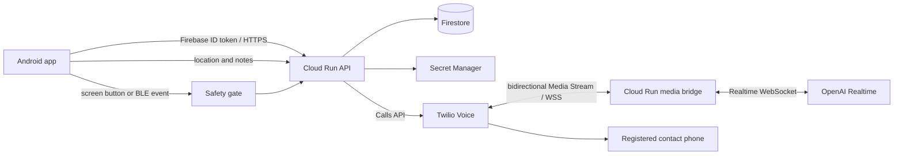

# LIFELiNK 実装計画

最終更新: 2026-09-25

## 1. プロダクトのゴール

声を出せない状況でユーザーがボタンを押すと、LIFELiNK が事前登録済みの連絡先へ AI 音声で電話し、発信前までに収集できた現在地・住所・状況を通話の最初に伝える。

このアプリは公的な緊急通報の代替ではない。警察、消防、救急などの緊急番号へ自動発信するものではなく、ユーザーが指定した家族・友人などへの連絡を補助する。

## 2. ハッカソン MVP の成功条件

実 Android 端末から次の縦断フローが一度以上成功し、証跡を残せることを MVP 完了条件とする。

1. ユーザーが Android でログインする。
2. Android が現在位置、取得時刻、精度を保存する。
3. ユーザーが緊急連絡先を登録し、backend は電話番号そのものではなく `contact_id` で参照できるようにする。
4. 画面上の明示的な緊急ボタン、または既存 BLE イベントを Safety gate に渡す。
5. 同じ緊急イベントでは発信要求が一度だけ受理される。
6. backend が認証済みユーザーの `contact_id` を解決し、Twilio から登録先へ発信する。
7. Twilio Media Streams と OpenAI Realtime API を双方向 WebSocket で接続する。
8. AI が最初に「緊急連絡アプリからの電話であること、住所、緯度・経度、精度、情報の取得時刻または経過時間」を話す。
9. 通話中に Android から送ったメモまたは新しい位置情報を AI の会話コンテキストへ追加し、相手へ伝えられる。

ビルド成功、モック通話、TwiML の生成だけでは MVP 完了としない。Twilio の実番号から事前登録した実番号へ発信し、双方向音声と追加情報の注入を確認する。

## 3. MVP の対象範囲

### 今回実装する

- Android ログイン
- 現在位置の取得・保存と逆ジオコーディング
- 緊急連絡先の登録・選択
- 画面上の明示的な緊急ボタン
- 既存 BLE イベントを受け取れる場合の同一 Safety gate への接続
- 端末と backend の二段階の重複発信防止
- Firebase Authentication、Firestore、Cloud Run、Secret Manager
- Twilio Programmable Voice、双方向 Media Streams
- OpenAI Realtime API による初回発話、会話、通話中の追加情報注入
- 発信状態と失敗理由を Android へ表示する最低限の UI
- 実通話の縦断確認に必要な構造化ログ

### 実通話成立まで主線から外す

以下はコード上の拡張点と設計判断を残すが、上記の実通話が成立するまで実装のために主線を止めない。

- World ID / IDKit による人間性証明
- 友人共有
- Discord 風の通話・会話履歴
- Android マイクからの周辺音声中継
- GATT ボタンとロック中の常時反応
- Play Store 公開対応
- 通話録音、長期トランスクリプト保存

## 4. ユーザーフロー

### 初期設定

1. Android アプリにログインする。
2. 位置情報の利用目的を表示し、Foreground location 権限を得る。
3. 緊急連絡先の名前と電話番号を登録する。
4. backend が電話番号を E.164 形式へ正規化して保存し、Android には `contact_id` を返す。
5. テスト発信で番号と音声経路が正しいことを確認する。

### 緊急発信

1. ユーザーが画面上の緊急ボタンを明示的に押す、またはリンク済み BLE イベントが発生する。
2. Android が可能な範囲で最新位置を取得し、取得済みの住所、精度、取得時刻、メモをスナップショット化する。
3. Safety gate が誤操作確認、短時間の重複、進行中イベントを検査する。
4. Android が一意な `emergency_event_id` と登録済み `contact_id` を backend へ送る。
5. backend が Firebase ID token、所有者、連絡先、イベントの冪等性を検証する。
6. backend がイベントを永続化してから Twilio 発信を一度だけ作成する。
7. 相手が応答すると Media Stream を OpenAI Realtime へ接続し、最初に位置情報を発話する。
8. Android はイベント画面からメモ・位置更新を送信し、backend は該当する通話セッションへ追加する。
9. 終話後、成功・失敗状態と最小限の監査情報を保存する。

## 5. システム構成

### Android

- Application ID / package name は `com.rtree.LIFELiNK` とする。Android と Firebase の仕様上は大文字を利用できるため、ユーザー指定を優先する。一度公開すると変更できない識別子として扱う。
- Kotlin と Jetpack Compose を第一候補とする。
- Firebase Authentication の Google ログインを使い、ID token を backend の Bearer token として送る。
- Google ログインはアプリへの認証、World ID は緊急発信権限の人間性証明として分離する。World ID 未証明でも初期設定はできるが、発信 API は利用できない。
- MVP は Foreground location のみを要求する。継続的な Background location は要求しない。
- ボタンと BLE は同じ `EmergencyTrigger` インターフェースへ変換し、必ず同じ Safety gate を通す。
- 位置スナップショットは `latitude`、`longitude`、`accuracy_m`、`captured_at`、`address`、`geocoded_at` を持つ。

### Cloud Run backend

- Firebase Admin SDK で ID token を検証する。
- API と Twilio Media Stream の WebSocket bridge を同じサービスに置くか、初期実装で運用が単純になる構成を選ぶ。負荷分離は MVP 後とする。
- Firestore のユーザーデータを UID で分離し、`contact_id` が認証ユーザーに属することを必ずサーバー側で確認する。
- Twilio、OpenAI、Google Maps の秘密情報は Secret Manager から実行時に参照する。
- Cloud Run のサービスアカウントには Firestore 利用と必要な Secret 参照だけを許可する。

### Twilio と OpenAI Realtime

- backend が Twilio Calls API で outbound call を作成する。
- TwiML の `<Connect><Stream>` から `wss://` の Cloud Run bridge へ接続する。
- Twilio WebSocket の `X-Twilio-Signature` を検証し、未検証接続を拒否する。
- Twilio の音声は G.711 μ-law、8 kHz、mono を前提とする。OpenAI Realtime セッションも可能なら `audio/pcmu` を指定し、不要な再サンプリングを避ける。採用モデルで直接扱えない場合だけ変換を追加する。
- OpenAI API key はサーバーだけが保持し、Android や Twilio のパラメータへ渡さない。
- 初回発話を完了するまでは通常会話より初期情報の伝達を優先する。
- 通話中の更新は対象 `emergency_event_id` と Twilio Call SID を照合してから会話アイテムとして注入する。

## 6. データモデル案

### `users/{uid}`

- `display_name`
- `created_at`
- `default_contact_id`

### `users/{uid}/contacts/{contact_id}`

- `name`
- `phone_e164`
- `enabled`
- `created_at`
- `updated_at`

電話番号は画面やログへ平文で出さず、API 応答では末尾のみをマスク表示する。

### `users/{uid}/locations/{location_id}`

- `latitude`
- `longitude`
- `accuracy_m`
- `captured_at`
- `address`
- `geocoded_at`

### `emergency_events/{emergency_event_id}`

- `uid`
- `contact_id`
- `trigger_type`: `screen_button` または `ble`
- `state`: `accepted`、`dialing`、`in_progress`、`completed`、`failed`
- `location_snapshot`
- `initial_note`
- `twilio_call_sid`
- `created_at`
- `updated_at`
- `failure_code`

### `emergency_events/{emergency_event_id}/updates/{update_id}`

- `type`: `note` または `location`
- `payload`
- `created_at`
- `delivered_to_ai_at`

## 7. Safety gate と一回だけの発信

「1回だけ」は端末だけに依存せず、backend を最終的な保証点とする。

1. Android はトリガーごとに UUID の `emergency_event_id` を一度だけ生成する。
2. Android は進行中イベントがある間、同じ操作から新しい ID を発行しない。
3. backend は Firestore transaction でイベントを `accepted` として初回だけ作成する。
4. 同じ `emergency_event_id` の再送には既存状態を返し、Twilio Calls API を再実行しない。
5. Twilio Call SID をイベントへ保存し、状態 callback も重複適用できる設計にする。
6. タイムアウトや通信断で Android が再送しても、同じイベント ID を使う。

端末クラッシュと backend の Twilio 呼び出しの間には外部 API を含むため、厳密な分散トランザクションは作れない。MVP ではイベント状態、Twilio Call SID、照会・再試行規則を使い、障害時に二重発信より「状態不明として人間に再確認」を優先する。

## 8. AI の初回発話仕様

初回発話は次の順序を固定し、欠けている値を推測しない。

1. 「これは LIFELiNK 緊急連絡アプリからの自動電話です」
2. 住所。取得できない場合は「住所は取得できていません」
3. 緯度・経度
4. 位置精度。例: 「精度は約 20 メートルです」
5. 情報の鮮度。例: 「この位置は 45 秒前に取得されました」
6. ユーザーが発信前に入力した状況メモ
7. 「新しい情報が入り次第お伝えします」

古い位置を現在地と断定しない。鮮度が基準を超えた場合は「最後に確認できた位置」と表現する。住所、座標、時刻はモデルに自由生成させず、backend が構造化データから初回メッセージを組み立てる。

## 9. API 境界案

- `POST /v1/contacts` - 連絡先を登録する
- `GET /v1/contacts` - マスク済み連絡先を取得する
- `POST /v1/locations` - 位置と住所を保存する
- `POST /v1/emergency-events` - 冪等にイベントを作成し発信する
- `GET /v1/emergency-events/{id}` - 発信状態を取得する
- `POST /v1/emergency-events/{id}/updates` - メモまたは位置を追加する
- `POST /v1/twilio/voice` - TwiML を返す
- `POST /v1/twilio/status` - 通話状態 callback を受ける
- `WSS /v1/twilio/media` - 双方向 Media Stream を受ける

すべての Android API は Firebase ID token を要求する。Twilio webhook と WebSocket は Twilio 署名を検証する。ログには Authorization、電話番号、API key、音声 payload を記録しない。

## 10. 外部リソースとシークレット

### Agent が原則として作成・設定する

ユーザーが GCP の認証と課金先を用意した後、Agent は CLI、API、MCP で可能な範囲を止まらず構築する。

- 必要な GCP API の有効化
- Firestore database と security rules
- Cloud Run service、デプロイ、revision
- 実行用 service account と最小権限 IAM
- Secret Manager の Secret コンテナ作成、Cloud Run への割り当て
- Firebase Android app の登録と、取得可能なら `google-services.json` の配置
- OAuth client の作成または Firebase Auth 設定で自動化可能な部分
- Twilio webhook URL と TwiML の設定
- backend URL、GCP project number、Cloud Run revision 名の非秘密設定への反映
- World ID を実装する段階での Developer Portal app、RP、action の作成

### 人間に依頼する可能性が高いもの

- GCP/Firebase の課金アカウント選択、利用規約への同意、組織ポリシー解除
- Google、Twilio、OpenAI、World ID のアカウント作成や本人確認
- Twilio 電話番号の購入、規制情報・Business Profile・発信先地域の許可
- OAuth 同意画面のブランド情報や外部公開審査
- Android の package name、表示名、対象 GCP project / billing account の最終決定
- 実電話を受ける緊急連絡先からの同意
- Android 実機での権限許可、BLE ペアリング、実通話の受電確認

### Secret Manager に保存する値

- Twilio Account SID: Secret `key-twilio-sid`
- Twilio Auth Token: Secret `key-twilio-authToken`
- Twilio 発信番号
- OpenAI API key: Secret `key-openai-ethglobaltokyo-nolimit`
- Google Maps Geocoding API key
- World ID RP signing key（World ID 実装時）

秘密値はチャット、Git、README、`doc/plan.md`、コマンド出力へ掲載しない。Agent が Secret を生成または一度だけ受け取る場合は、表示せず Secret Manager へ直接保存してから利用する。Cloud Run ではサービスアカウントの Application Default Credentials を使い、可能な限り service account JSON key を作らない。

### 追跡する非秘密識別子

- GCP/Firebase project name: `ethglobalTokyo2026LIFELiNK`
- GCP/Firebase project ID: `ethglobaltokyo2026lifelink`
- GCP/Firebase project number: `1023311564471`
- Firebase Android package name: `com.rtree.LIFELiNK`
- Firebase Android app ID（登録後に追記）
- Cloud Run service 名（登録後に追記）、region: `asia-northeast1`、URL と revision 名（デプロイ後に追記）
- Firestore database ID: `(default)`、region: `asia-northeast1`
- Cloud Run service account: `lifelink-backend@ethglobaltokyo2026lifelink.iam.gserviceaccount.com`
- Secret 名と version（値は記録しない）
- Twilio Phone Number SID、Call SID（電話番号や token は記録しない）
- World ID `app_id`、`rp_id`、action、environment（signing key は記録しない）

## 11. 実装フェーズ

### Phase 0: 人間の意思決定とクラウド準備

- Android package name、GCP project、Firebase ログイン方式、Cloud Run region、Firestore location は決定済み。
- GCP billing、Twilio、OpenAI の利用可能状態を確認する。
- Secret Manager を先に用意し、それから外部サービスの秘密値を登録する。
- 完了条件: Agent が対象 project へ CLI でアクセスでき、秘密値を表示せずデプロイに利用できる。

### Phase 1: Android とデータ登録

- Android のログイン、位置取得、位置保存、連絡先登録を実装する。
- backend の Firebase token 検証と Firestore 所有権チェックを実装する。
- 完了条件: 実端末でログインし、登録した位置と連絡先を再取得できる。

### Phase 2: 一回だけの発信

- 画面ボタン、`EmergencyTrigger`、Safety gate、backend の冪等イベント作成を実装する。
- Twilio Calls API と status callback を接続する。
- 完了条件: 連打・HTTP 再送を行っても実電話が一回だけ着信する。

### Phase 3: AI 双方向通話

- Twilio Media Streams と OpenAI Realtime を bridge する。
- 構造化された初回発話と通常会話を実装する。
- 完了条件: 相手が初回情報を聞き、AI と双方向に会話できる。

### Phase 4: 通話中更新

- Android からメモと新位置をイベントへ追加し、進行中 Realtime session へ注入する。
- 完了条件: 通話を切らずに追加メモまたは位置更新が相手へ音声で伝わる。

### Phase 5: BLE 接続と失敗系

- 既存 BLE イベントを同じ Safety gate へ接続する。
- 権限拒否、位置取得失敗、住所取得失敗、通信断、Twilio/OpenAI 障害を確認する。
- 完了条件: 失敗時に二重発信せず、Android に状態と次の操作が表示される。

### Phase 6: 延期機能

- World ID / IDKit、友人共有、Discord 風履歴、周辺音声、GATT ロック中対応を優先順位順に実装する。ただし発信 API には最初から `human_verified` の認可境界を用意し、World ID 統合後は証明済みユーザーだけが発信できるようにする。
- World ID は `world-id-idkit` Skill と Developer Portal MCP を使い、Secret Manager の保存先を準備してから RP signing key を生成する。

## 12. 重要な制約と判断

- Twilio Programmable Voice を公的緊急番号への発信には使わない。
- Trial の Twilio アカウントは発信先が検証済み番号に制限される可能性がある。実通話前に account と発信先地域の状態を確認する。
- Android の Background location とロック中 GATT は権限・Foreground Service・Google Play 審査の負担が大きいため MVP から外す。
- 位置情報、電話番号、会話内容は機微情報として扱い、保存量と保持期間を最小化する。MVP では音声を録音しない。
- AI が誤った位置を作らないよう、位置情報の文面は backend が生成する。
- 通話相手には冒頭で AI による自動電話であることを明示する。
- 実番号へのテスト発信は、発信先の事前同意と時間帯の確認後に行う。

## 13. 未決事項

実装開始前に人間が決める必要がある項目は次のとおり。その他は合理的な初期値を Agent が選び、判断をこの文書へ追記する。

- GCP region と Firestore location
- Twilio の発信国、発信番号、テスト受電番号
- 位置情報を何分で「古い」と扱うか
- 誤操作防止 UI を長押し、確認カウントダウン、スライドのどれにするか
- イベント、位置、メモの保持期間

## 14. 公式参照先

- Android location permissions: https://developer.android.com/develop/sensors-and-location/location/permissions
- Android BLE background communication: https://developer.android.com/develop/connectivity/bluetooth/ble/background
- Firebase Authentication for Android: https://firebase.google.com/docs/auth/android/start
- Firebase ID token verification: https://firebase.google.com/docs/auth/admin/verify-id-tokens
- Firestore security rules: https://firebase.google.com/docs/firestore/security/get-started
- Cloud Run Secret Manager integration: https://cloud.google.com/run/docs/configuring/services/secrets
- Google Maps Geocoding API: https://developers.google.com/maps/documentation/geocoding/overview
- Twilio outbound Call resource: https://www.twilio.com/docs/voice/api/call-resource
- Twilio bidirectional Media Streams: https://www.twilio.com/docs/voice/media-streams
- Twilio `<Connect><Stream>`: https://www.twilio.com/docs/voice/twiml/connect
- Twilio request validation: https://www.twilio.com/docs/usage/security#validating-requests
- OpenAI Realtime API: https://developers.openai.com/api/docs/guides/realtime
- OpenAI Realtime conversations: https://developers.openai.com/api/docs/guides/realtime-conversations
- World ID IDKit integration: https://docs.world.org/world-id/idkit/integrate

## 15. 変更管理

- ゴール、スコープ、アーキテクチャ、外部サービス、重要な判断が変わるたびにこの文書を更新する。
- 実装タスク、依存関係、担当、完了条件は `doc/tasks.md` で管理する。
- 計画変更と実装成果は意味のある小さな単位で Commit & Push し、ハッカソン中の時系列の作業証跡を残す。